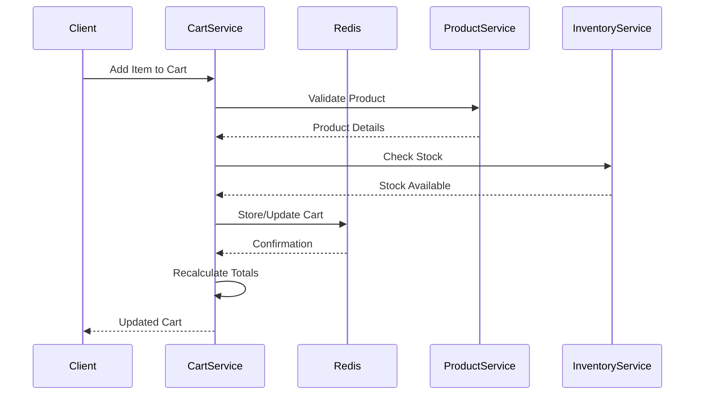

comprehensive documentation for Cart/Basket Service.

## **Cart/Basket Service - Complete Documentation**

### **Table of Contents**
1. [Overview](#overview)
2. [Architecture](#architecture)
3. [Getting Started](#getting-started)
4. [API Documentation](#api-documentation)
5. [Redis Data Structure](#redis-data-structure)
6. [Cart Lifecycle](#cart-lifecycle)
7. [Integration with Other Services](#integration-with-other-services)
8. [Event System](#event-system)
9. [Error Handling](#error-handling)
10. [Monitoring & Logging](#monitoring--logging)
11. [Deployment](#deployment)
12. [Troubleshooting](#troubleshooting)
13. [API Reference](#api-reference)

---

## **1. Overview**

### **1.1 Purpose**
The Cart/Basket Service is a high-performance shopping cart management system for the e-commerce platform, responsible for:
- Real-time shopping cart management for authenticated and guest users
- Persistent cart storage using Redis for ultra-fast access
- Cart item management (add, update, remove)
- Price and stock validation with product and inventory services
- Coupon and discount application
- Cart merging between guest and authenticated sessions
- Automatic cart expiration for abandoned carts
- Real-time cart summary calculations

### **1.2 Key Features**
- ✅ **Redis-based storage** - Sub-millisecond response times
- ✅ **Guest cart support** - No login required to add items
- ✅ **User cart persistence** - Cart saved across devices
- ✅ **Smart cart merging** - Combine guest cart with user cart on login
- ✅ **Real-time price updates** - Sync with product service
- ✅ **Stock availability checking** - Prevent out-of-stock purchases
- ✅ **Coupon management** - Apply and remove discounts
- ✅ **Automatic expiration** - Clean up abandoned carts
- ✅ **Cart limits** - Max items and quantities per product
- ✅ **Attribute support** - Size, color, and other variants
- ✅ **Event-driven architecture** - Real-time cart events
- ✅ **High performance** - Optimized for 10,000+ concurrent users

### **1.3 Technology Stack**
| Component | Technology | Version |
|-----------|------------|---------|
| Runtime | Node.js | 18+ |
| Framework | Express.js | 4.18+ |
| Cache/Database | Redis | 6.0+ |
| Message Broker | RabbitMQ | 3.8+ |
| Validation | Joi | 17.9+ |
| Logging | Winston | 3.10+ |

### **1.4 Performance Metrics**
| Metric | Target | Peak |
|--------|--------|------|
| Cart Read Latency (p99) | < 5ms | < 10ms |
| Cart Write Latency (p99) | < 10ms | < 20ms |
| Concurrent Users Supported | 10,000+ | 50,000+ |
| Redis Memory per Cart | ~2-5KB | ~10KB |

---

## **2. Architecture**

### **2.1 System Architecture**
```
┌─────────────────────────────────────────────────────────────────┐
│                       Cart Service                               │
│  ┌──────────────┐  ┌──────────────┐  ┌──────────────┐          │
│  │    Cart      │  │   Cart       │  │   Cart       │          │
│  │  Controller  │  │   Service    │  │  Repository  │          │
│  └──────────────┘  └──────────────┘  └──────────────┘          │
│  ┌──────────────┐  ┌──────────────┐  ┌──────────────┐          │
│  │   Product    │  │   Inventory  │  │   Coupon     │          │
│  │  Validator   │  │   Checker    │  │  Validator   │          │
│  └──────────────┘  └──────────────┘  └──────────────┘          │
└───────┬──────────────┬──────────────┬───────────────────────────┘
        │              │              │
        ▼              ▼              ▼
┌──────────────┐ ┌─────────────┐ ┌──────────────┐
│    Redis     │ │   RabbitMQ  │ │   Product    │
│   Cluster    │ │    Events   │ │   Service    │
└──────────────┘ └─────────────┘ └──────────────┘
        │              │              │
        └──────────────┼──────────────┘
                       ▼
              ┌──────────────┐
              │  Inventory   │
              │   Service    │
              └──────────────┘
```

### **2.2 Cart Data Flow**


### **2.3 Cart States**
```
┌─────────────────────────────────────────────────────────────┐
│                     Cart States                              │
├───────────────┬─────────────────────────────────────────────┤
│    Active     │ Cart has items, not expired                 │
│    Empty      │ No items in cart                            │
│    Expired    │ Cart TTL exceeded, automatically cleaned    │
│    Merged     │ Guest cart merged into user cart            │
│    Abandoned  │ No activity for extended period             │
└───────────────┴─────────────────────────────────────────────┘
```

### **2.4 Redis Key Structure**
```
cart:user:{userId}          # Authenticated user cart
cart:guest:{sessionId}      # Guest session cart

# Example:
cart:user:507f1f77bcf86cd799439011
cart:guest:sess_abc123xyz
```

---

## **3. Getting Started**

### **3.1 Prerequisites**
```bash
# Required software
Node.js >= 18.0.0
Redis >= 6.0
RabbitMQ >= 3.8

# Optional
Docker >= 20.0
Docker Compose >= 1.29
```

### **3.2 Installation**

```bash
# Clone repository
git clone https://github.com/your-org/cart-service.git
cd cart-service

# Install dependencies
npm install

# Copy environment variables
cp .env.example .env

# Edit configuration
nano .env

# Start Redis
docker run -d -p 6379:6379 --name redis redis:6.2-alpine

# Start RabbitMQ
docker run -d -p 5672:5672 -p 15672:15672 --name rabbitmq rabbitmq:3.9-management

# Start development server
npm run dev

# Run tests
npm test
```

### **3.3 Docker Setup**

**docker-compose.yml**
```yaml
version: '3.8'
services:
  cart-service:
    build: .
    ports:
      - "3006:3006"
    environment:
      - NODE_ENV=production
      - REDIS_HOST=redis
      - RABBITMQ_URL=amqp://rabbitmq:5672
    depends_on:
      - redis
      - rabbitmq
    restart: unless-stopped

  redis:
    image: redis:6.2-alpine
    ports:
      - "6379:6379"
    command: redis-server --appendonly yes
    volumes:
      - redis_data:/data

  rabbitmq:
    image: rabbitmq:3.9-management
    ports:
      - "5672:5672"
      - "15672:15672"
    environment:
      - RABBITMQ_DEFAULT_USER=guest
      - RABBITMQ_DEFAULT_PASS=guest

volumes:
  redis_data:
```

### **3.4 Environment Variables**

| Variable | Description | Default | Required |
|----------|-------------|---------|----------|
| `PORT` | Service port | 3006 | No |
| `NODE_ENV` | Environment | development | No |
| `REDIS_HOST` | Redis host | localhost | Yes |
| `REDIS_PORT` | Redis port | 6379 | Yes |
| `REDIS_PASSWORD` | Redis password | - | No |
| `RABBITMQ_URL` | RabbitMQ URL | - | Yes |
| `JWT_SECRET` | JWT secret for auth | - | Yes |
| `PRODUCT_SERVICE_URL` | Product service URL | http://localhost:3002 | Yes |
| `INVENTORY_SERVICE_URL` | Inventory service URL | http://localhost:3005 | Yes |
| `CART_TTL_DAYS` | Cart expiration days | 7 | No |
| `GUEST_CART_TTL_HOURS` | Guest cart expiration | 24 | No |
| `MAX_CART_ITEMS` | Max unique items | 50 | No |
| `MAX_QUANTITY_PER_ITEM` | Max quantity per product | 99 | No |

---

## **4. API Documentation**

### **4.1 Base URL**
```
Development: http://localhost:3006/api/v1
Production: https://api.yourdomain.com/cart/api/v1
```

### **4.2 Authentication**
The cart service supports both authenticated and guest users:
- **Authenticated users**: Include JWT token in `Authorization` header
- **Guest users**: Include `X-Session-ID` header for cart persistence

```http
# Authenticated user
Authorization: Bearer <your_jwt_token>

# Guest user
X-Session-ID: sess_abc123xyz
```

### **4.3 Cart Endpoints**

#### **Get Cart**
```http
GET /cart
```

**Headers:**
```
Authorization: Bearer <token>  # OR
X-Session-ID: <session_id>
```

**Response (200 OK):**
```json
{
  "success": true,
  "data": {
    "cart": {
      "id": "507f1f77bcf86cd799439011",
      "type": "user",
      "items": [
        {
          "id": "item_001",
          "productId": "prod_iphone15",
          "sku": "APL-IP15P-001",
          "name": "iPhone 15 Pro",
          "quantity": 2,
          "price": 999.99,
          "originalPrice": 1099.99,
          "total": 1999.98,
          "discount": 0,
          "image": "https://cdn.example.com/iphone15.jpg",
          "attributes": {
            "color": "Natural Titanium",
            "storage": "256GB"
          },
          "inStock": true,
          "maxQuantity": 99,
          "addedAt": "2024-01-15T10:30:00Z"
        }
      ],
      "summary": {
        "subtotal": 1999.98,
        "discount": 0,
        "tax": 299.997,
        "shipping": 0,
        "total": 2299.977
      },
      "coupon": null,
      "itemCount": 2,
      "uniqueItemCount": 1,
      "createdAt": "2024-01-15T10:30:00Z",
      "updatedAt": "2024-01-15T10:30:00Z",
      "expiresAt": "2024-01-22T10:30:00Z"
    },
    "expiry": {
      "ttlSeconds": 604800,
      "expiresAt": "2024-01-22T10:30:00Z"
    }
  }
}
```

#### **Get Cart Summary**
```http
GET /cart/summary
```

**Response (200 OK):**
```json
{
  "success": true,
  "data": {
    "itemCount": 2,
    "uniqueItemCount": 1,
    "subtotal": 1999.98,
    "discount": 0,
    "total": 2299.977,
    "couponApplied": false
  }
}
```

#### **Get Cart Item Count**
```http
GET /cart/count
```

**Response (200 OK):**
```json
{
  "success": true,
  "data": {
    "count": 2
  }
}
```

#### **Add Item to Cart**
```http
POST /cart/items
```

**Request Body:**
```json
{
  "productId": "prod_iphone15",
  "quantity": 1,
  "attributes": {
    "color": "Natural Titanium",
    "storage": "256GB"
  }
}
```

**Response (200 OK):**
```json
{
  "success": true,
  "message": "Item added to cart successfully",
  "data": {
    "id": "507f1f77bcf86cd799439011",
    "type": "user",
    "items": [
      {
        "id": "item_001",
        "productId": "prod_iphone15",
        "quantity": 3,
        "price": 999.99,
        "total": 2999.97
      }
    ],
    "summary": {
      "subtotal": 2999.97,
      "tax": 449.9955,
      "total": 3449.9655
    },
    "itemCount": 3,
    "uniqueItemCount": 1
  }
}
```

#### **Update Item Quantity**
```http
PUT /cart/items/:itemId
```

**Request Body:**
```json
{
  "quantity": 2
}
```

**Response (200 OK):**
```json
{
  "success": true,
  "message": "Cart updated successfully",
  "data": { ... }
}
```

#### **Remove Item from Cart**
```http
DELETE /cart/items/:itemId
```

**Response (200 OK):**
```json
{
  "success": true,
  "message": "Item removed from cart successfully",
  "data": { ... }
}
```

#### **Clear Cart**
```http
DELETE /cart
```

**Response (200 OK):**
```json
{
  "success": true,
  "message": "Cart cleared successfully"
}
```

#### **Apply Coupon**
```http
POST /cart/coupon
```

**Request Body:**
```json
{
  "couponCode": "WELCOME10"
}
```

**Response (200 OK):**
```json
{
  "success": true,
  "message": "Coupon applied successfully",
  "data": {
    "coupon": {
      "code": "WELCOME10",
      "discount": 299.997,
      "type": "percentage"
    },
    "summary": {
      "subtotal": 2999.97,
      "discount": 299.997,
      "tax": 404.99595,
      "total": 3104.96895
    }
  }
}
```

#### **Remove Coupon**
```http
DELETE /cart/coupon
```

**Response (200 OK):**
```json
{
  "success": true,
  "message": "Coupon removed successfully",
  "data": { ... }
}
```

#### **Merge Guest Cart (on login)**
```http
POST /cart/merge
```

**Headers:**
```
Authorization: Bearer <user_token>
X-Session-ID: <guest_session_id>
```

**Response (200 OK):**
```json
{
  "success": true,
  "message": "Guest cart merged successfully",
  "data": {
    "merged": true,
    "cart": { ... }
  }
}
```

---

## **5. Redis Data Structure**

### **5.1 Cart Storage Format**

```javascript
// Redis Key: cart:user:{userId} or cart:guest:{sessionId}
{
  "id": "507f1f77bcf86cd799439011",
  "userId": "507f1f77bcf86cd799439011",
  "sessionId": null,
  "type": "user",
  "items": [
    {
      "id": "uuid-v4",
      "productId": "prod_iphone15",
      "sku": "APL-IP15P-001",
      "name": "iPhone 15 Pro",
      "quantity": 2,
      "price": 999.99,
      "originalPrice": 1099.99,
      "total": 1999.98,
      "discount": 0,
      "image": "https://...",
      "attributes": {
        "color": "Natural Titanium",
        "storage": "256GB"
      },
      "inStock": true,
      "maxQuantity": 99,
      "addedAt": "2024-01-15T10:30:00Z",
      "updatedAt": "2024-01-15T10:30:00Z"
    }
  ],
  "summary": {
    "subtotal": 1999.98,
    "discount": 0,
    "tax": 299.997,
    "shipping": 0,
    "total": 2299.977
  },
  "coupon": {
    "code": "WELCOME10",
    "discount": 199.998,
    "type": "percentage",
    "details": {
      "value": 10,
      "maxDiscount": 500
    }
  },
  "createdAt": "2024-01-15T10:30:00Z",
  "updatedAt": "2024-01-15T10:30:00Z",
  "expiresAt": "2024-01-22T10:30:00Z",
  "itemCount": 2,
  "uniqueItemCount": 1
}
```

### **5.2 Redis Commands**

```bash
# Get cart
redis-cli GET "cart:user:507f1f77bcf86cd799439011"

# Set cart with TTL (7 days)
redis-cli SETEX "cart:user:507f1f77bcf86cd799439011" 604800 "{\"items\":[...]}"

# Delete cart
redis-cli DEL "cart:user:507f1f77bcf86cd799439011"

# Check if cart exists
redis-cli EXISTS "cart:user:507f1f77bcf86cd799439011"

# Get cart TTL
redis-cli TTL "cart:user:507f1f77bcf86cd799439011"

# Scan for user carts
redis-cli SCAN 0 MATCH "cart:user:*" COUNT 100

# Scan for guest carts
redis-cli SCAN 0 MATCH "cart:guest:*" COUNT 100
```

### **5.3 TTL Configuration**

| Cart Type | TTL | Configuration |
|-----------|-----|---------------|
| Authenticated User | 7 days (604800 seconds) | `CART_TTL_DAYS=7` |
| Guest User | 24 hours (86400 seconds) | `GUEST_CART_TTL_HOURS=24` |

---

## **6. Cart Lifecycle**

### **6.1 Cart States Diagram**
```
┌─────────────────────────────────────────────────────────────┐
│                    Cart Lifecycle                            │
├─────────────────────────────────────────────────────────────┤
│                                                              │
│  ┌─────────┐     Add Item     ┌─────────┐                  │
│  │  Empty  │ ───────────────▶ │ Active  │                  │
│  └─────────┘                   └────┬────┘                  │
│       ▲                             │                       │
│       │                             │ Remove All Items      │
│       │ Clear Cart                  ▼                       │
│       │                      ┌─────────┐                    │
│       └──────────────────────│  Empty  │                    │
│                              └─────────┘                    │
│                                                              │
│  Active Cart can also:                                      │
│  - Expire after TTL (auto-cleanup)                          │
│  - Be merged when guest logs in                             │
│  - Be abandoned (no activity)                               │
│                                                              │
└─────────────────────────────────────────────────────────────┘
```

### **6.2 Cart Expiration Flow**
```
1. User adds items to cart
   ↓
2. Cart stored with TTL (7 days for users, 24 hours for guests)
   ↓
3. Redis automatically removes expired carts
   ↓
4. (Optional) Cleanup job can notify analytics of abandonment
```

### **6.3 Guest to User Cart Merge Flow**
```
1. Guest adds items to cart (session ID: sess_abc)
   ↓
2. User logs in (user ID: user_123)
   ↓
3. Cart service merges guest cart into user cart
   ↓
4. Items combined, better coupon kept
   ↓
5. Guest cart deleted, user cart updated
   ↓
6. Response returns merged cart
```

---

## **7. Integration with Other Services**

### **7.1 Product Service Integration**

```javascript
// Validate product and get current price
GET ${PRODUCT_SERVICE_URL}/api/v1/products/{productId}

Response:
{
  "success": true,
  "data": {
    "_id": "prod_iphone15",
    "sku": "APL-IP15P-001",
    "name": "iPhone 15 Pro",
    "price": 999.99,
    "comparePrice": 1099.99,
    "images": [{ "url": "...", "isPrimary": true }]
  }
}
```

### **7.2 Inventory Service Integration**

```javascript
// Check stock availability
POST ${INVENTORY_SERVICE_URL}/api/v1/inventory/check-availability

Request:
{
  "items": [
    { "productId": "prod_iphone15", "quantity": 2 }
  ]
}

Response:
{
  "success": true,
  "data": [
    {
      "productId": "prod_iphone15",
      "available": 95,
      "hasStock": true,
      "allowBackorders": false
    }
  ]
}
```

### **7.3 Coupon Service (Future)**

```javascript
// Validate coupon
POST ${COUPON_SERVICE_URL}/api/v1/coupons/validate

Request:
{
  "code": "WELCOME10",
  "cartTotal": 1999.98
}

Response:
{
  "valid": true,
  "type": "percentage",
  "value": 10,
  "maxDiscount": 500,
  "message": "Coupon applied successfully"
}
```

---

## **8. Event System**

### **8.1 Published Events**

| Event | Routing Key | Trigger | Payload |
|-------|-------------|---------|---------|
| Item Added | `cart.item.added` | Product added to cart | userId, productId, quantity |
| Item Updated | `cart.item.updated` | Quantity changed | userId, productId, oldQuantity, newQuantity |
| Item Removed | `cart.item.removed` | Item removed | userId, productId, quantity |
| Cart Cleared | `cart.cleared` | All items removed | userId |
| Cart Merged | `cart.merged` | Guest cart merged | userId, guestItemsCount |

### **8.2 Event Examples**

#### **Item Added Event**
```json
{
  "eventId": "550e8400-e29b-41d4-a716-446655440000",
  "eventType": "cart.item.added",
  "version": "1.0",
  "timestamp": "2024-01-15T10:30:00Z",
  "source": "cart-service",
  "data": {
    "userId": "user_123",
    "productId": "prod_iphone15",
    "quantity": 1,
    "newQuantity": 3,
    "isNewItem": false
  }
}
```

#### **Cart Merged Event**
```json
{
  "eventId": "550e8400-e29b-41d4-a716-446655440001",
  "eventType": "cart.merged",
  "version": "1.0",
  "timestamp": "2024-01-15T10:30:00Z",
  "source": "cart-service",
  "data": {
    "userId": "user_123",
    "guestItemsCount": 3,
    "mergedItemsCount": 5
  }
}
```

---

## **9. Error Handling**

### **9.1 Error Response Format**
```json
{
  "success": false,
  "message": "Error description",
  "timestamp": "2024-01-15T10:30:00Z",
  "details": ["Additional error details"]
}
```

### **9.2 HTTP Status Codes**

| Status | Description |
|--------|-------------|
| 200 | Success |
| 400 | Bad Request - Invalid input |
| 401 | Unauthorized - Invalid token |
| 404 | Not Found - Resource not found |
| 409 | Conflict - Duplicate operation |
| 422 | Unprocessable Entity - Validation failed |
| 429 | Too Many Requests - Rate limit |
| 500 | Internal Server Error |

### **9.3 Common Errors**

#### **Cart Limit Exceeded**
```json
{
  "success": false,
  "message": "Cart cannot exceed 50 unique items",
  "timestamp": "2024-01-15T10:30:00Z"
}
```

#### **Quantity Limit Exceeded**
```json
{
  "success": false,
  "message": "Maximum 99 items per product",
  "timestamp": "2024-01-15T10:30:00Z"
}
```

#### **Insufficient Stock**
```json
{
  "success": false,
  "message": "Only 5 items available in stock",
  "timestamp": "2024-01-15T10:30:00Z"
}
```

#### **Invalid Coupon**
```json
{
  "success": false,
  "message": "Invalid or expired coupon code",
  "timestamp": "2024-01-15T10:30:00Z"
}
```

#### **Product Not Found**
```json
{
  "success": false,
  "message": "Product not found",
  "timestamp": "2024-01-15T10:30:00Z"
}
```

---

## **10. Monitoring & Logging**

### **10.1 Health Check Endpoints**

#### **Full Health Check**
```http
GET /health
```

**Response:**
```json
{
  "status": "healthy",
  "service": "cart-service",
  "version": "1.0.0",
  "timestamp": "2024-01-15T10:30:00Z",
  "uptime": 86400,
  "services": {
    "redis": "connected",
    "rabbitmq": "connected"
  }
}
```

#### **Readiness Probe**
```http
GET /health/ready
```

#### **Liveness Probe**
```http
GET /health/live
```

### **10.2 Metrics to Monitor**

| Metric | Description | Alert Threshold |
|--------|-------------|-----------------|
| Cart Operations/sec | Request rate | > 1000/sec |
| Redis Latency | Response time | > 10ms |
| Cache Hit Rate | Cart found in Redis | < 95% |
| Active Carts | Total active carts | > 100,000 |
| Average Cart Size | Items per cart | > 20 items |
| Cart Abandonment Rate | Expired vs Active | > 70% |
| Merge Success Rate | Guest to user merges | < 90% |

### **10.3 Logging Examples**

#### **Item Added to Cart**
```json
{
  "level": "info",
  "message": "Item added to cart",
  "service": "cart-service",
  "timestamp": "2024-01-15T10:30:00Z",
  "userId": "user_123",
  "productId": "prod_iphone15",
  "quantity": 1,
  "cartSize": 3
}
```

#### **Cart Merged**
```json
{
  "level": "info",
  "message": "Guest cart merged with user cart",
  "service": "cart-service",
  "timestamp": "2024-01-15T10:30:00Z",
  "userId": "user_123",
  "guestItems": 3,
  "userItems": 2,
  "mergedItems": 5
}
```

#### **Redis Error**
```json
{
  "level": "error",
  "message": "Redis connection failed",
  "service": "cart-service",
  "timestamp": "2024-01-15T10:30:00Z",
  "error": "ECONNREFUSED",
  "retryCount": 3
}
```

---

## **11. Deployment**

### **11.1 Kubernetes Deployment**

**deployment.yaml**
```yaml
apiVersion: apps/v1
kind: Deployment
metadata:
  name: cart-service
  namespace: ecommerce
spec:
  replicas: 3
  selector:
    matchLabels:
      app: cart-service
  template:
    metadata:
      labels:
        app: cart-service
    spec:
      containers:
      - name: cart-service
        image: cart-service:latest
        ports:
        - containerPort: 3006
        env:
        - name: NODE_ENV
          value: "production"
        - name: REDIS_HOST
          value: "redis-service"
        - name: REDIS_PORT
          value: "6379"
        - name: RABBITMQ_URL
          value: "amqp://rabbitmq-service:5672"
        - name: PRODUCT_SERVICE_URL
          value: "http://product-service:3002"
        - name: INVENTORY_SERVICE_URL
          value: "http://inventory-service:3005"
        resources:
          requests:
            memory: "128Mi"
            cpu: "100m"
          limits:
            memory: "256Mi"
            cpu: "200m"
        livenessProbe:
          httpGet:
            path: /health/live
            port: 3006
          initialDelaySeconds: 30
          periodSeconds: 10
        readinessProbe:
          httpGet:
            path: /health/ready
            port: 3006
          initialDelaySeconds: 5
          periodSeconds: 5
```

### **11.2 Redis Sentinel Configuration (Production)**

```yaml
# redis-sentinel.yaml
apiVersion: v1
kind: ConfigMap
metadata:
  name: redis-config
data:
  redis.conf: |
    port 6379
    requirepass ${REDIS_PASSWORD}
    masterauth ${REDIS_PASSWORD}
    appendonly yes
    save 900 1
    save 300 10
    save 60 10000
```

### **11.3 Environment Configuration**

| Environment | Replicas | Memory Limit | CPU Limit | Redis Mode |
|-------------|----------|--------------|-----------|------------|
| Development | 1 | 256Mi | 200m | Single |
| Staging | 2 | 256Mi | 200m | Sentinel |
| Production | 3+ | 512Mi | 500m | Cluster |

### **11.4 Performance Tuning**

```javascript
// Redis connection pool
const MAX_RETRIES = 3;
const RETRY_DELAY = 100;
const CONNECTION_TIMEOUT = 10000;

// Cart limits
MAX_CART_ITEMS = 50;
MAX_QUANTITY_PER_ITEM = 99;

// TTL settings
CART_TTL_DAYS = 7;
GUEST_CART_TTL_HOURS = 24;

// Bulk operations
BATCH_SIZE = 100;
```

---

## **12. Troubleshooting**

### **12.1 Common Issues & Solutions**

#### **Issue: Redis Connection Failed**
```bash
# Check Redis status
redis-cli ping

# Verify Redis is running
docker ps | grep redis

# Check Redis logs
docker logs redis

# Test connection
redis-cli -h localhost -p 6379
```

**Solution:** Ensure Redis is running and connection string is correct.

#### **Issue: Cart Not Persisting**
```bash
# Check Redis memory
redis-cli INFO memory

# Monitor Redis commands
redis-cli MONITOR

# Check TTL
redis-cli TTL "cart:user:123"

# Verify write operations
redis-cli --stat
```

**Solution:** Check Redis memory limits and TTL configuration.

#### **Issue: Product Validation Failing**
```bash
# Test product service
curl http://localhost:3002/api/v1/products/prod_001

# Check service connectivity
nc -zv localhost 3002

# View cart service logs
docker logs cart-service | grep "product"
```

**Solution:** Verify product service is running and accessible.

#### **Issue: Stock Check Timeout**
```bash
# Check inventory service
curl http://localhost:3005/health

# Increase timeout
# In .env: INVENTORY_TIMEOUT_MS=5000

# Check network latency
ping inventory-service
```

**Solution:** Increase timeout values or optimize inventory service.

### **12.2 Debugging Commands**

```bash
# View service logs
docker logs cart-service -f --tail 100

# Check health
curl http://localhost:3006/health | jq

# View Redis keys
redis-cli KEYS "cart:*"

# Get specific cart
redis-cli GET "cart:user:507f1f77bcf86cd799439011" | jq

# Monitor Redis in real-time
redis-cli MONITOR

# Check Redis memory usage
redis-cli INFO memory

# Test cart operations
curl -X POST http://localhost:3006/api/v1/cart/items \
  -H "Authorization: Bearer TOKEN" \
  -H "Content-Type: application/json" \
  -d '{"productId":"prod_001","quantity":1}'

# Check RabbitMQ queues
rabbitmqctl list_queues | grep cart
```

### **12.3 Recovery Procedures**

#### **Force Clear User Cart**
```bash
# Delete from Redis directly
redis-cli DEL "cart:user:507f1f77bcf86cd799439011"

# Or use API
curl -X DELETE http://localhost:3006/api/v1/cart \
  -H "Authorization: Bearer TOKEN"
```

#### **Manual Cart Merge**
```javascript
// Manual merge in Redis
const guestCart = redis.get("cart:guest:sess_abc");
const userCart = redis.get("cart:user:123");
const merged = mergeCarts(userCart, guestCart);
redis.set("cart:user:123", merged);
redis.del("cart:guest:sess_abc");
```

#### **Bulk Cart Cleanup**
```bash
# Remove all expired carts
redis-cli --scan --pattern "cart:*" | while read key; do
  ttl=$(redis-cli TTL "$key")
  if [ $ttl -eq -2 ]; then
    redis-cli DEL "$key"
  fi
done
```

---

## **13. API Reference**

### **13.1 Quick Reference Card**

```bash
# Cart Operations
GET    /cart                          # Get full cart
GET    /cart/summary                  # Get cart summary
GET    /cart/count                    # Get item count
POST   /cart/items                    # Add item
PUT    /cart/items/:itemId            # Update quantity
DELETE /cart/items/:itemId            # Remove item
DELETE /cart                          # Clear cart

# Coupon Operations
POST   /cart/coupon                   # Apply coupon
DELETE /cart/coupon                   # Remove coupon

# Cart Management
POST   /cart/merge                    # Merge guest cart

# Headers (use one)
Authorization: Bearer <token>         # Authenticated user
X-Session-ID: <session_id>            # Guest user

# Health
GET    /health                        # Full health check
GET    /health/ready                  # Readiness probe
GET    /health/live                   # Liveness probe
```

### **13.2 Postman Collection**

```json
{
  "info": {
    "name": "Cart Service API",
    "schema": "https://schema.getpostman.com/json/collection/v2.1.0/collection.json"
  },
  "variable": [
    {
      "key": "base_url",
      "value": "http://localhost:3006/api/v1"
    },
    {
      "key": "token",
      "value": "your_jwt_token"
    },
    {
      "key": "session_id",
      "value": "sess_test_123"
    }
  ],
  "item": [
    {
      "name": "Cart",
      "item": [
        {
          "name": "Get Cart",
          "request": {
            "method": "GET",
            "url": "{{base_url}}/cart",
            "header": [
              {
                "key": "Authorization",
                "value": "Bearer {{token}}"
              }
            ]
          }
        },
        {
          "name": "Add Item",
          "request": {
            "method": "POST",
            "url": "{{base_url}}/cart/items",
            "header": [
              {
                "key": "Authorization",
                "value": "Bearer {{token}}"
              }
            ],
            "body": {
              "mode": "raw",
              "raw": "{\n  \"productId\": \"prod_001\",\n  \"quantity\": 2,\n  \"attributes\": {\n    \"size\": \"L\",\n    \"color\": \"Black\"\n  }\n}"
            }
          }
        },
        {
          "name": "Apply Coupon",
          "request": {
            "method": "POST",
            "url": "{{base_url}}/cart/coupon",
            "header": [
              {
                "key": "Authorization",
                "value": "Bearer {{token}}"
              }
            ],
            "body": {
              "mode": "raw",
              "raw": "{\n  \"couponCode\": \"WELCOME10\"\n}"
            }
          }
        }
      ]
    },
    {
      "name": "Health",
      "item": [
        {
          "name": "Health Check",
          "request": {
            "method": "GET",
            "url": "{{base_url}}/health"
          }
        }
      ]
    }
  ]
}
```

### **13.3 Rate Limits**

| Endpoint | Window | Max Requests |
|----------|--------|--------------|
| `GET /cart` | 1 minute | 60 |
| `POST /cart/items` | 1 minute | 30 |
| `PUT /cart/items/*` | 1 minute | 30 |
| `DELETE /cart/items/*` | 1 minute | 30 |
| `POST /cart/coupon` | 1 minute | 10 |
| All other endpoints | 1 minute | 120 |

---

## **14. Changelog**

### **v1.0.0** (2024-01-15)
- Initial release
- Redis-based cart storage
- Guest and authenticated user carts
- Cart item management (add, update, remove)
- Product validation integration
- Stock availability checking
- Coupon support
- Cart merging functionality
- Automatic cart expiration
- Event-driven architecture
- Comprehensive error handling
- Health check endpoints

### **Planned Features**
- [ ] Persistent cart analytics
- [ ] Abandoned cart recovery emails
- [ ] Saved carts/wishlists
- [ ] Multi-currency support
- [ ] Cart sharing/social features
- [ ] Real-time price drop notifications
- [ ] Bulk operations (add multiple items)
- [ ] Cart versioning and restore

---

## **15. SLA & Support**

### **15.1 Service Level Agreements**

| Metric | Target | Critical |
|--------|--------|----------|
| Availability | 99.99% | < 99.9% |
| Cart Read Latency (p99) | < 10ms | > 50ms |
| Cart Write Latency (p99) | < 20ms | > 100ms |
| Error Rate | < 0.1% | > 1% |

### **15.2 Support Contacts**

- **Email**: cart@ecommerce.com
- **Documentation**: https://docs.ecommerce.com/cart-service
- **Issue Tracker**: https://github.com/your-org/cart-service/issues
- **Slack**: #cart-service channel

### **15.3 Support Response Times**

| Priority | Response Time | Resolution Time |
|----------|--------------|-----------------|
| Critical (Cart not working) | 15 minutes | 1 hour |
| High (Performance issues) | 30 minutes | 2 hours |
| Normal (Feature requests) | 4 hours | 24 hours |
| Low (Documentation) | 24 hours | 48 hours |

---

**Documentation Version**: 1.0.0  
**Last Updated**: January 15, 2024  
**Maintainer**: Platform Team  
**Status**: ✅ Production Ready

---

This complete Cart/Basket Service documentation covers all aspects including Redis data structure, API endpoints, integration patterns, event system, deployment, and troubleshooting. For additional questions or custom requirements, please contact the platform team.