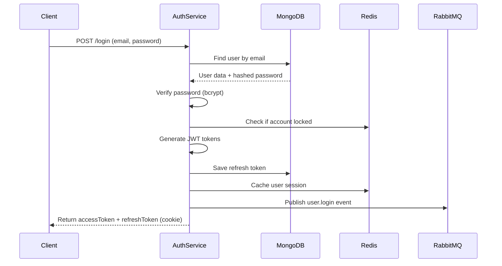

comprehensive documentation for Identity/Auth Service.

## **Identity/Auth Service - Complete Documentation**

### **Table of Contents**
1. [Overview](#overview)
2. [Architecture](#architecture)
3. [Getting Started](#getting-started)
4. [Authentication Flow](#authentication-flow)
5. [API Documentation](#api-documentation)
6. [Database Schema](#database-schema)
7. [Security](#security)
8. [Event System](#event-system)
9. [Role & Permission Management](#role--permission-management)
10. [Error Handling](#error-handling)
11. [Monitoring & Logging](#monitoring--logging)
12. [Deployment](#deployment)
13. [Troubleshooting](#troubleshooting)
14. [API Reference](#api-reference)

---

## **1. Overview**

### **1.1 Purpose**
The Identity/Auth Service is the central authentication and authorization hub for the e-commerce platform, responsible for:
- User registration and account management
- Authentication (login/logout)
- Token management (JWT access & refresh tokens)
- Role-based access control (RBAC)
- Permission management
- User profile management
- Email verification
- Password reset functionality

### **1.2 Key Features**
- ✅ **JWT-based authentication** with access/refresh tokens
- ✅ **Role-based access control** (RBAC)
- ✅ **Permission-based authorization**
- ✅ **Email verification** with OTP
- ✅ **Password reset flow**
- ✅ **Session management** with Redis
- ✅ **Token blacklisting**
- ✅ **Rate limiting** for security
- ✅ **Event-driven architecture** with RabbitMQ
- ✅ **Redis caching** for performance
- ✅ **Comprehensive logging**
- ✅ **Health checks & monitoring**

### **1.3 Technology Stack**
| Component | Technology | Version |
|-----------|------------|---------|
| Runtime | Node.js | 18+ |
| Framework | Express.js | 4.18+ |
| Database | MongoDB | 5.0+ |
| Cache | Redis | 6.0+ |
| Message Broker | RabbitMQ | 3.8+ |
| Authentication | JWT | 9.0+ |
| Password Hashing | Bcrypt | 2.4+ |
| Validation | Joi | 17.9+ |
| Logging | Winston | 3.10+ |
| Testing | Jest | 29.0+ |

---

## **2. Architecture**

### **2.1 System Architecture**
```
┌─────────────────────────────────────────────────────────────┐
│                        Client Applications                   │
│  (Web App, Mobile App, Third-party Services, API Gateway)   │
└─────────────────────┬───────────────────────────────────────┘
                      │ HTTPS
                      ▼
┌─────────────────────────────────────────────────────────────┐
│                    Identity/Auth Service                     │
│  ┌──────────────┐  ┌──────────────┐  ┌──────────────┐      │
│  │   Express    │  │   JWT Auth   │  │   Session    │      │
│  │   Server     │  │  Middleware  │  │  Management  │      │
│  └──────────────┘  └──────────────┘  └──────────────┘      │
│  ┌──────────────┐  ┌──────────────┐  ┌──────────────┐      │
│  │    RBAC      │  │ Rate Limiter │  │   Security   │      │
│  │  Middleware  │  │              │  │   Headers    │      │
│  └──────────────┘  └──────────────┘  └──────────────┘      │
└───────┬──────────────┬──────────────┬───────────────────────┘
        │              │              │
        ▼              ▼              ▼
┌──────────────┐ ┌─────────────┐ ┌──────────────┐
│   MongoDB    │ │    Redis    │ │   RabbitMQ   │
│   Database   │ │    Cache    │ │   Events     │
└──────────────┘ └─────────────┘ └──────────────┘
```

### **2.2 Authentication Flow**


### **2.3 Token Lifecycle**
```
┌─────────────────────────────────────────────────────────────┐
│                     Token Lifecycle                          │
├─────────────────────────────────────────────────────────────┤
│ 1. User Login                                                │
│    ↓                                                         │
│ 2. Generate Access Token (15 min) + Refresh Token (7 days) │
│    ↓                                                         │
│ 3. Client uses Access Token for API requests                │
│    ↓                                                         │
│ 4. Access Token expires → Use Refresh Token                 │
│    ↓                                                         │
│ 5. Generate new Access Token + new Refresh Token            │
│    ↓                                                         │
│ 6. Old Refresh Token revoked                                │
│    ↓                                                         │
│ 7. Logout → Blacklist tokens                                │
└─────────────────────────────────────────────────────────────┘
```

---

## **3. Getting Started**

### **3.1 Prerequisites**
```bash
# Required software
Node.js >= 18.0.0
MongoDB >= 5.0
Redis >= 6.0
RabbitMQ >= 3.8

# Optional
Docker >= 20.0
Docker Compose >= 1.29
```

### **3.2 Installation**

```bash
# Clone repository
git clone https://github.com/your-org/identity-auth-service.git
cd identity-auth-service

# Install dependencies
npm install

# Copy environment variables
cp .env.example .env

# Edit configuration
nano .env

# Seed database with default roles and admin user
npm run db:seed

# Run migrations
npm run db:migrate

# Start development server
npm run dev

# Run tests
npm test
```

### **3.3 Docker Setup**

**docker-compose.yml**
```yaml
version: '3.8'
services:
  auth-service:
    build: .
    ports:
      - "3001:3001"
    environment:
      - NODE_ENV=production
      - MONGODB_URI=mongodb://mongodb:27017/auth_service
      - REDIS_HOST=redis
      - RABBITMQ_URL=amqp://rabbitmq:5672
    depends_on:
      - mongodb
      - redis
      - rabbitmq
    restart: unless-stopped

  mongodb:
    image: mongo:5.0
    ports:
      - "27017:27017"
    volumes:
      - mongodb_data:/data/db
    environment:
      - MONGO_INITDB_ROOT_USERNAME=admin
      - MONGO_INITDB_ROOT_PASSWORD=password

  redis:
    image: redis:6.2-alpine
    ports:
      - "6379:6379"
    command: redis-server --appendonly yes

  rabbitmq:
    image: rabbitmq:3.9-management
    ports:
      - "5672:5672"
      - "15672:15672"
    environment:
      - RABBITMQ_DEFAULT_USER=guest
      - RABBITMQ_DEFAULT_PASS=guest

volumes:
  mongodb_data:
```

### **3.4 Environment Variables**

| Variable | Description | Default | Required |
|----------|-------------|---------|----------|
| `PORT` | Service port | 3001 | No |
| `NODE_ENV` | Environment | development | No |
| `MONGODB_URI` | MongoDB connection string | - | Yes |
| `REDIS_HOST` | Redis host | localhost | Yes |
| `REDIS_PORT` | Redis port | 6379 | Yes |
| `RABBITMQ_URL` | RabbitMQ URL | - | Yes |
| `JWT_SECRET` | JWT signing secret | - | Yes |
| `JWT_REFRESH_SECRET` | Refresh token secret | - | Yes |
| `JWT_ACCESS_EXPIRY` | Access token expiry | 15m | No |
| `JWT_REFRESH_EXPIRY` | Refresh token expiry | 7d | No |
| `SMTP_HOST` | Email SMTP host | - | For email |
| `SMTP_USER` | SMTP username | - | For email |
| `SMTP_PASS` | SMTP password | - | For email |
| `BCRYPT_ROUNDS` | Password hash rounds | 10 | No |
| `MAX_LOGIN_ATTEMPTS` | Max failed logins | 5 | No |
| `LOCKOUT_DURATION_MINUTES` | Account lock time | 30 | No |

---

## **4. Authentication Flow**

### **4.1 Registration Flow**
```
1. User submits registration form
   ↓
2. Validate input (email, password, name)
   ↓
3. Check if email already exists
   ↓
4. Hash password with bcrypt (10 rounds)
   ↓
5. Create user document in MongoDB
   ↓
6. Generate email verification token
   ↓
7. Send verification email
   ↓
8. Publish user.created event to RabbitMQ
   ↓
9. Return success response
```

### **4.2 Login Flow**
```
1. User submits email and password
   ↓
2. Find user by email
   ↓
3. Check if account is locked
   ↓
4. Verify password (bcrypt compare)
   ↓
5. Reset failed login attempts on success
   ↓
6. Generate access token (15 min) and refresh token (7 days)
   ↓
7. Store refresh token in MongoDB
   ↓
8. Cache user data in Redis (1 hour)
   ↓
9. Set refresh token as HTTP-only cookie
   ↓
10. Return access token to client
```

### **4.3 Token Refresh Flow**
```
1. Access token expires
   ↓
2. Client sends refresh token
   ↓
3. Verify refresh token signature and expiry
   ↓
4. Check if refresh token exists and not revoked
   ↓
5. Revoke old refresh token
   ↓
6. Generate new access token and refresh token
   ↓
7. Store new refresh token
   ↓
8. Return new tokens to client
```

---

## **5. API Documentation**

### **5.1 Base URL**
```
Development: http://localhost:3001/api/v1
Production: https://api.yourdomain.com/auth/api/v1
```

### **5.2 Authentication Endpoints**

#### **Register User**
```http
POST /auth/register
```

**Request Body:**
```json
{
  "email": "john@example.com",
  "password": "SecurePass123!",
  "firstName": "John",
  "lastName": "Doe",
  "phoneNumber": "+1234567890",
  "acceptTerms": true
}
```

**Response (201 Created):**
```json
{
  "success": true,
  "message": "Registration successful. Please verify your email.",
  "data": {
    "user": {
      "_id": "507f1f77bcf86cd799439011",
      "email": "john@example.com",
      "firstName": "John",
      "lastName": "Doe",
      "emailVerified": false,
      "status": "active"
    },
    "accessToken": "eyJhbGciOiJIUzI1NiIs...",
    "refreshToken": "eyJhbGciOiJIUzI1NiIs...",
    "requiresEmailVerification": true
  }
}
```

#### **Login**
```http
POST /auth/login
```

**Request Body:**
```json
{
  "email": "john@example.com",
  "password": "SecurePass123!",
  "rememberMe": true
}
```

**Response (200 OK):**
```json
{
  "success": true,
  "message": "Login successful",
  "data": {
    "user": {
      "_id": "507f1f77bcf86cd799439011",
      "email": "john@example.com",
      "firstName": "John",
      "lastName": "Doe",
      "roles": ["user"],
      "emailVerified": true,
      "lastLogin": "2024-01-15T10:30:00Z"
    },
    "accessToken": "eyJhbGciOiJIUzI1NiIs..."
  }
}
```

**Cookies Set:**
```
refreshToken: eyJhbGciOiJIUzI1NiIs... (HttpOnly, Secure, SameSite=Strict)
```

#### **Refresh Token**
```http
POST /auth/refresh-token
```

**Request Body:**
```json
{
  "refreshToken": "eyJhbGciOiJIUzI1NiIs..."
}
```

**Response (200 OK):**
```json
{
  "success": true,
  "data": {
    "accessToken": "eyJhbGciOiJIUzI1NiIs...",
    "user": { ... }
  }
}
```

#### **Logout**
```http
POST /auth/logout
```

**Headers:**
```
Authorization: Bearer <access_token>
```

**Response (200 OK):**
```json
{
  "success": true,
  "message": "Logout successful"
}
```

#### **Verify Email**
```http
GET /auth/verify-email?token={verification_token}
```

**Response (200 OK):**
```json
{
  "success": true,
  "message": "Email verified successfully"
}
```

#### **Forgot Password**
```http
POST /auth/forgot-password
```

**Request Body:**
```json
{
  "email": "john@example.com"
}
```

**Response (200 OK):**
```json
{
  "success": true,
  "message": "If an account exists with that email, you will receive a password reset link"
}
```

#### **Reset Password**
```http
POST /auth/reset-password
```

**Request Body:**
```json
{
  "token": "reset_token_here",
  "newPassword": "NewSecurePass123!"
}
```

**Response (200 OK):**
```json
{
  "success": true,
  "message": "Password reset successful"
}
```

#### **Change Password**
```http
POST /auth/change-password
```

**Headers:**
```
Authorization: Bearer <access_token>
```

**Request Body:**
```json
{
  "oldPassword": "CurrentPass123!",
  "newPassword": "NewSecurePass123!"
}
```

**Response (200 OK):**
```json
{
  "success": true,
  "message": "Password changed successfully"
}
```

### **5.3 User Management Endpoints**

#### **Get Current User**
```http
GET /users/me
```

**Headers:**
```
Authorization: Bearer <access_token>
```

**Response (200 OK):**
```json
{
  "success": true,
  "data": {
    "_id": "507f1f77bcf86cd799439011",
    "email": "john@example.com",
    "firstName": "John",
    "lastName": "Doe",
    "fullName": "John Doe",
    "phoneNumber": "+1234567890",
    "avatar": null,
    "roles": ["user"],
    "permissions": ["user:read", "product:read", "order:read", "order:write"],
    "emailVerified": true,
    "phoneVerified": false,
    "status": "active",
    "lastLogin": "2024-01-15T10:30:00Z",
    "preferences": {
      "language": "en",
      "timezone": "UTC",
      "notifications": {
        "email": true,
        "sms": false,
        "push": true
      }
    },
    "createdAt": "2024-01-01T00:00:00Z",
    "updatedAt": "2024-01-15T10:30:00Z"
  }
}
```

#### **Update Current User**
```http
PUT /users/me
```

**Headers:**
```
Authorization: Bearer <access_token>
```

**Request Body:**
```json
{
  "firstName": "Johnathan",
  "lastName": "Doe",
  "phoneNumber": "+19876543210",
  "preferences": {
    "language": "es",
    "timezone": "America/New_York",
    "notifications": {
      "email": true,
      "sms": true,
      "push": false
    }
  }
}
```

**Response (200 OK):**
```json
{
  "success": true,
  "message": "User updated successfully",
  "data": { ... }
}
```

#### **Get User Sessions**
```http
GET /users/me/sessions
```

**Headers:**
```
Authorization: Bearer <access_token>
```

**Response (200 OK):**
```json
{
  "success": true,
  "data": [
    {
      "id": "507f1f77bcf86cd799439012",
      "userAgent": "Mozilla/5.0 (Windows NT 10.0; Win64; x64)",
      "ipAddress": "192.168.1.1",
      "createdAt": "2024-01-15T10:30:00Z",
      "expiresAt": "2024-01-22T10:30:00Z"
    }
  ]
}
```

#### **Revoke All Sessions**
```http
DELETE /users/me/sessions
```

**Headers:**
```
Authorization: Bearer <access_token>
```

**Response (200 OK):**
```json
{
  "success": true,
  "message": "All sessions revoked successfully"
}
```

### **5.4 Admin Endpoints**

#### **Get All Users**
```http
GET /users?page=1&limit=20&search=john&role=user&status=active
```

**Headers:**
```
Authorization: Bearer <admin_access_token>
```

**Response (200 OK):**
```json
{
  "success": true,
  "data": {
    "users": [...],
    "pagination": {
      "page": 1,
      "limit": 20,
      "total": 150,
      "pages": 8,
      "hasNext": true,
      "hasPrev": false
    }
  }
}
```

#### **Get User Statistics**
```http
GET /users/stats
```

**Headers:**
```
Authorization: Bearer <admin_access_token>
```

**Response (200 OK):**
```json
{
  "success": true,
  "data": {
    "total": 1250,
    "active": 1100,
    "verified": 980,
    "newToday": 25,
    "byRole": [
      { "_id": "user", "count": 1100 },
      { "_id": "moderator", "count": 100 },
      { "_id": "admin", "count": 5 },
      { "_id": "support", "count": 45 }
    ]
  }
}
```

#### **Update User Role**
```http
PUT /users/{userId}/role
```

**Headers:**
```
Authorization: Bearer <admin_access_token>
```

**Request Body:**
```json
{
  "role": "moderator"
}
```

**Response (200 OK):**
```json
{
  "success": true,
  "message": "User role updated successfully",
  "data": {
    "_id": "507f1f77bcf86cd799439011",
    "email": "john@example.com",
    "roles": ["moderator"],
    "permissions": ["product:read", "product:write", "order:read"]
  }
}
```

### **5.5 Role Management Endpoints**

#### **Get All Roles**
```http
GET /users/roles
```

**Headers:**
```
Authorization: Bearer <admin_access_token>
```

**Response (200 OK):**
```json
{
  "success": true,
  "data": [
    {
      "_id": "507f1f77bcf86cd799439020",
      "name": "user",
      "description": "Regular user with basic permissions",
      "permissions": ["user:read", "product:read", "order:read", "order:write"],
      "level": 10,
      "isDefault": true
    },
    {
      "_id": "507f1f77bcf86cd799439021",
      "name": "moderator",
      "description": "Moderator with product management permissions",
      "permissions": ["product:read", "product:write", "order:read", "user:read"],
      "level": 30,
      "isDefault": false
    }
  ]
}
```

#### **Create Role**
```http
POST /users/roles
```

**Headers:**
```
Authorization: Bearer <admin_access_token>
```

**Request Body:**
```json
{
  "name": "content_manager",
  "description": "Manages content and products",
  "permissions": ["product:read", "product:write", "product:delete"],
  "level": 25
}
```

**Response (201 Created):**
```json
{
  "success": true,
  "message": "Role created successfully",
  "data": { ... }
}
```

---

## **6. Database Schema**

### **6.1 User Schema**
```javascript
{
  _id: ObjectId,
  email: String (unique, indexed),
  password: String (hashed, not selected by default),
  firstName: String,
  lastName: String,
  phoneNumber: String,
  avatar: String,
  roles: [String], // ['user', 'admin', 'moderator', 'support']
  permissions: [String],
  emailVerified: Boolean,
  phoneVerified: Boolean,
  twoFactorEnabled: Boolean,
  twoFactorSecret: String,
  status: String, // 'active', 'inactive', 'suspended', 'deleted'
  lastLogin: Date,
  lastLoginIP: String,
  loginAttempts: Number,
  lockUntil: Date,
  passwordResetToken: String,
  passwordResetExpires: Date,
  emailVerificationToken: String,
  emailVerificationExpires: Date,
  metadata: {
    registeredAt: Date,
    registeredIP: String,
    userAgent: String,
    lastPasswordChange: Date
  },
  preferences: {
    language: String,
    timezone: String,
    notifications: {
      email: Boolean,
      sms: Boolean,
      push: Boolean
    }
  },
  createdAt: Date,
  updatedAt: Date
}
```

### **6.2 Role Schema**
```javascript
{
  _id: ObjectId,
  name: String (unique),
  description: String,
  permissions: [String],
  isDefault: Boolean,
  level: Number,
  createdAt: Date,
  updatedAt: Date
}
```

### **6.3 RefreshToken Schema**
```javascript
{
  _id: ObjectId,
  token: String (unique),
  userId: ObjectId (ref: User),
  expiresAt: Date (TTL index),
  revoked: Boolean,
  revokedAt: Date,
  revokedReason: String,
  userAgent: String,
  ipAddress: String,
  createdAt: Date
}
```

### **6.4 Indexes**
```javascript
// User collection
db.users.createIndex({ email: 1 }, { unique: true })
db.users.createIndex({ status: 1 })
db.users.createIndex({ roles: 1 })
db.users.createIndex({ createdAt: -1 })

// RefreshToken collection
db.refreshtokens.createIndex({ token: 1 }, { unique: true })
db.refreshtokens.createIndex({ userId: 1, revoked: 1 })
db.refreshtokens.createIndex({ expiresAt: 1 }, { expireAfterSeconds: 0 })
```

---

## **7. Security**

### **7.1 Password Requirements**
- Minimum 8 characters
- At least one uppercase letter
- At least one lowercase letter
- At least one number
- At least one special character (@$!%*?&)

### **7.2 Rate Limiting**
| Endpoint | Window | Max Requests |
|----------|--------|--------------|
| `/auth/login` | 15 minutes | 5 attempts |
| `/auth/register` | 1 hour | 10 attempts |
| `/auth/forgot-password` | 1 hour | 3 attempts |
| `/auth/reset-password` | 15 minutes | 3 attempts |
| All other endpoints | 15 minutes | 100 requests |

### **7.3 Account Lockout Policy**
- After 5 failed login attempts
- Account locked for 30 minutes
- Successful login resets counter

### **7.4 Token Security**
```javascript
// Access Token
- Expiry: 15 minutes
- Contains: userId, email, roles, permissions
- Stored in: Memory (client) or Authorization header

// Refresh Token
- Expiry: 7 days
- Contains: userId, token type
- Stored in: HTTP-only cookie (server)
- One-time use (rotated on refresh)
```

### **7.5 Security Headers**
```javascript
// Helmet.js configuration
- X-Content-Type-Options: nosniff
- X-Frame-Options: DENY
- X-XSS-Protection: 1; mode=block
- Strict-Transport-Security: max-age=31536000
- Content-Security-Policy: (configured)
```

### **7.6 Input Validation**
All inputs are validated using Joi schemas:
- Email validation (format, length)
- Password strength validation
- Name validation (no special characters)
- Phone number format (E.164)

### **7.7 SQL/NoSQL Injection Prevention**
- MongoDB parameterized queries
- Input sanitization
- Validation before database operations

### **7.8 XSS Prevention**
- Output encoding
- CSP headers
- Cookie HttpOnly flag

---

## **8. Event System**

### **8.1 Published Events**

| Event | Routing Key | Trigger | Data |
|-------|-------------|---------|------|
| User Created | `user.created` | Registration complete | userId, email, name, phone |
| User Updated | `user.updated` | Profile update | userId, email, changes |
| User Deleted | `user.deleted` | Account deletion | userId, email |
| User Login | `user.login` | Successful login | userId, email, ip, userAgent |
| User Logout | `user.logout` | Logout action | userId |
| Email Verified | `user.email.verified` | Email verification | userId, email |
| Password Changed | `user.password.changed` | Password change | userId |
| Role Updated | `user.role.updated` | Role assignment | userId, oldRole, newRole |

### **8.2 Event Format**
```json
{
  "eventId": "550e8400-e29b-41d4-a716-446655440000",
  "eventType": "user.created",
  "version": "1.0",
  "timestamp": "2024-01-15T10:30:00Z",
  "source": "auth-service",
  "data": {
    "userId": "507f1f77bcf86cd799439011",
    "email": "john@example.com",
    "firstName": "John",
    "lastName": "Doe",
    "phoneNumber": "+1234567890"
  }
}
```

### **8.3 Subscribed Events**
| Event | Source | Action |
|-------|--------|--------|
| `notification.*` | Notification Service | Log notification events |

---

## **9. Role & Permission Management**

### **9.1 Predefined Roles**

| Role | Level | Description | Permissions |
|------|-------|-------------|-------------|
| **user** | 10 | Regular customer | user:read, product:read, order:read, order:write |
| **moderator** | 30 | Content moderator | product:read, product:write, order:read, user:read |
| **support** | 40 | Customer support | user:read, order:read, order:write, support:read, support:write |
| **admin** | 100 | Full system access | * (all permissions) |

### **9.2 Permission List**

#### **User Permissions**
```
user:read    - View user profiles
user:write   - Update user profiles
user:delete  - Delete user accounts
```

#### **Product Permissions**
```
product:read    - View products
product:write   - Create/update products
product:delete  - Delete products
```

#### **Order Permissions**
```
order:read    - View orders
order:write   - Create/update orders
order:delete  - Delete/cancel orders
```

#### **Admin Permissions**
```
admin:access  - Access admin panel
admin:users   - Manage users
admin:roles   - Manage roles
admin:settings - Manage system settings
```

#### **Support Permissions**
```
support:read   - View support tickets
support:write  - Respond to tickets
```

### **9.3 Permission Checking**
```javascript
// Middleware usage
router.get('/admin/users', 
  requirePermission('admin:users'),
  userController.getAllUsers
);

// Role check
router.delete('/products/:id',
  requireRole('admin', 'moderator'),
  productController.deleteProduct
);

// Ownership check
router.put('/orders/:id',
  requireOwnership(async (req) => {
    const order = await Order.findById(req.params.id);
    return order.userId;
  }),
  orderController.updateOrder
);
```

---

## **10. Error Handling**

### **10.1 Error Response Format**
```json
{
  "success": false,
  "message": "Error description",
  "timestamp": "2024-01-15T10:30:00Z",
  "errors": [ ... ] // Optional details
}
```

### **10.2 HTTP Status Codes**

| Status Code | Description |
|-------------|-------------|
| 200 | Success |
| 201 | Created |
| 400 | Bad Request - Invalid input |
| 401 | Unauthorized - Invalid/missing token |
| 403 | Forbidden - Insufficient permissions |
| 404 | Not Found - Resource doesn't exist |
| 409 | Conflict - Resource already exists |
| 422 | Unprocessable Entity - Validation failed |
| 429 | Too Many Requests - Rate limit exceeded |
| 500 | Internal Server Error |

### **10.3 Common Errors**

#### **Authentication Errors**
```json
{
  "success": false,
  "message": "Invalid credentials",
  "timestamp": "2024-01-15T10:30:00Z"
}
```

#### **Validation Errors**
```json
{
  "success": false,
  "message": "Validation error",
  "timestamp": "2024-01-15T10:30:00Z",
  "details": [
    "email is required",
    "password must be at least 8 characters"
  ]
}
```

#### **Permission Errors**
```json
{
  "success": false,
  "message": "Permission denied: admin:users required",
  "timestamp": "2024-01-15T10:30:00Z"
}
```

#### **Account Locked**
```json
{
  "success": false,
  "message": "Account is locked. Try again in 25 minutes",
  "timestamp": "2024-01-15T10:30:00Z"
}
```

---

## **11. Monitoring & Logging**

### **11.1 Health Check Endpoints**

#### **Liveness Probe**
```http
GET /health/live
```
**Response:**
```json
{
  "alive": true
}
```

#### **Readiness Probe**
```http
GET /health/ready
```
**Response:**
```json
{
  "ready": true
}
```

#### **Full Health Check**
```http
GET /health
```
**Response:**
```json
{
  "status": "healthy",
  "service": "auth-service",
  "version": "1.0.0",
  "timestamp": "2024-01-15T10:30:00Z",
  "uptime": 86400,
  "services": {
    "mongodb": "connected",
    "redis": "connected",
    "rabbitmq": "connected"
  }
}
```

### **11.2 Metrics to Monitor**

| Metric | Description | Alert Threshold |
|--------|-------------|-----------------|
| Login Success Rate | % of successful logins | < 80% |
| Failed Login Attempts | Number of failed logins | > 100/min |
| Token Refresh Rate | % of successful refreshes | < 90% |
| API Response Time | Average response time | > 500ms |
| Error Rate | % of 5xx errors | > 1% |
| Active Sessions | Current active users | - |
| Database Connections | MongoDB connection pool | > 80% |

### **11.3 Logging Levels**

| Level | Usage |
|-------|-------|
| **error** | System errors, database failures, critical issues |
| **warn** | Failed logins, rate limit exceeded, suspicious activity |
| **info** | User login, logout, registration, token refresh |
| **debug** | Detailed request/response (development only) |

### **11.4 Log Format**
```json
{
  "level": "info",
  "message": "User logged in successfully",
  "service": "auth-service",
  "timestamp": "2024-01-15T10:30:00Z",
  "userId": "507f1f77bcf86cd799439011",
  "email": "john@example.com",
  "ipAddress": "192.168.1.1",
  "userAgent": "Mozilla/5.0..."
}
```

---

## **12. Deployment**

### **12.1 Kubernetes Deployment**

**deployment.yaml**
```yaml
apiVersion: apps/v1
kind: Deployment
metadata:
  name: auth-service
  namespace: ecommerce
spec:
  replicas: 3
  selector:
    matchLabels:
      app: auth-service
  template:
    metadata:
      labels:
        app: auth-service
    spec:
      containers:
      - name: auth-service
        image: auth-service:latest
        ports:
        - containerPort: 3001
        env:
        - name: NODE_ENV
          value: "production"
        - name: MONGODB_URI
          valueFrom:
            secretKeyRef:
              name: mongodb-secret
              key: uri
        - name: JWT_SECRET
          valueFrom:
            secretKeyRef:
              name: jwt-secret
              key: secret
        resources:
          requests:
            memory: "256Mi"
            cpu: "250m"
          limits:
            memory: "512Mi"
            cpu: "500m"
        livenessProbe:
          httpGet:
            path: /health/live
            port: 3001
          initialDelaySeconds: 30
          periodSeconds: 10
        readinessProbe:
          httpGet:
            path: /health/ready
            port: 3001
          initialDelaySeconds: 5
          periodSeconds: 5
```

**service.yaml**
```yaml
apiVersion: v1
kind: Service
metadata:
  name: auth-service
  namespace: ecommerce
spec:
  selector:
    app: auth-service
  ports:
  - port: 3001
    targetPort: 3001
  type: ClusterIP
```

### **12.2 Environment Configuration**

| Environment | Replicas | Memory Limit | CPU Limit | Log Level |
|-------------|----------|--------------|-----------|-----------|
| Development | 1 | 512Mi | 500m | debug |
| Staging | 2 | 512Mi | 500m | info |
| Production | 3+ | 1Gi | 1000m | warn |

### **12.3 CI/CD Pipeline**

**.github/workflows/deploy.yml**
```yaml
name: Deploy Auth Service

on:
  push:
    branches: [main]
    paths:
      - 'auth-service/**'

jobs:
  test:
    runs-on: ubuntu-latest
    steps:
      - uses: actions/checkout@v2
      - name: Setup Node.js
        uses: actions/setup-node@v2
        with:
          node-version: '18'
      - name: Install dependencies
        run: npm ci
      - name: Run tests
        run: npm test
      - name: Run linting
        run: npm run lint
  
  build:
    needs: test
    runs-on: ubuntu-latest
    steps:
      - name: Build Docker image
        run: |
          docker build -t auth-service:${{ github.sha }} .
          docker tag auth-service:${{ github.sha }} auth-service:latest
  
  deploy:
    needs: build
    runs-on: ubuntu-latest
    steps:
      - name: Deploy to Kubernetes
        run: |
          kubectl set image deployment/auth-service \
            auth-service=auth-service:${{ github.sha }}
          kubectl rollout status deployment/auth-service
```

---

## **13. Troubleshooting**

### **13.1 Common Issues & Solutions**

#### **Issue: Cannot connect to MongoDB**
```bash
# Check MongoDB status
mongosh --eval "db.runCommand({ping: 1})"

# Check connection string
echo $MONGODB_URI

# View logs
docker logs auth-service --tail 100 | grep MongoDB
```

**Solution:** Verify MongoDB is running and connection string is correct.

#### **Issue: JWT Token Invalid**
```bash
# Decode token to check expiry
jwt decode <token>

# Check JWT secret
echo $JWT_SECRET
```

**Solution:** Ensure JWT_SECRET matches between services.

#### **Issue: Redis Connection Failed**
```bash
# Test Redis connection
redis-cli ping

# Check Redis status
redis-cli info server
```

**Solution:** Verify Redis is running and REDIS_HOST is correct.

#### **Issue: RabbitMQ Events Not Publishing**
```bash
# List exchanges
rabbitmqctl list_exchanges

# Check queues
rabbitmqctl list_queues

# View bindings
rabbitmqctl list_bindings
```

**Solution:** Ensure RabbitMQ exchanges and queues are properly declared.

### **13.2 Debugging Commands**

```bash
# View service logs
docker logs auth-service -f --tail 100

# Check service health
curl http://localhost:3001/health | jq

# Test authentication
curl -X POST http://localhost:3001/api/v1/auth/login \
  -H "Content-Type: application/json" \
  -d '{"email":"admin@example.com","password":"Admin@123"}'

# Monitor Redis cache
redis-cli monitor | grep "user:"

# Check MongoDB indexes
mongosh auth_service --eval "db.users.getIndexes()"

# View event logs
docker logs rabbitmq | grep "user.created"
```

### **13.3 Performance Tuning**

```javascript
// Increase MongoDB connection pool
mongoose.connect(uri, {
  maxPoolSize: 50,
  minPoolSize: 10
});

// Redis cache TTL optimization
await setCache(`user:${userId}`, userData, 3600); // 1 hour

// JWT token expiry adjustment
JWT_ACCESS_EXPIRY=30m  // Increase for less frequent refreshes
JWT_REFRESH_EXPIRY=30d  // Increase for longer sessions

// Rate limit adjustment
RATE_LIMIT_MAX_REQUESTS=200  // Increase for high-traffic APIs
```

### **13.4 Support Contacts**

| Issue Type | Contact | Response Time |
|------------|---------|---------------|
| Service Down | DevOps Team | 15 minutes |
| Authentication Issues | Security Team | 1 hour |
| Database Problems | DBA Team | 30 minutes |
| Performance Issues | Performance Team | 2 hours |

---

## **14. API Reference**

### **14.1 Quick Reference Card**

```bash
# Register User
curl -X POST http://localhost:3001/api/v1/auth/register \
  -H "Content-Type: application/json" \
  -d '{
    "email": "user@example.com",
    "password": "SecurePass123!",
    "firstName": "John",
    "lastName": "Doe"
  }'

# Login
curl -X POST http://localhost:3001/api/v1/auth/login \
  -H "Content-Type: application/json" \
  -d '{"email":"user@example.com","password":"SecurePass123!"}'

# Get Current User (with token)
curl -X GET http://localhost:3001/api/v1/users/me \
  -H "Authorization: Bearer YOUR_ACCESS_TOKEN"

# Refresh Token
curl -X POST http://localhost:3001/api/v1/auth/refresh-token \
  -H "Content-Type: application/json" \
  -d '{"refreshToken":"YOUR_REFRESH_TOKEN"}'

# Logout
curl -X POST http://localhost:3001/api/v1/auth/logout \
  -H "Authorization: Bearer YOUR_ACCESS_TOKEN"

# Change Password
curl -X POST http://localhost:3001/api/v1/auth/change-password \
  -H "Authorization: Bearer YOUR_ACCESS_TOKEN" \
  -H "Content-Type: application/json" \
  -d '{"oldPassword":"OldPass123!","newPassword":"NewPass123!"}'

# Forgot Password
curl -X POST http://localhost:3001/api/v1/auth/forgot-password \
  -H "Content-Type: application/json" \
  -d '{"email":"user@example.com"}'

# Reset Password
curl -X POST http://localhost:3001/api/v1/auth/reset-password \
  -H "Content-Type: application/json" \
  -d '{"token":"RESET_TOKEN","newPassword":"NewPass123!"}'

# Update User Profile
curl -X PUT http://localhost:3001/api/v1/users/me \
  -H "Authorization: Bearer YOUR_ACCESS_TOKEN" \
  -H "Content-Type: application/json" \
  -d '{"firstName":"Johnathan","phoneNumber":"+1234567890"}'

# Get User Sessions
curl -X GET http://localhost:3001/api/v1/users/me/sessions \
  -H "Authorization: Bearer YOUR_ACCESS_TOKEN"

# Revoke All Sessions
curl -X DELETE http://localhost:3001/api/v1/users/me/sessions \
  -H "Authorization: Bearer YOUR_ACCESS_TOKEN"

# Admin: Get All Users
curl -X GET "http://localhost:3001/api/v1/users?page=1&limit=20" \
  -H "Authorization: Bearer ADMIN_TOKEN"

# Admin: Update User Role
curl -X PUT http://localhost:3001/api/v1/users/USER_ID/role \
  -H "Authorization: Bearer ADMIN_TOKEN" \
  -H "Content-Type: application/json" \
  -d '{"role":"moderator"}'

# Health Check
curl http://localhost:3001/health
```

### **14.2 Postman Collection**

```json
{
  "info": {
    "name": "Identity/Auth Service API",
    "schema": "https://schema.getpostman.com/json/collection/v2.1.0/collection.json"
  },
  "item": [
    {
      "name": "Authentication",
      "item": [
        {
          "name": "Register",
          "request": {
            "method": "POST",
            "url": "{{base_url}}/auth/register",
            "body": {
              "mode": "raw",
              "raw": "{\n  \"email\": \"test@example.com\",\n  \"password\": \"Test123!\",\n  \"firstName\": \"Test\",\n  \"lastName\": \"User\",\n  \"acceptTerms\": true\n}"
            }
          }
        },
        {
          "name": "Login",
          "request": {
            "method": "POST",
            "url": "{{base_url}}/auth/login",
            "body": {
              "mode": "raw",
              "raw": "{\n  \"email\": \"test@example.com\",\n  \"password\": \"Test123!\"\n}"
            }
          }
        }
      ]
    }
  ],
  "variable": [
    {
      "key": "base_url",
      "value": "http://localhost:3001/api/v1"
    }
  ]
}
```

---

## **15. Changelog**

### **v1.0.0** (2024-01-15)
- Initial release
- Complete authentication system
- JWT token management
- RBAC implementation
- Email verification
- Password reset flow
- Session management
- Event publishing
- Comprehensive API documentation

---

## **16. License**

This service is proprietary and confidential. Unauthorized copying or distribution is prohibited.

---

## **17. Support**

### **Contact Information**
- **Email**: support@ecommerce.com
- **Documentation**: https://docs.ecommerce.com/auth-service
- **Issue Tracker**: https://github.com/your-org/auth-service/issues
- **Slack**: #auth-service channel

### **SLAs**
- **Critical Issues**: Response within 15 minutes
- **High Priority**: Response within 1 hour
- **Normal**: Response within 4 hours
- **Low Priority**: Response within 24 hours

---

**Documentation Version**: 1.0.0  
**Last Updated**: January 15, 2024  
**Maintainer**: Platform Team  
**Status**: ✅ Production Ready

---

This documentation provides a complete guide for the Identity/Auth Service. For additional questions or custom requirements, please contact the platform team.