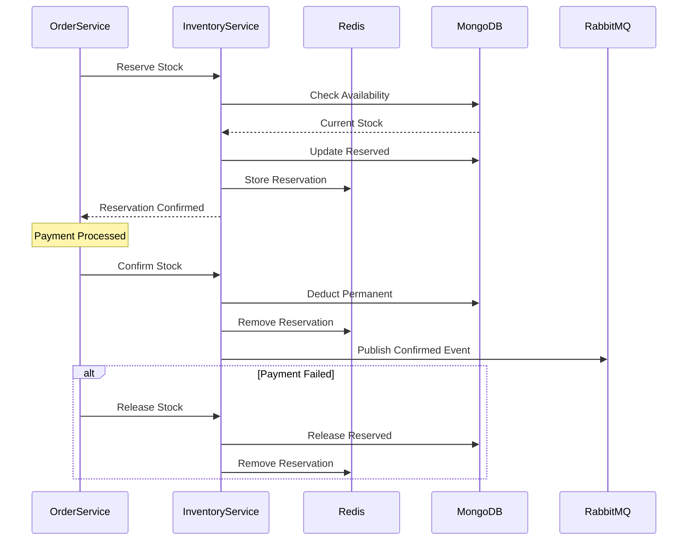

comprehensive documentation for Inventory/Stock Service.

## **Inventory/Stock Service - Complete Documentation**

### **Table of Contents**
1. [Overview](#overview)
2. [Architecture](#architecture)
3. [Stock Reservation System](#stock-reservation-system)
4. [Getting Started](#getting-started)
5. [API Documentation](#api-documentation)
6. [Database Schema](#database-schema)
7. [Stock Movement Tracking](#stock-movement-tracking)
8. [Event System](#event-system)
9. [Inventory Alerts](#inventory-alerts)
10. [Error Handling](#error-handling)
11. [Monitoring & Logging](#monitoring--logging)
12. [Deployment](#deployment)
13. [Troubleshooting](#troubleshooting)
14. [API Reference](#api-reference)

---

## **1. Overview**

### **1.1 Purpose**
The Inventory/Stock Service is the central inventory management system for the e-commerce platform, responsible for:
- Real-time stock tracking and management
- Order-based stock reservation system
- Inventory movement history and audit trails
- Low stock and out-of-stock alerts
- Multi-warehouse inventory support
- Supplier and reorder management
- Stock adjustment and reconciliation
- Integration with order and payment services

### **1.2 Key Features**
- ✅ **Real-time inventory tracking** - Accurate stock levels
- ✅ **Reservation system** - Temporary stock locking for orders
- ✅ **Automatic timeout handling** - Release expired reservations
- ✅ **Stock movement history** - Complete audit trail
- ✅ **Low stock alerts** - Automatic notifications
- ✅ **Bulk operations** - Efficient stock updates
- ✅ **Multiple warehouse support** - Distributed inventory
- ✅ **Supplier management** - Reorder point tracking
- ✅ **Event-driven architecture** - Real-time updates
- ✅ **Redis caching** - High performance
- ✅ **Idempotent operations** - Prevent double counting

### **1.3 Technology Stack**
| Component | Technology | Version |
|-----------|------------|---------|
| Runtime | Node.js | 18+ |
| Framework | Express.js | 4.18+ |
| Database | MongoDB | 5.0+ |
| Cache | Redis | 6.0+ |
| Message Broker | RabbitMQ | 3.8+ |
| Validation | Joi | 17.9+ |
| Logging | Winston | 3.10+ |

---

## **2. Architecture**

### **2.1 System Architecture**
```
┌─────────────────────────────────────────────────────────────────┐
│                     Inventory Service                            │
│  ┌──────────────┐  ┌──────────────┐  ┌──────────────┐          │
│  │  Inventory   │  │  Stock       │  │  Movement    │          │
│  │  Controller  │  │  Reservation │  │  Tracker     │          │
│  └──────────────┘  └──────────────┘  └──────────────┘          │
│  ┌──────────────┐  ┌──────────────┐  ┌──────────────┐          │
│  │  Inventory   │  │  Stock Alert │  │  Supplier    │          │
│  │  Service     │  │  Service     │  │  Service     │          │
│  └──────────────┘  └──────────────┘  └──────────────┘          │
└───────┬──────────────┬──────────────┬───────────────────────────┘
        │              │              │
        ▼              ▼              ▼
┌──────────────┐ ┌─────────────┐ ┌──────────────┐
│   MongoDB    │ │    Redis    │ │   RabbitMQ   │
│  Inventory   │ │  Cache &    │ │    Events    │
│  Movements   │ │ Reservations│ │              │
└──────────────┘ └─────────────┘ └──────────────┘
        │              │              │
        └──────────────┼──────────────┘
                       ▼
              ┌──────────────┐
              │   Order      │
              │   Service    │
              └──────────────┘
```

### **2.2 Stock Flow Diagram**


### **2.3 Inventory States**
```
┌─────────────────────────────────────────────────────────────┐
│                     Stock States                             │
├───────────────┬─────────────────────────────────────────────┤
│   Available   │ Quantity - Reserved (Available for sale)    │
│   Reserved    │ Temporarily locked for pending orders       │
│   Confirmed   │ Permanently deducted (paid orders)          │
│   Low Stock   │ Available ≤ Threshold (Alert triggered)     │
│   Out of Stock│ Available = 0 (No backorders)               │
└───────────────┴─────────────────────────────────────────────┘
```

---

## **3. Stock Reservation System**

### **3.1 Reservation Lifecycle**

```
┌──────────┐     ┌──────────┐     ┌──────────┐
│  Order   │────▶│ Reserve  │────▶│ Confirm  │
│ Created  │     │  Stock   │     │  Stock   │
└──────────┘     └────┬─────┘     └──────────┘
                      │
                      │ (30 min timeout)
                      ▼
                ┌──────────┐
                │ Release  │
                │  Stock   │
                └──────────┘
```

### **3.2 Reservation Process**

```javascript
// Step 1: Reserve Stock
{
  "orderId": "ORD-202401-000001",
  "items": [
    { "productId": "prod_001", "quantity": 2 },
    { "productId": "prod_002", "quantity": 1 }
  ]
}

// Step 2: System Response
{
  "success": true,
  "reservationId": "res_ORD-202401-000001_1705312200000",
  "expiresAt": "2024-01-15T11:00:00Z",
  "items": [
    { "productId": "prod_001", "sku": "SKU-001", "quantity": 2 },
    { "productId": "prod_002", "sku": "SKU-002", "quantity": 1 }
  ]
}
```

### **3.3 Reservation Timeout Configuration**

| Parameter | Default | Description |
|-----------|---------|-------------|
| `RESERVATION_TIMEOUT_MINUTES` | 30 | Time before reservation expires |
| `MAX_RESERVATION_ATTEMPTS` | 3 | Maximum retry attempts |
| Cleanup Interval | 5 minutes | Expired reservation cleanup |

### **3.4 Redis Reservation Schema**

```javascript
{
  "reservationId": "res_ORD-202401-000001_1705312200000",
  "orderId": "ORD-202401-000001",
  "items": [
    {
      "productId": "prod_001",
      "sku": "SKU-001",
      "quantity": 2,
      "inventoryId": "507f1f77bcf86cd799439011"
    }
  ],
  "createdAt": "2024-01-15T10:30:00Z",
  "expiresAt": "2024-01-15T11:00:00Z"
}
```

---

## **4. Getting Started**

### **4.1 Prerequisites**
```bash
# Required software
Node.js >= 18.0.0
MongoDB >= 5.0
Redis >= 6.0
RabbitMQ >= 3.8

# Optional
Docker >= 20.0
Docker Compose >= 1.29
```

### **4.2 Installation**

```bash
# Clone repository
git clone https://github.com/your-org/inventory-service.git
cd inventory-service

# Install dependencies
npm install

# Copy environment variables
cp .env.example .env

# Edit configuration
nano .env

# Start dependencies
docker-compose up -d mongodb redis rabbitmq

# Seed database with sample inventory
npm run db:seed

# Start development server
npm run dev

# Run tests
npm test
```

### **4.3 Docker Setup**

**docker-compose.yml**
```yaml
version: '3.8'
services:
  inventory-service:
    build: .
    ports:
      - "3005:3005"
    environment:
      - NODE_ENV=production
      - MONGODB_URI=mongodb://mongodb:27017/inventory_service
      - REDIS_HOST=redis
      - RABBITMQ_URL=amqp://rabbitmq:5672
    depends_on:
      - mongodb
      - redis
      - rabbitmq
    restart: unless-stopped

  mongodb:
    image: mongo:5.0
    ports:
      - "27017:27017"
    volumes:
      - mongodb_data:/data/db

  redis:
    image: redis:6.2-alpine
    ports:
      - "6379:6379"

  rabbitmq:
    image: rabbitmq:3.9-management
    ports:
      - "5672:5672"
      - "15672:15672"

volumes:
  mongodb_data:
```

### **4.4 Environment Variables**

| Variable | Description | Default | Required |
|----------|-------------|---------|----------|
| `PORT` | Service port | 3005 | No |
| `NODE_ENV` | Environment | development | No |
| `MONGODB_URI` | MongoDB connection | - | Yes |
| `REDIS_HOST` | Redis host | localhost | Yes |
| `REDIS_PORT` | Redis port | 6379 | Yes |
| `RABBITMQ_URL` | RabbitMQ URL | - | Yes |
| `JWT_SECRET` | JWT secret for auth | - | Yes |
| `RESERVATION_TIMEOUT_MINUTES` | Reservation expiry | 30 | No |
| `LOW_STOCK_THRESHOLD` | Default low stock level | 10 | No |
| `CRITICAL_STOCK_THRESHOLD` | Critical stock level | 5 | No |
| `CACHE_TTL` | Cache time-to-live | 3600 | No |

---

## **5. API Documentation**

### **5.1 Base URL**
```
Development: http://localhost:3005/api/v1
Production: https://api.yourdomain.com/inventory/api/v1
```

### **5.2 Authentication**
All endpoints require JWT token:
```http
Authorization: Bearer <your_jwt_token>
```

### **5.3 Inventory Endpoints**

#### **Create Inventory**
```http
POST /inventory
```

**Request Body:**
```json
{
  "productId": "prod_iphone15",
  "sku": "APL-IP15P-001",
  "name": "iPhone 15 Pro",
  "quantity": 100,
  "lowStockThreshold": 10,
  "criticalStockThreshold": 5,
  "trackInventory": true,
  "allowBackorders": false,
  "location": {
    "warehouse": "Main Warehouse",
    "aisle": "A-1",
    "shelf": "S-3",
    "bin": "B-12"
  },
  "supplier": {
    "id": "sup_apple",
    "name": "Apple Inc.",
    "leadTime": 14
  },
  "reorderPoint": 20,
  "reorderQuantity": 50,
  "metadata": {
    "costPrice": 850.00,
    "sellingPrice": 999.99,
    "weight": 0.5
  }
}
```

**Response (201 Created):**
```json
{
  "success": true,
  "message": "Inventory created successfully",
  "data": {
    "_id": "507f1f77bcf86cd799439011",
    "productId": "prod_iphone15",
    "sku": "APL-IP15P-001",
    "name": "iPhone 15 Pro",
    "quantity": 100,
    "reserved": 0,
    "available": 100,
    "status": "active",
    "createdAt": "2024-01-15T10:30:00Z"
  }
}
```

#### **Get Inventory by Product ID**
```http
GET /inventory/product/:productId
```

**Response (200 OK):**
```json
{
  "success": true,
  "data": {
    "_id": "507f1f77bcf86cd799439011",
    "productId": "prod_iphone15",
    "sku": "APL-IP15P-001",
    "name": "iPhone 15 Pro",
    "quantity": 100,
    "reserved": 5,
    "available": 95,
    "availableQuantity": 95,
    "lowStockThreshold": 10,
    "criticalStockThreshold": 5,
    "isLowStock": false,
    "isCriticalStock": false,
    "isOutOfStock": false,
    "status": "active",
    "location": {
      "warehouse": "Main Warehouse",
      "aisle": "A-1",
      "shelf": "S-3",
      "bin": "B-12"
    },
    "supplier": {
      "id": "sup_apple",
      "name": "Apple Inc.",
      "leadTime": 14
    },
    "reorderPoint": 20,
    "reorderQuantity": 50,
    "lastRestockedAt": "2024-01-10T00:00:00Z",
    "createdAt": "2024-01-15T10:30:00Z",
    "updatedAt": "2024-01-15T10:30:00Z"
  }
}
```

#### **Get All Inventory**
```http
GET /inventory?page=1&limit=20&search=iphone&status=active&lowStock=true
```

**Query Parameters:**
| Parameter | Type | Description |
|-----------|------|-------------|
| page | integer | Page number (default: 1) |
| limit | integer | Items per page (default: 20, max: 100) |
| search | string | Search by name or SKU |
| status | string | Filter by status (active, low_stock, out_of_stock) |
| lowStock | boolean | Show only low stock items |
| sortBy | string | Sort field (name, sku, quantity, available) |
| sortOrder | string | asc or desc (default: desc) |

**Response (200 OK):**
```json
{
  "success": true,
  "data": {
    "inventory": [...],
    "pagination": {
      "page": 1,
      "limit": 20,
      "total": 150,
      "pages": 8,
      "hasNext": true,
      "hasPrev": false
    }
  }
}
```

#### **Update Inventory**
```http
PUT /inventory/product/:productId
```

**Request Body:**
```json
{
  "lowStockThreshold": 15,
  "reorderPoint": 25,
  "reorderQuantity": 100,
  "notes": "Updated threshold due to increased demand"
}
```

**Response (200 OK):**
```json
{
  "success": true,
  "message": "Inventory updated successfully",
  "data": { ... }
}
```

#### **Add Stock**
```http
POST /inventory/product/:productId/add-stock
```

**Request Body:**
```json
{
  "quantity": 50,
  "notes": "Received new shipment from supplier"
}
```

**Response (200 OK):**
```json
{
  "success": true,
  "message": "Stock added successfully",
  "data": {
    "quantity": 150,
    "reserved": 5,
    "available": 145,
    "lastRestockedAt": "2024-01-15T10:35:00Z"
  }
}
```

#### **Deduct Stock**
```http
POST /inventory/product/:productId/deduct-stock
```

**Request Body:**
```json
{
  "quantity": 10,
  "reason": "Damaged items - returned to supplier"
}
```

**Response (200 OK):**
```json
{
  "success": true,
  "message": "Stock deducted successfully",
  "data": {
    "quantity": 140,
    "reserved": 5,
    "available": 135
  }
}
```

#### **Check Stock Availability**
```http
POST /inventory/check-availability
```

**Request Body:**
```json
{
  "items": [
    { "productId": "prod_iphone15", "quantity": 2 },
    { "productId": "prod_samsung24", "quantity": 1 }
  ]
}
```

**Response (200 OK):**
```json
{
  "success": true,
  "data": [
    {
      "productId": "prod_iphone15",
      "sku": "APL-IP15P-001",
      "name": "iPhone 15 Pro",
      "requested": 2,
      "available": 95,
      "hasStock": true,
      "allowBackorders": false,
      "message": "In stock"
    },
    {
      "productId": "prod_samsung24",
      "sku": "SAM-GS24-001",
      "name": "Samsung Galaxy S24",
      "requested": 1,
      "available": 145,
      "hasStock": true,
      "allowBackorders": true,
      "message": "In stock"
    }
  ]
}
```

#### **Reserve Stock**
```http
POST /inventory/reserve
```

**Request Body:**
```json
{
  "orderId": "ORD-202401-000001",
  "items": [
    { "productId": "prod_iphone15", "quantity": 1 },
    { "productId": "prod_samsung24", "quantity": 2 }
  ]
}
```

**Response (200 OK):**
```json
{
  "success": true,
  "message": "Stock reserved successfully",
  "data": {
    "success": true,
    "reservationId": "res_ORD-202401-000001_1705312200000",
    "items": [
      {
        "productId": "prod_iphone15",
        "sku": "APL-IP15P-001",
        "quantity": 1
      },
      {
        "productId": "prod_samsung24",
        "sku": "SAM-GS24-001",
        "quantity": 2
      }
    ],
    "expiresAt": "2024-01-15T11:00:00Z"
  }
}
```

#### **Confirm Reservation**
```http
POST /inventory/confirm
```

**Request Body:**
```json
{
  "orderId": "ORD-202401-000001",
  "items": [
    { "productId": "prod_iphone15", "quantity": 1 },
    { "productId": "prod_samsung24", "quantity": 2 }
  ]
}
```

**Response (200 OK):**
```json
{
  "success": true,
  "message": "Stock confirmation successful",
  "data": {
    "success": true,
    "confirmations": [
      {
        "productId": "prod_iphone15",
        "sku": "APL-IP15P-001",
        "quantity": 1,
        "newQuantity": 94
      }
    ]
  }
}
```

#### **Release Stock**
```http
POST /inventory/release
```

**Request Body:**
```json
{
  "orderId": "ORD-202401-000001",
  "items": [
    { "productId": "prod_iphone15", "quantity": 1 }
  ]
}
```

#### **Get Low Stock Products**
```http
GET /inventory/low-stock
```

**Response (200 OK):**
```json
{
  "success": true,
  "data": [
    {
      "productId": "prod_nike_airmax",
      "sku": "NKE-AM-001",
      "name": "Nike Air Max",
      "available": 5,
      "lowStockThreshold": 10,
      "status": "low_stock"
    }
  ]
}
```

#### **Get Out of Stock Products**
```http
GET /inventory/out-of-stock
```

#### **Get Inventory Statistics**
```http
GET /inventory/stats
```

**Response (200 OK):**
```json
{
  "success": true,
  "data": {
    "totalProducts": 1250,
    "totalValue": 1250000,
    "lowStock": 25,
    "outOfStock": 10,
    "totalReserved": 150,
    "healthyStock": 1215
  }
}
```

#### **Get Product Stock Movements**
```http
GET /inventory/product/:productId/movements?page=1&limit=50&type=reserve&startDate=2024-01-01&endDate=2024-01-31
```

**Response (200 OK):**
```json
{
  "success": true,
  "data": {
    "movements": [
      {
        "type": "reserve",
        "quantity": 1,
        "reference": "ORD-202401-000001",
        "referenceType": "order",
        "performedBy": "system",
        "metadata": {
          "orderId": "ORD-202401-000001"
        },
        "createdAt": "2024-01-15T10:30:00Z"
      }
    ],
    "pagination": {
      "page": 1,
      "limit": 50,
      "total": 25,
      "pages": 1
    }
  }
}
```

#### **Bulk Update Inventory**
```http
POST /inventory/bulk-update
```

**Request Body:**
```json
{
  "updates": [
    {
      "productId": "prod_iphone15",
      "operation": "add",
      "quantity": 50,
      "notes": "Restock"
    },
    {
      "productId": "prod_samsung24",
      "operation": "deduct",
      "quantity": 5,
      "reason": "Damaged"
    }
  ]
}
```

**Response (200 OK):**
```json
{
  "success": true,
  "message": "Bulk inventory update completed",
  "data": {
    "success": [
      {
        "productId": "prod_iphone15",
        "sku": "APL-IP15P-001",
        "newQuantity": 150
      }
    ],
    "failed": []
  }
}
```

#### **Get Reservation Status**
```http
GET /inventory/reservation/:orderId
```

**Response (200 OK):**
```json
{
  "success": true,
  "data": {
    "hasReservation": true,
    "reservationId": "res_ORD-202401-000001_1705312200000",
    "orderId": "ORD-202401-000001",
    "expiresAt": "2024-01-15T11:00:00Z",
    "items": [
      {
        "productId": "prod_iphone15",
        "sku": "APL-IP15P-001",
        "reservedQuantity": 1,
        "status": "active"
      }
    ]
  }
}
```

---

## **6. Database Schema**

### **6.1 Inventory Schema**
```javascript
{
  _id: ObjectId,
  productId: String,              // Product ID (unique index)
  sku: String,                    // Stock keeping unit (unique)
  name: String,                   // Product name
  quantity: Number,               // Total physical quantity
  reserved: Number,               // Reserved for pending orders
  available: Number,              // Virtual (quantity - reserved)
  lowStockThreshold: Number,      // Alert threshold
  criticalStockThreshold: Number, // Critical alert threshold
  trackInventory: Boolean,        // Enable inventory tracking
  allowBackorders: Boolean,       // Allow orders when out of stock
  location: {                     // Warehouse location
    warehouse: String,
    aisle: String,
    shelf: String,
    bin: String
  },
  supplier: {                     // Supplier information
    id: String,
    name: String,
    sku: String,
    leadTime: Number
  },
  reorderPoint: Number,           // Auto-reorder trigger
  reorderQuantity: Number,        // Quantity to reorder
  lastRestockedAt: Date,          // Last restock date
  lastCountedAt: Date,            // Last physical count
  status: String,                 // active, low_stock, out_of_stock
  metadata: {                     // Additional data
    costPrice: Number,
    sellingPrice: Number,
    weight: Number,
    dimensions: {
      length: Number,
      width: Number,
      height: Number
    }
  },
  createdAt: Date,
  updatedAt: Date
}
```

### **6.2 StockMovement Schema**
```javascript
{
  _id: ObjectId,
  productId: String,              // Product ID (indexed)
  sku: String,                    // Product SKU
  type: String,                   // reserve, release, confirm, add, deduct, adjust
  quantity: Number,               // Quantity changed
  previousQuantity: Number,       // Quantity before change
  newQuantity: Number,            // Quantity after change
  previousReserved: Number,       // Reserved before change
  newReserved: Number,            // Reserved after change
  reference: String,              // Order ID or reference
  referenceType: String,          // order, reservation, purchase_order
  status: String,                 // pending, completed, failed
  performedBy: String,            // User or system
  performedByRole: String,        // admin, system, customer
  metadata: {                     // Additional context
    ipAddress: String,
    userAgent: String,
    notes: String,
    reason: String
  },
  batchId: String,                // Batch operation ID
  createdAt: Date
}
```

### **6.3 Indexes**
```javascript
// Inventory indexes
db.inventories.createIndex({ productId: 1 }, { unique: true })
db.inventories.createIndex({ sku: 1 }, { unique: true })
db.inventories.createIndex({ status: 1 })
db.inventories.createIndex({ 'location.warehouse': 1 })

// StockMovement indexes
db.stockmovements.createIndex({ productId: 1, createdAt: -1 })
db.stockmovements.createIndex({ reference: 1 })
db.stockmovements.createIndex({ type: 1, createdAt: -1 })
db.stockmovements.createIndex({ batchId: 1 })
```

---

## **7. Stock Movement Tracking**

### **7.1 Movement Types**

| Type | Description | Impact |
|------|-------------|--------|
| `reserve` | Temporary stock lock | Reserved +, Available - |
| `release` | Cancel reservation | Reserved -, Available + |
| `confirm` | Permanent deduction | Quantity -, Reserved - |
| `add` | Increase stock | Quantity +, Available + |
| `deduct` | Decrease stock | Quantity -, Available - |
| `adjust` | Manual adjustment | Quantity ±, Available ± |

### **7.2 Movement Example**

```javascript
// Reserve Movement
{
  "type": "reserve",
  "quantity": 2,
  "previousQuantity": 100,
  "newQuantity": 100,
  "previousReserved": 0,
  "newReserved": 2,
  "reference": "ORD-12345",
  "referenceType": "order"
}

// Confirm Movement (after payment)
{
  "type": "confirm",
  "quantity": 2,
  "previousQuantity": 100,
  "newQuantity": 98,
  "previousReserved": 2,
  "newReserved": 0,
  "reference": "ORD-12345",
  "referenceType": "order"
}
```

### **7.3 Movement Queries**

```javascript
// Get daily movement summary
const dailyMovements = await StockMovement.aggregate([
  {
    $match: {
      productId: "prod_iphone15",
      createdAt: { $gte: startDate }
    }
  },
  {
    $group: {
      _id: { $dateToString: { format: "%Y-%m-%d", date: "$createdAt" } },
      reserved: { $sum: { $cond: [{ $eq: ["$type", "reserve"] }, "$quantity", 0] } },
      confirmed: { $sum: { $cond: [{ $eq: ["$type", "confirm"] }, "$quantity", 0] } }
    }
  }
]);
```

---

## **8. Event System**

### **8.1 Published Events**

| Event | Routing Key | Trigger | Payload |
|-------|-------------|---------|---------|
| Inventory Reserved | `inventory.reserved` | Stock reserved | orderId, reservationId, items |
| Inventory Released | `inventory.released` | Stock released | orderId, items |
| Inventory Confirmed | `inventory.confirmed` | Stock confirmed | orderId, items, newQuantity |
| Inventory Low | `inventory.low` | Below threshold | productId, currentStock, threshold |
| Inventory Out of Stock | `inventory.out.of.stock` | Zero stock | productId, sku, name |
| Inventory Updated | `inventory.updated` | Stock changed | productId, operation, change |

### **8.2 Subscribed Events**

| Event | Source | Action |
|-------|--------|--------|
| `order.created` | Order Service | Reserve inventory |
| `order.cancelled` | Order Service | Release inventory |
| `payment.success` | Payment Service | Confirm inventory |
| `payment.failed` | Payment Service | Release inventory |

### **8.3 Event Examples**

#### **Inventory Reserved Event**
```json
{
  "eventId": "550e8400-e29b-41d4-a716-446655440000",
  "eventType": "inventory.reserved",
  "version": "1.0",
  "timestamp": "2024-01-15T10:30:00Z",
  "source": "inventory-service",
  "data": {
    "orderId": "ORD-202401-000001",
    "reservationId": "res_ORD-202401-000001_1705312200000",
    "items": [
      { "productId": "prod_001", "sku": "SKU-001", "quantity": 2 }
    ]
  }
}
```

#### **Low Stock Alert Event**
```json
{
  "eventId": "550e8400-e29b-41d4-a716-446655440001",
  "eventType": "inventory.low",
  "version": "1.0",
  "timestamp": "2024-01-15T10:30:00Z",
  "source": "inventory-service",
  "data": {
    "productId": "prod_nike_airmax",
    "sku": "NKE-AM-001",
    "name": "Nike Air Max",
    "currentStock": 5,
    "threshold": 10,
    "isCritical": true
  }
}
```

---

## **9. Inventory Alerts**

### **9.1 Alert Thresholds**

| Alert Level | Threshold | Action |
|-------------|-----------|--------|
| Low Stock | Available ≤ 10 | Send notification, suggest reorder |
| Critical Stock | Available ≤ 5 | Urgent notification, auto-reorder |
| Out of Stock | Available = 0 | Disable product, notify admin |

### **9.2 Alert Configuration**

```javascript
// Per-product threshold
{
  "lowStockThreshold": 10,
  "criticalStockThreshold": 5
}

// Global defaults
LOW_STOCK_THRESHOLD=10
CRITICAL_STOCK_THRESHOLD=5
```

### **9.3 Auto-Reorder Logic**

```javascript
// Check if reorder is needed
const needsReorder = async (inventory) => {
  if (!inventory.trackInventory) return false;
  
  const available = inventory.availableQuantity;
  const reorderPoint = inventory.reorderPoint || 20;
  
  return available <= reorderPoint;
};
```

---

## **10. Error Handling**

### **10.1 Error Response Format**
```json
{
  "success": false,
  "message": "Error description",
  "timestamp": "2024-01-15T10:30:00Z",
  "details": ["Additional error details"]
}
```

### **10.2 HTTP Status Codes**

| Status | Description |
|--------|-------------|
| 200 | Success |
| 201 | Created |
| 400 | Bad Request - Invalid input |
| 401 | Unauthorized - Invalid token |
| 403 | Forbidden - Insufficient permissions |
| 404 | Not Found - Inventory not found |
| 409 | Conflict - Duplicate SKU |
| 422 | Unprocessable Entity - Validation failed |
| 429 | Too Many Requests - Rate limit |
| 500 | Internal Server Error |

### **10.3 Common Errors**

#### **Insufficient Stock**
```json
{
  "success": false,
  "message": "Insufficient stock",
  "timestamp": "2024-01-15T10:30:00Z",
  "details": ["Available: 5, Requested: 10"]
}
```

#### **Duplicate SKU**
```json
{
  "success": false,
  "message": "Inventory with SKU APL-IP15P-001 already exists",
  "timestamp": "2024-01-15T10:30:00Z"
}
```

#### **Invalid Reservation**
```json
{
  "success": false,
  "message": "Cannot release more than reserved",
  "timestamp": "2024-01-15T10:30:00Z",
  "details": ["Reserved: 5, Requested: 10"]
}
```

---

## **11. Monitoring & Logging**

### **11.1 Health Check Endpoints**

#### **Full Health Check**
```http
GET /health
```

**Response:**
```json
{
  "status": "healthy",
  "service": "inventory-service",
  "version": "1.0.0",
  "timestamp": "2024-01-15T10:30:00Z",
  "uptime": 86400,
  "services": {
    "mongodb": "connected",
    "redis": "connected",
    "rabbitmq": "connected"
  }
}
```

#### **Readiness Probe**
```http
GET /health/ready
```

#### **Liveness Probe**
```http
GET /health/live
```

### **11.2 Metrics to Monitor**

| Metric | Description | Alert Threshold |
|--------|-------------|-----------------|
| Stock Accuracy | Inventory vs System | < 98% |
| Reservation Timeout Rate | Expired reservations | > 5% |
| Low Stock Products | Count of low stock | > 10 |
| Out of Stock Products | Count of OOS | > 5 |
| Inventory Turns | Sell-through rate | < 4x/year |
| Reservation Success Rate | Successful reservations | < 95% |

### **11.3 Logging Examples**

#### **Reservation Created**
```json
{
  "level": "info",
  "message": "Stock reserved",
  "service": "inventory-service",
  "timestamp": "2024-01-15T10:30:00Z",
  "orderId": "ORD-202401-000001",
  "reservationId": "res_xxx",
  "items": 2
}
```

#### **Low Stock Alert**
```json
{
  "level": "warn",
  "message": "Low stock alert",
  "service": "inventory-service",
  "timestamp": "2024-01-15T10:30:00Z",
  "productId": "prod_nike_airmax",
  "sku": "NKE-AM-001",
  "currentStock": 5,
  "threshold": 10
}
```

---

## **12. Deployment**

### **12.1 Kubernetes Deployment**

**deployment.yaml**
```yaml
apiVersion: apps/v1
kind: Deployment
metadata:
  name: inventory-service
  namespace: ecommerce
spec:
  replicas: 3
  selector:
    matchLabels:
      app: inventory-service
  template:
    metadata:
      labels:
        app: inventory-service
    spec:
      containers:
      - name: inventory-service
        image: inventory-service:latest
        ports:
        - containerPort: 3005
        env:
        - name: NODE_ENV
          value: "production"
        - name: MONGODB_URI
          valueFrom:
            secretKeyRef:
              name: mongodb-secret
              key: uri
        - name: REDIS_HOST
          value: "redis-service"
        - name: RABBITMQ_URL
          value: "amqp://rabbitmq-service:5672"
        resources:
          requests:
            memory: "256Mi"
            cpu: "250m"
          limits:
            memory: "512Mi"
            cpu: "500m"
        livenessProbe:
          httpGet:
            path: /health/live
            port: 3005
          initialDelaySeconds: 30
          periodSeconds: 10
        readinessProbe:
          httpGet:
            path: /health/ready
            port: 3005
          initialDelaySeconds: 5
          periodSeconds: 5
```

### **12.2 Environment Configuration**

| Environment | Replicas | Memory Limit | CPU Limit | Log Level |
|-------------|----------|--------------|-----------|-----------|
| Development | 1 | 512Mi | 500m | debug |
| Staging | 2 | 512Mi | 500m | info |
| Production | 3+ | 1Gi | 1000m | warn |

### **12.3 Performance Tuning**

```javascript
// MongoDB connection pool
mongoose.connect(uri, {
  maxPoolSize: 50,
  minPoolSize: 10
});

// Redis cache TTL
INVENTORY_CACHE_TTL = 300;  // 5 minutes
RESERVATION_TTL = 1800;  // 30 minutes

// Reservation timeout
RESERVATION_TIMEOUT_MINUTES = 30;

// Batch sizes
BULK_UPDATE_BATCH_SIZE = 100;
MOVEMENTS_PAGE_SIZE = 50;
```

---

## **13. Troubleshooting**

### **13.1 Common Issues & Solutions**

#### **Issue: Insufficient Stock Despite Showing Available**
```bash
# Check reserved stock
mongo inventory_service --eval "db.inventories.find({productId:'prod_001'}).pretty()"

# View active reservations
redis-cli KEYS "reservation:*"

# Check movement history
curl http://localhost:3005/api/v1/inventory/product/prod_001/movements
```

**Solution:** Review reservation system and force release stale reservations.

#### **Issue: Reservation Not Timing Out**
```bash
# Check Redis TTL
redis-cli TTL "reservation:res_xxx"

# Manually cleanup expired reservations
curl -X POST http://localhost:3005/api/v1/inventory/cleanup-reservations \
  -H "Authorization: Bearer ADMIN_TOKEN"
```

**Solution:** Verify Redis TTL configuration and cleanup job.

#### **Issue: Duplicate Stock Movements**
```bash
# Check for duplicate batch IDs
mongo inventory_service --eval "db.stockmovements.aggregate([{$group:{_id:'$batchId',count:{$sum:1}}},{$match:{count:{$gt:1}}}])"

# Verify idempotency keys
redis-cli KEYS "idempotency:*"
```

**Solution:** Implement idempotency keys for all write operations.

### **13.2 Debugging Commands**

```bash
# View service logs
docker logs inventory-service -f --tail 100

# Check health
curl http://localhost:3005/health | jq

# Monitor Redis reservations
redis-cli MONITOR | grep "reservation"

# Check stock levels
mongo inventory_service --eval "db.inventories.find({}, {productId:1, quantity:1, reserved:1}).pretty()"

# Test reservation
curl -X POST http://localhost:3005/api/v1/inventory/reserve \
  -H "Authorization: Bearer TOKEN" \
  -H "Content-Type: application/json" \
  -d '{"orderId":"TEST-001","items":[{"productId":"prod_001","quantity":1}]}'

# View pending reservations
redis-cli KEYS "reservation:*" | xargs redis-cli GET
```

### **13.3 Recovery Procedures**

#### **Manual Stock Adjustment**
```javascript
// Force update stock quantity
db.inventories.updateOne(
  { productId: "prod_001" },
  { $set: { quantity: 100, reserved: 0 } }
);

// Clear all reservations for product
redis-cli KEYS "reservation:*" | xargs redis-cli DEL
```

#### **Rebuild Stock Movements**
```javascript
// Regenerate available quantity
db.inventories.updateMany(
  {},
  [{ $set: { available: { $subtract: ["$quantity", "$reserved"] } } }]
);
```

---

## **14. API Reference**

### **14.1 Quick Reference Card**

```bash
# Inventory CRUD
GET    /inventory                           # List inventory
GET    /inventory/product/:productId        # Get by product ID
GET    /inventory/sku/:sku                  # Get by SKU
POST   /inventory                           # Create inventory
PUT    /inventory/product/:productId        # Update inventory

# Stock Operations
POST   /inventory/product/:productId/add-stock      # Add stock
POST   /inventory/product/:productId/deduct-stock   # Deduct stock
POST   /inventory/check-availability                # Check availability

# Reservation System
POST   /inventory/reserve                   # Reserve stock
POST   /inventory/confirm                   # Confirm reservation
POST   /inventory/release                   # Release reservation
GET    /inventory/reservation/:orderId      # Get reservation status

# Reports & Monitoring
GET    /inventory/low-stock                 # Low stock products
GET    /inventory/out-of-stock              # Out of stock products
GET    /inventory/stats                     # Inventory statistics
GET    /inventory/product/:productId/movements  # Stock movements

# Bulk Operations
POST   /inventory/bulk-update               # Bulk inventory update
POST   /inventory/cleanup-reservations      # Cleanup expired

# Health
GET    /health                              # Full health check
GET    /health/ready                        # Readiness probe
GET    /health/live                         # Liveness probe
```

### **14.2 Postman Collection**

```json
{
  "info": {
    "name": "Inventory Service API",
    "schema": "https://schema.getpostman.com/json/collection/v2.1.0/collection.json"
  },
  "variable": [
    {
      "key": "base_url",
      "value": "http://localhost:3005/api/v1"
    },
    {
      "key": "token",
      "value": "your_jwt_token"
    }
  ],
  "item": [
    {
      "name": "Inventory",
      "item": [
        {
          "name": "Get All Inventory",
          "request": {
            "method": "GET",
            "url": "{{base_url}}/inventory?page=1&limit=10",
            "header": [
              {
                "key": "Authorization",
                "value": "Bearer {{token}}"
              }
            ]
          }
        },
        {
          "name": "Check Availability",
          "request": {
            "method": "POST",
            "url": "{{base_url}}/inventory/check-availability",
            "header": [
              {
                "key": "Authorization",
                "value": "Bearer {{token}}"
              }
            ],
            "body": {
              "mode": "raw",
              "raw": "{\n  \"items\": [\n    {\"productId\": \"prod_001\", \"quantity\": 2}\n  ]\n}"
            }
          }
        },
        {
          "name": "Reserve Stock",
          "request": {
            "method": "POST",
            "url": "{{base_url}}/inventory/reserve",
            "header": [
              {
                "key": "Authorization",
                "value": "Bearer {{token}}"
              }
            ],
            "body": {
              "mode": "raw",
              "raw": "{\n  \"orderId\": \"ORD-TEST-001\",\n  \"items\": [\n    {\"productId\": \"prod_001\", \"quantity\": 1}\n  ]\n}"
            }
          }
        }
      ]
    }
  ]
}
```

---

## **15. Changelog**

### **v1.0.0** (2024-01-15)
- Initial release
- Complete inventory management
- Stock reservation system
- Real-time stock tracking
- Movement history audit
- Low stock alerts
- Event-driven architecture
- Redis caching implementation
- Bulk operations support

### **Planned Features**
- [ ] Multi-warehouse support
- [ ] Automated reordering
- [ ] Barcode/RFID integration
- [ ] Batch tracking (expiry dates)
- [ ] Inventory forecasting
- [ ] Stock transfer between warehouses
- [ ] Cycle counting
- [ ] Returns processing

---

## **16. SLA & Support**

### **16.1 Service Level Agreements**

| Metric | Target | Critical |
|--------|--------|----------|
| Availability | 99.9% | < 99.5% |
| Stock Check Latency (p95) | < 50ms | > 200ms |
| Reservation Processing (p95) | < 100ms | > 500ms |
| Accuracy | 100% | < 99.9% |

### **16.2 Support Contacts**

- **Email**: inventory@ecommerce.com
- **Documentation**: https://docs.ecommerce.com/inventory-service
- **Issue Tracker**: https://github.com/your-org/inventory-service/issues
- **Slack**: #inventory-service channel

### **16.3 Support Response Times**

| Priority | Response Time | Resolution Time |
|----------|--------------|-----------------|
| Critical (Stock discrepancy) | 15 minutes | 1 hour |
| High (Reservation issues) | 30 minutes | 2 hours |
| Normal (Reporting) | 2 hours | 8 hours |
| Low (Documentation) | 24 hours | 48 hours |

---

**Documentation Version**: 1.0.0  
**Last Updated**: January 15, 2024  
**Maintainer**: Platform Team  
**Status**: ✅ Production Ready

---

This complete Inventory/Stock Service documentation covers all aspects including reservation system, stock movement tracking, API endpoints, database schema, event system, alerts, deployment, and troubleshooting. For additional questions or custom requirements, please contact the platform team.