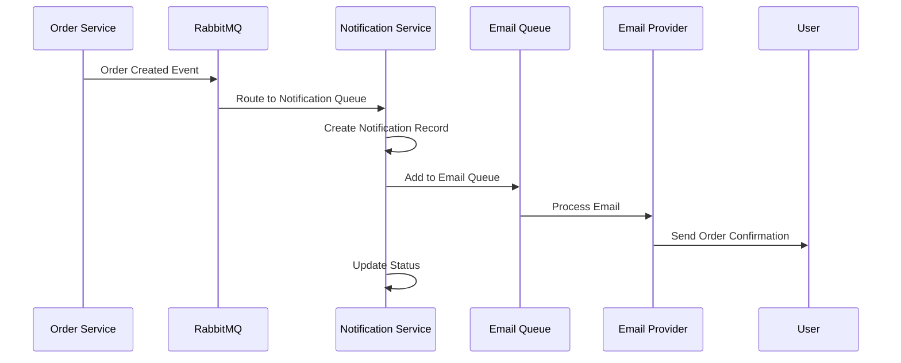

comprehensive documentation for Notification Service. This will include API documentation, architecture overview, setup guides, and usage examples.

## **Notification Service Documentation**

### **Table of Contents**
1. [Overview](#overview)
2. [Architecture](#architecture)
3. [Getting Started](#getting-started)
4. [API Documentation](#api-documentation)
5. [Event Documentation](#event-documentation)
6. [Configuration](#configuration)
7. [Email Templates](#email-templates)
8. [SMS Templates](#sms-templates)
9. [Error Handling](#error-handling)
10. [Monitoring & Logging](#monitoring--logging)
11. [Deployment](#deployment)
12. [Troubleshooting](#troubleshooting)

---

## **1. Overview**

### **1.1 Purpose**
The Notification Service is responsible for managing all communication channels in the e-commerce platform, including:
- Email notifications
- SMS messages
- In-app notifications
- Push notifications (future)

### **1.2 Key Features**
- ✅ Multi-channel delivery (Email, SMS, In-app)
- ✅ Async processing with message queues
- ✅ Retry mechanism with exponential backoff
- ✅ Template-based messaging
- ✅ Multi-language support (English, Spanish, French)
- ✅ Priority-based queuing
- ✅ Real-time event subscription
- ✅ Bulk notification support
- ✅ Delivery tracking and analytics

### **1.3 Technology Stack**
| Component | Technology |
|-----------|------------|
| Runtime | Node.js 18+ |
| Framework | Express.js |
| Database | MongoDB |
| Message Broker | RabbitMQ |
| Queue Management | Bull (Redis) |
| Email Provider | Nodemailer/SendGrid |
| SMS Provider | Twilio |
| Logging | Winston |
| Testing | Jest |

---

## **2. Architecture**

### **2.1 System Architecture Diagram**
```
┌─────────────┐     ┌─────────────┐     ┌─────────────┐
│   Order     │     │   Payment   │     │   User      │
│   Service   │     │   Service   │     │   Service   │
└──────┬──────┘     └──────┬──────┘     └──────┬──────┘
       │                   │                   │
       └───────────────────┼───────────────────┘
                           │
                    ┌──────▼──────┐
                    │  RabbitMQ   │
                    │   Events    │
                    └──────┬──────┘
                           │
                    ┌──────▼──────┐
                    │ Notification│
                    │   Service   │
                    └──────┬──────┘
                           │
              ┌────────────┼────────────┐
              │            │            │
         ┌────▼────┐  ┌─────▼─────┐  ┌──▼───┐
         │  Email  │  │   SMS     │  │ In-app│
         │  Queue  │  │  Queue    │  │Notification│
         └────┬────┘  └─────┬─────┘  └──────┘
              │             │
         ┌────▼────┐  ┌─────▼─────┐
         │  Email  │  │   SMS     │
         │ Provider│  │ Provider  │
         └─────────┘  └───────────┘
```

### **2.2 Event Flow**


### **2.3 Data Flow**
1. **Event Reception**: Services publish events to RabbitMQ exchanges
2. **Processing**: Notification service consumes events and creates notification records
3. **Queuing**: Notifications are added to priority queues based on urgency
4. **Delivery**: Workers process queues and send via appropriate channels
5. **Tracking**: Delivery status is updated in MongoDB

---

## **3. Getting Started**

### **3.1 Prerequisites**
```bash
# Required software
Node.js >= 18.0.0
MongoDB >= 5.0
Redis >= 6.0
RabbitMQ >= 3.8
```

### **3.2 Installation**

```bash
# Clone the repository
git clone https://github.com/your-org/ecommerce-notification-service.git
cd ecommerce-notification-service

# Install dependencies
npm install

# Copy environment variables
cp .env.example .env

# Edit .env with your configuration
nano .env

# Start the service
npm run dev
```

### **3.3 Docker Setup**
```yaml
# docker-compose.yml
version: '3.8'
services:
  notification-service:
    build: .
    ports:
      - "3007:3007"
    environment:
      - NODE_ENV=production
      - MONGODB_URI=mongodb://mongodb:27017/notification_service
      - REDIS_HOST=redis
      - RABBITMQ_URL=amqp://rabbitmq:5672
    depends_on:
      - mongodb
      - redis
      - rabbitmq
    restart: unless-stopped

  mongodb:
    image: mongo:5.0
    ports:
      - "27017:27017"
    volumes:
      - mongodb_data:/data/db

  redis:
    image: redis:6.2-alpine
    ports:
      - "6379:6379"

  rabbitmq:
    image: rabbitmq:3.9-management
    ports:
      - "5672:5672"
      - "15672:15672"

volumes:
  mongodb_data:
```

### **3.4 Environment Variables**

| Variable | Description | Default | Required |
|----------|-------------|---------|----------|
| `PORT` | Service port | 3007 | No |
| `NODE_ENV` | Environment | development | No |
| `MONGODB_URI` | MongoDB connection string | - | Yes |
| `REDIS_HOST` | Redis host | localhost | Yes |
| `REDIS_PORT` | Redis port | 6379 | Yes |
| `RABBITMQ_URL` | RabbitMQ connection URL | - | Yes |
| `SMTP_HOST` | SMTP server host | - | For email |
| `SMTP_USER` | SMTP username | - | For email |
| `SMTP_PASS` | SMTP password | - | For email |
| `TWILIO_ACCOUNT_SID` | Twilio account SID | - | For SMS |
| `TWILIO_AUTH_TOKEN` | Twilio auth token | - | For SMS |
| `TWILIO_PHONE_NUMBER` | Twilio phone number | - | For SMS |

---

## **4. API Documentation**

### **4.1 Base URL**
```
Development: http://localhost:3007/api/v1
Production: https://api.yourdomain.com/notification/api/v1
```

### **4.2 Authentication**
All endpoints require JWT token in Authorization header:
```http
Authorization: Bearer <your_jwt_token>
```

### **4.3 Endpoints**

#### **Get User Notifications**
```http
GET /notifications/user/:userId
```

**Query Parameters:**
| Parameter | Type | Description | Default |
|-----------|------|-------------|---------|
| page | integer | Page number | 1 |
| limit | integer | Items per page | 20 |
| status | string | Filter by status | - |
| channel | string | Filter by channel | - |

**Response:**
```json
{
  "success": true,
  "data": [
    {
      "_id": "507f1f77bcf86cd799439011",
      "userId": "user_123",
      "type": "email",
      "channel": "order",
      "title": "Order Confirmation #ORD-12345",
      "content": "Your order has been confirmed",
      "status": "sent",
      "priority": "high",
      "createdAt": "2024-01-15T10:30:00Z",
      "sentAt": "2024-01-15T10:30:05Z"
    }
  ],
  "pagination": {
    "page": 1,
    "limit": 20,
    "total": 45,
    "pages": 3
  }
}
```

#### **Create Notification**
```http
POST /notifications
```

**Request Body:**
```json
{
  "userId": "user_123",
  "type": "email",
  "channel": "promotion",
  "title": "Special Offer!",
  "content": "Get 20% off your next purchase",
  "priority": "medium",
  "scheduledFor": "2024-01-20T09:00:00Z"
}
```

**Response:**
```json
{
  "success": true,
  "data": {
    "_id": "507f1f77bcf86cd799439012",
    "userId": "user_123",
    "type": "email",
    "channel": "promotion",
    "title": "Special Offer!",
    "content": "Get 20% off your next purchase",
    "status": "pending",
    "priority": "medium",
    "scheduledFor": "2024-01-20T09:00:00Z",
    "createdAt": "2024-01-15T10:35:00Z"
  }
}
```

#### **Send Bulk Notifications**
```http
POST /notifications/bulk
```

**Request Body:**
```json
{
  "userIds": ["user_123", "user_456", "user_789"],
  "type": "email",
  "channel": "promotion",
  "title": "Flash Sale!",
  "content": "50% off everything for 24 hours",
  "priority": "high"
}
```

**Response:**
```json
{
  "success": true,
  "message": "3 notifications created",
  "data": [
    { "_id": "507f1f77bcf86cd799439013", "userId": "user_123" },
    { "_id": "507f1f77bcf86cd799439014", "userId": "user_456" },
    { "_id": "507f1f77bcf86cd799439015", "userId": "user_789" }
  ]
}
```

#### **Mark Notification as Read**
```http
PATCH /notifications/:id/read
```

**Response:**
```json
{
  "success": true,
  "data": {
    "_id": "507f1f77bcf86cd799439011",
    "status": "read",
    "readAt": "2024-01-15T11:00:00Z"
  }
}
```

#### **Get Notification Statistics**
```http
GET /notifications/user/:userId/stats
```

**Response:**
```json
{
  "success": true,
  "data": {
    "status": [
      { "_id": "sent", "count": 150 },
      { "_id": "read", "count": 120 },
      { "_id": "failed", "count": 5 }
    ],
    "channels": [
      { "_id": "email", "count": 200 },
      { "_id": "sms", "count": 50 },
      { "_id": "in_app", "count": 75 }
    ]
  }
}
```

#### **Health Check**
```http
GET /health
```

**Response:**
```json
{
  "status": "healthy",
  "timestamp": "2024-01-15T10:30:00Z",
  "uptime": 86400,
  "services": {
    "mongodb": true,
    "redis": true,
    "rabbitmq": true
  }
}
```

### **4.4 Error Responses**

| Status Code | Description |
|-------------|-------------|
| 200 | Success |
| 201 | Created |
| 400 | Bad Request - Invalid parameters |
| 401 | Unauthorized - Invalid or missing token |
| 404 | Not Found - Resource doesn't exist |
| 429 | Too Many Requests - Rate limit exceeded |
| 500 | Internal Server Error |

**Error Response Format:**
```json
{
  "success": false,
  "message": "Validation error",
  "details": [
    "userId is required",
    "type must be one of [email, sms, push, in_app]"
  ]
}
```

---

## **5. Event Documentation**

### **5.1 Event Schema**

All events follow this standard format:
```json
{
  "eventId": "evt_01HABCD1234",
  "eventType": "order.created",
  "version": "1.0",
  "timestamp": "2024-01-15T10:30:00Z",
  "source": "order-service",
  "data": {
    // Event-specific data
  }
}
```

### **5.2 Supported Events**

#### **User Events**
| Event | Routing Key | Description | Trigger |
|-------|-------------|-------------|---------|
| User Created | `user.created` | New user registration | User signs up |
| Password Reset | `user.password.reset` | Password reset requested | User requests password reset |

**Example Event - User Created:**
```json
{
  "eventId": "evt_01HABCD1234",
  "eventType": "user.created",
  "version": "1.0",
  "timestamp": "2024-01-15T10:30:00Z",
  "source": "auth-service",
  "data": {
    "userId": "user_123",
    "email": "john@example.com",
    "name": "John Doe",
    "phoneNumber": "+1234567890",
    "preferredLanguage": "en"
  }
}
```

#### **Order Events**
| Event | Routing Key | Description |
|-------|-------------|-------------|
| Order Created | `order.created` | New order placed |
| Order Status Updated | `order.status.updated` | Order status changes |

**Example Event - Order Created:**
```json
{
  "eventId": "evt_01HABCD1235",
  "eventType": "order.created",
  "version": "1.0",
  "timestamp": "2024-01-15T10:35:00Z",
  "source": "order-service",
  "data": {
    "orderId": "ORD-12345",
    "userId": "user_123",
    "customerEmail": "john@example.com",
    "customerName": "John Doe",
    "customerPhone": "+1234567890",
    "items": [
      {
        "name": "Laptop",
        "sku": "LAP-001",
        "quantity": 1,
        "price": 999.99
      }
    ],
    "subtotal": 999.99,
    "shipping": 10.00,
    "tax": 80.00,
    "total": 1089.99,
    "shippingAddress": {
      "street": "123 Main St",
      "city": "New York",
      "state": "NY",
      "zipCode": "10001",
      "country": "USA"
    }
  }
}
```

#### **Payment Events**
| Event | Routing Key | Description |
|-------|-------------|-------------|
| Payment Success | `payment.success` | Payment completed |
| Payment Failed | `payment.failed` | Payment failed |

**Example Event - Payment Success:**
```json
{
  "eventId": "evt_01HABCD1236",
  "eventType": "payment.success",
  "version": "1.0",
  "timestamp": "2024-01-15T10:36:00Z",
  "source": "payment-service",
  "data": {
    "transactionId": "txn_123456",
    "orderId": "ORD-12345",
    "userId": "user_123",
    "amount": 1089.99,
    "currency": "USD",
    "paymentMethod": "credit_card",
    "customerEmail": "john@example.com",
    "customerName": "John Doe",
    "customerPhone": "+1234567890",
    "last4": "4242"
  }
}
```

#### **Inventory Events**
| Event | Routing Key | Description |
|-------|-------------|-------------|
| Inventory Low | `inventory.low` | Stock below threshold |
| Out of Stock | `inventory.out.of.stock` | Product completely out |

**Example Event - Inventory Low:**
```json
{
  "eventId": "evt_01HABCD1237",
  "eventType": "inventory.low",
  "version": "1.0",
  "timestamp": "2024-01-15T10:40:00Z",
  "source": "inventory-service",
  "data": {
    "productId": "prod_123",
    "name": "Wireless Mouse",
    "sku": "MOU-001",
    "currentStock": 5,
    "threshold": 10,
    "category": "Electronics",
    "supplierEmail": "supplier@example.com",
    "supplierPhone": "+1234567890"
  }
}
```

### **5.3 Publishing Events**

To publish events from other services:

```javascript
// Example: Publishing from Order Service
const amqp = require('amqplib');

async function publishOrderCreated(orderData) {
  const connection = await amqp.connect(process.env.RABBITMQ_URL);
  const channel = await connection.createChannel();
  
  const exchange = 'order.events';
  const routingKey = 'order.created';
  
  await channel.assertExchange(exchange, 'topic', { durable: true });
  
  const event = {
    eventId: `evt_${Date.now()}`,
    eventType: 'order.created',
    version: '1.0',
    timestamp: new Date().toISOString(),
    source: 'order-service',
    data: orderData
  };
  
  channel.publish(exchange, routingKey, Buffer.from(JSON.stringify(event)), {
    persistent: true
  });
  
  console.log(`Event published: ${routingKey}`);
  await channel.close();
  await connection.close();
}
```

---

## **6. Configuration**

### **6.1 Queue Configuration**

```javascript
// config/queues.js
module.exports = {
  emailQueue: {
    name: 'email_queue',
    concurrency: 5,
    attempts: 3,
    backoff: {
      type: 'exponential',
      delay: 2000
    },
    removeOnComplete: true,
    removeOnFail: false
  },
  smsQueue: {
    name: 'sms_queue',
    concurrency: 10,
    attempts: 3,
    backoff: {
      type: 'fixed',
      delay: 5000
    }
  }
};
```

### **6.2 Rate Limiting**

```javascript
// config/rate-limit.js
module.exports = {
  windowMs: 15 * 60 * 1000, // 15 minutes
  max: 100, // Limit each IP to 100 requests per window
  message: 'Too many requests, please try again later.',
  standardHeaders: true,
  legacyHeaders: false
};
```

### **6.3 Logging Configuration**

```javascript
// config/logger.js
module.exports = {
  level: process.env.LOG_LEVEL || 'info',
  format: 'json',
  transports: [
    {
      type: 'file',
      filename: 'logs/error.log',
      level: 'error',
      maxsize: 10485760, // 10MB
      maxFiles: 5
    },
    {
      type: 'file',
      filename: 'logs/combined.log',
      maxsize: 10485760,
      maxFiles: 5
    }
  ]
};
```

---

## **7. Email Templates**

### **7.1 Template Variables**

#### **Welcome Email**
```handlebars
{{name}} - User's name
{{loginUrl}} - Login page URL
{{supportEmail}} - Support email address
{{year}} - Current year
```

#### **Order Confirmation**
```handlebars
{{orderId}} - Order number
{{customerName}} - Customer's name
{{orderDate}} - Order date
{{items}} - Array of ordered items
{{subtotal}} - Order subtotal
{{shipping}} - Shipping cost
{{tax}} - Tax amount
{{total}} - Order total
{{shippingAddress}} - Shipping address object
{{estimatedDelivery}} - Estimated delivery date
```

### **7.2 Customizing Templates**

Templates are located in `src/templates/email/` and use Handlebars syntax:

```handlebars
<!-- Add custom styling -->
<style>
  .custom-class {
    background: #f0f0f0;
  }
</style>

<!-- Use helpers -->
{{#if discount}}
  <div class="discount">Save {{discount}}%!</div>
{{/if}}

<!-- Loop through items -->
{{#each items}}
  <tr>
    <td>{{this.name}}</td>
    <td>{{this.quantity}}</td>
  </tr>
{{/each}}
```

### **7.3 Adding New Templates**

1. Create new `.hbs` file in `src/templates/email/`
2. Register template in `email.service.js`:
```javascript
async sendCustomEmail(userData) {
  const template = this.templates['custom-template'];
  const html = template(userData);
  return await sendEmail({
    to: userData.email,
    subject: 'Custom Subject',
    html
  });
}
```

---

## **8. SMS Templates**

### **8.1 Template Structure**

SMS templates are stored in JSON format with multi-language support:

```json
{
  "templates": {
    "template_name": {
      "en": "English message with {variables}",
      "es": "Spanish message with {variables}",
      "fr": "French message with {variables}"
    }
  }
}
```

### **8.2 Using SMS Templates**

```javascript
const smsService = require('./services/sms.service');

// Send using template
await smsService.sendTemplate('order_confirmation', phoneNumber, {
  orderId: 'ORD-12345',
  total: '1089.99'
});

// Result: "Your order #ORD-12345 has been confirmed. Total: $1089.99"
```

### **8.3 Adding New SMS Templates**

Add to `src/templates/sms/templates.json`:

```json
{
  "templates": {
    "new_promotion": {
      "en": "Special offer: {discount}% off! Use code: {promoCode}",
      "es": "Oferta especial: {discount}% de descuento! Usa código: {promoCode}",
      "fr": "Offre spéciale: {discount}% de réduction! Utilisez le code: {promoCode}"
    }
  }
}
```

---

## **9. Error Handling**

### **9.1 Retry Strategy**

| Attempt | Delay | Backoff Type |
|---------|-------|--------------|
| 1 | 2 seconds | Exponential |
| 2 | 4 seconds | Exponential |
| 3 | 8 seconds | Exponential |

### **9.2 Error Categories**

| Error Type | Handling Strategy | User Impact |
|------------|------------------|--------------|
| Network Error | Retry 3 times, then log | Notification delayed |
| Invalid Email | Don't retry, mark as failed | Notification not sent |
| Rate Limited | Exponential backoff, retry | Notification delayed |
| Template Error | Don't retry, alert admin | Notification failed |

### **9.3 Error Codes**

```javascript
const ErrorCodes = {
  INVALID_EMAIL: 'ERR_001',
  INVALID_PHONE: 'ERR_002',
  RATE_LIMITED: 'ERR_003',
  TEMPLATE_NOT_FOUND: 'ERR_004',
  PROVIDER_ERROR: 'ERR_005',
  QUEUE_FULL: 'ERR_006'
};
```

---

## **10. Monitoring & Logging**

### **10.1 Metrics to Monitor**

| Metric | Description | Alert Threshold |
|--------|-------------|-----------------|
| Notification Success Rate | % of successful deliveries | < 95% |
| Queue Length | Number of pending notifications | > 1000 |
| Processing Time | Time to process notification | > 30 seconds |
| Error Rate | % of failed notifications | > 5% |

### **10.2 Logging Best Practices**

```javascript
// Info level for normal operations
logger.info('Notification sent', {
  notificationId: '123',
  userId: 'user_123',
  type: 'email',
  duration: 150 // ms
});

// Error level for failures
logger.error('Failed to send email', {
  error: error.message,
  notificationId: '123',
  retryCount: 3
});

// Debug for development
logger.debug('Processing event', {
  routingKey: 'order.created',
  eventId: 'evt_123'
});
```

### **10.3 Health Check Endpoints**

```bash
# Basic health check
curl http://localhost:3007/health

# Detailed metrics (internal)
curl http://localhost:3007/metrics

# Readiness probe
curl http://localhost:3007/ready

# Liveness probe
curl http://localhost:3007/live
```

---

## **11. Deployment**

### **11.1 Kubernetes Deployment**

```yaml
# deployment.yaml
apiVersion: apps/v1
kind: Deployment
metadata:
  name: notification-service
spec:
  replicas: 3
  selector:
    matchLabels:
      app: notification-service
  template:
    metadata:
      labels:
        app: notification-service
    spec:
      containers:
      - name: notification-service
        image: notification-service:latest
        ports:
        - containerPort: 3007
        env:
        - name: NODE_ENV
          value: "production"
        - name: MONGODB_URI
          valueFrom:
            secretKeyRef:
              name: mongodb-secret
              key: uri
        resources:
          requests:
            memory: "256Mi"
            cpu: "250m"
          limits:
            memory: "512Mi"
            cpu: "500m"
        livenessProbe:
          httpGet:
            path: /live
            port: 3007
          initialDelaySeconds: 30
          periodSeconds: 10
        readinessProbe:
          httpGet:
            path: /ready
            port: 3007
          initialDelaySeconds: 5
          periodSeconds: 5
```

### **11.2 Environment-Specific Configuration**

| Environment | Replicas | Memory Limit | CPU Limit | Log Level |
|-------------|----------|--------------|-----------|-----------|
| Development | 1 | 512Mi | 500m | debug |
| Staging | 2 | 512Mi | 500m | info |
| Production | 3+ | 1Gi | 1000m | warn |

### **11.3 CI/CD Pipeline**

```yaml
# .github/workflows/deploy.yml
name: Deploy Notification Service

on:
  push:
    branches: [main]
    paths:
      - 'notification-service/**'

jobs:
  test:
    runs-on: ubuntu-latest
    steps:
      - uses: actions/checkout@v2
      - name: Run tests
        run: |
          npm install
          npm test
  
  deploy:
    needs: test
    runs-on: ubuntu-latest
    steps:
      - name: Build and push Docker image
        run: |
          docker build -t notification-service:${{ github.sha }}
          docker push notification-service:${{ github.sha }}
      
      - name: Deploy to Kubernetes
        run: |
          kubectl set image deployment/notification-service \
            notification-service=notification-service:${{ github.sha }}
```

---

## **12. Troubleshooting**

### **12.1 Common Issues and Solutions**

#### **Emails not sending**
```bash
# Check SMTP configuration
telnet smtp.gmail.com 587

# Verify credentials
node -e "console.log(process.env.SMTP_USER)"

# Check queue
redis-cli LLEN email_queue
```

#### **RabbitMQ connection issues**
```bash
# Check RabbitMQ status
rabbitmqctl status

# List queues
rabbitmqctl list_queues

# Check exchanges
rabbitmqctl list_exchanges
```

#### **MongoDB connection issues**
```bash
# Check MongoDB status
mongosh --eval "db.runCommand({ping: 1})"

# Check indexes
mongosh notification_service --eval "db.notifications.getIndexes()"
```

### **12.2 Debugging Commands**

```bash
# View logs
docker logs notification-service -f --tail 100

# Check service health
curl http://localhost:3007/health | jq

# Monitor queue size
watch -n 1 'redis-cli LLEN email_queue'

# Test email sending
node scripts/test-email.js

# Test SMS sending
node scripts/test-sms.js
```

### **12.3 Performance Tuning**

```javascript
// Increase queue concurrency
emailQueue.process(10, async (job) => { ... });

// Batch processing
const BATCH_SIZE = 100;
const notifications = await Notification.find({ status: 'pending' })
  .limit(BATCH_SIZE);

// Connection pooling
mongoose.connect(uri, {
  maxPoolSize: 20,
  minPoolSize: 5
});
```

### **12.4 Support Contacts**

| Issue Type | Contact | Response Time |
|------------|---------|---------------|
| Service Down | DevOps Team | 15 minutes |
| Email Delivery | Email Provider Support | 1 hour |
| SMS Issues | Twilio Support | 2 hours |
| Database Issues | DBA Team | 30 minutes |

---

## **13. API Quick Reference**

```bash
# Get notifications
curl -X GET "http://localhost:3007/api/v1/notifications/user/user_123?page=1&limit=20" \
  -H "Authorization: Bearer YOUR_TOKEN"

# Create notification
curl -X POST http://localhost:3007/api/v1/notifications \
  -H "Authorization: Bearer YOUR_TOKEN" \
  -H "Content-Type: application/json" \
  -d '{
    "userId": "user_123",
    "type": "email",
    "channel": "order",
    "title": "Test Notification",
    "content": "This is a test"
  }'

# Send bulk notifications
curl -X POST http://localhost:3007/api/v1/notifications/bulk \
  -H "Authorization: Bearer YOUR_TOKEN" \
  -H "Content-Type: application/json" \
  -d '{
    "userIds": ["user_123", "user_456"],
    "type": "sms",
    "channel": "promotion",
    "title": "Flash Sale!",
    "content": "50% off today only!"
  }'

# Get stats
curl -X GET http://localhost:3007/api/v1/notifications/user/user_123/stats \
  -H "Authorization: Bearer YOUR_TOKEN"

# Health check
curl http://localhost:3007/health
```

---

## **14. Changelog**

### **v1.0.0** (2024-01-15)
- Initial release
- Email and SMS support
- RabbitMQ event integration
- Queue-based processing with Bull
- Template system for emails
- Multi-language SMS support
- RESTful API endpoints
- Health check endpoints
- Comprehensive error handling

---

## **15. License**

This project is proprietary and confidential. Unauthorized copying or distribution is prohibited.

---

## **16. Support**

For technical support or questions:
- **Email**: support@ecommerce.com
- **Documentation**: https://docs.ecommerce.com/notification-service
- **Issue Tracker**: https://github.com/your-org/notification-service/issues
- **Slack**: #notification-service channel

---

**Documentation Version**: 1.0.0  
**Last Updated**: January 15, 2024  
**Maintainer**: DevOps Team

---

This documentation provides a complete guide for using, maintaining, and extending the Notification Service. For additional questions or custom requirements, please contact the development team.