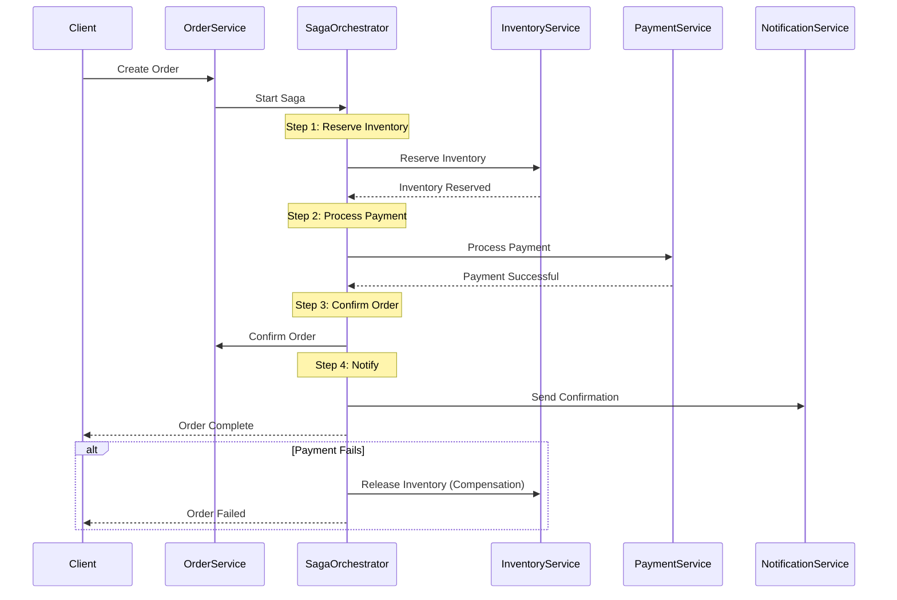

comprehensive documentation for Order Service with Saga pattern implementation.

## **Order Service - Complete Documentation**

### **Table of Contents**
1. [Overview](#overview)
2. [Architecture](#architecture)
3. [Saga Pattern Implementation](#saga-pattern-implementation)
4. [Getting Started](#getting-started)
5. [API Documentation](#api-documentation)
6. [Database Schema](#database-schema)
7. [Order State Machine](#order-state-machine)
8. [Event System](#event-system)
9. [Error Handling](#error-handling)
10. [Monitoring & Logging](#monitoring--logging)
11. [Deployment](#deployment)
12. [Troubleshooting](#troubleshooting)
13. [API Reference](#api-reference)

---

## **1. Overview**

### **1.1 Purpose**
The Order Service is the central orchestration engine for the e-commerce platform, responsible for:
- Order creation and management
- Distributed transaction coordination using Saga pattern
- Order state management and workflow
- Payment processing coordination
- Inventory reservation and confirmation
- Shipping tracking and updates
- Order cancellation and refunds
- Real-time order status tracking

### **1.2 Key Features**
- ✅ **Saga Pattern** for distributed transactions
- ✅ **State machine** for order workflow
- ✅ **Event-driven architecture** with RabbitMQ
- ✅ **Idempotent operations** for reliability
- ✅ **Compensation transactions** for rollbacks
- ✅ **Real-time order tracking**
- ✅ **Automatic retry mechanisms**
- ✅ **Timeout handling** for long-running transactions
- ✅ **Order timeline** with full history
- ✅ **Payment integration** with webhooks
- ✅ **Inventory integration** with reservation system
- ✅ **Cancellation with refunds**

### **1.3 Technology Stack**
| Component | Technology | Version |
|-----------|------------|---------|
| Runtime | Node.js | 18+ |
| Framework | Express.js | 4.18+ |
| Database | MongoDB | 5.0+ |
| Cache | Redis | 6.0+ |
| Message Broker | RabbitMQ | 3.8+ |
| Validation | Joi | 17.9+ |
| Logging | Winston | 3.10+ |

---

## **2. Architecture**

### **2.1 System Architecture**
```
┌─────────────────────────────────────────────────────────────────┐
│                        Order Service                             │
│  ┌──────────────┐  ┌──────────────┐  ┌──────────────┐          │
│  │   Order      │  │   Saga       │  │   Order      │          │
│  │ Controller   │  │ Orchestrator │  │   State      │          │
│  └──────────────┘  └──────────────┘  └──────────────┘          │
│  ┌──────────────┐  ┌──────────────┐  ┌──────────────┐          │
│  │   Order      │  │   Payment    │  │   Inventory  │          │
│  │   Service    │  │   Service    │  │   Service    │          │
│  └──────────────┘  └──────────────┘  └──────────────┘          │
└───────┬──────────────┬──────────────┬───────────────────────────┘
        │              │              │
        ▼              ▼              ▼
┌──────────────┐ ┌─────────────┐ ┌──────────────┐
│   MongoDB    │ │    Redis    │ │   RabbitMQ   │
│   Database   │ │    Cache    │ │    Events    │
└──────────────┘ └─────────────┘ └──────────────┘
        │              │              │
        └──────────────┼──────────────┘
                       ▼
              ┌──────────────┐
              │  Payment     │
              │  Service     │
              └──────────────┘
                       │
                       ▼
              ┌──────────────┐
              │  Inventory   │
              │  Service     │
              └──────────────┘
```

### **2.2 Saga Pattern Flow**


### **2.3 Data Flow - Order Creation**
```
1. Client → POST /orders
   ↓
2. Validate order data
   ↓
3. Create order (status: pending)
   ↓
4. Start Saga Orchestrator
   ↓
5. Reserve Inventory (Inventory Service)
   ↓
6. Process Payment (Payment Service)
   ↓
7. Confirm Order (status: confirmed)
   ↓
8. Send Notifications
   ↓
9. Return order details
```

---

## **3. Saga Pattern Implementation**

### **3.1 Saga Overview**
The Saga pattern manages distributed transactions across multiple services (Inventory, Payment, Notification) with compensation transactions for rollbacks.

### **3.2 Saga Steps**

| Step | Action | Compensation | Timeout |
|------|--------|--------------|---------|
| 1 | Reserve Inventory | Release Inventory | 10 seconds |
| 2 | Process Payment | Refund Payment | 15 seconds |
| 3 | Confirm Order | Cancel Order | 5 seconds |
| 4 | Send Notifications | None (optional) | 5 seconds |

### **3.3 Saga Context**
```json
{
  "sagaId": "550e8400-e29b-41d4-a716-446655440000",
  "orderId": "507f1f77bcf86cd799439011",
  "orderNumber": "ORD-202401-000001",
  "userId": "user_123",
  "items": [...],
  "total": 114.98,
  "step": "process_payment",
  "compensationSteps": [
    { "step": "refund_payment", "data": {...} },
    { "step": "release_inventory", "data": {...} }
  ]
}
```

### **3.4 Compensation Strategies**

| Failure Point | Compensation Action | Retry Strategy |
|---------------|---------------------|----------------|
| Inventory Reserve Failed | No compensation needed | Retry 3 times |
| Payment Failed | Release inventory | Retry 2 times |
| Order Confirm Failed | Refund + Release inventory | Retry 3 times |
| Timeout | Full compensation | Manual intervention |

### **3.5 Idempotency Keys**
```javascript
// Each order request has an idempotency key
POST /orders
Idempotency-Key: 550e8400-e29b-41d4-a716-446655440000

// Prevents duplicate order creation
```

---

## **4. Getting Started**

### **4.1 Prerequisites**
```bash
# Required software
Node.js >= 18.0.0
MongoDB >= 5.0
Redis >= 6.0
RabbitMQ >= 3.8

# Optional
Docker >= 20.0
Docker Compose >= 1.29
```

### **4.2 Installation**

```bash
# Clone repository
git clone https://github.com/your-org/order-service.git
cd order-service

# Install dependencies
npm install

# Copy environment variables
cp .env.example .env

# Edit configuration
nano .env

# Start dependencies
docker-compose up -d mongodb redis rabbitmq

# Seed database
npm run db:seed

# Start development server
npm run dev

# Run tests
npm test
```

### **4.3 Docker Setup**

**docker-compose.yml**
```yaml
version: '3.8'
services:
  order-service:
    build: .
    ports:
      - "3003:3003"
    environment:
      - NODE_ENV=production
      - MONGODB_URI=mongodb://mongodb:27017/order_service
      - REDIS_HOST=redis
      - RABBITMQ_URL=amqp://rabbitmq:5672
    depends_on:
      - mongodb
      - redis
      - rabbitmq
    restart: unless-stopped

  mongodb:
    image: mongo:5.0
    ports:
      - "27017:27017"
    volumes:
      - mongodb_data:/data/db

  redis:
    image: redis:6.2-alpine
    ports:
      - "6379:6379"

  rabbitmq:
    image: rabbitmq:3.9-management
    ports:
      - "5672:5672"
      - "15672:15672"

volumes:
  mongodb_data:
```

### **3.4 Environment Variables**

| Variable | Description | Default | Required |
|----------|-------------|---------|----------|
| `PORT` | Service port | 3003 | No |
| `NODE_ENV` | Environment | development | No |
| `MONGODB_URI` | MongoDB connection string | - | Yes |
| `REDIS_HOST` | Redis host | localhost | Yes |
| `REDIS_PORT` | Redis port | 6379 | Yes |
| `RABBITMQ_URL` | RabbitMQ URL | - | Yes |
| `JWT_SECRET` | JWT secret for auth | - | Yes |
| `SAGA_TIMEOUT_MS` | Saga step timeout | 30000 | No |
| `SAGA_COMPENSATION_RETRY_COUNT` | Retry attempts | 3 | No |
| `ORDER_TIMEOUT_MINUTES` | Order expiry | 30 | No |
| `MAX_ORDER_ITEMS` | Max items per order | 50 | No |
| `MIN_ORDER_AMOUNT` | Minimum order amount | 0.01 | No |
| `MAX_ORDER_AMOUNT` | Maximum order amount | 100000 | No |

---

## **5. API Documentation**

### **5.1 Base URL**
```
Development: http://localhost:3003/api/v1
Production: https://api.yourdomain.com/orders/api/v1
```

### **5.2 Authentication**
All endpoints require JWT token:
```http
Authorization: Bearer <your_jwt_token>
```

### **5.3 Order Endpoints**

#### **Create Order**
```http
POST /orders
Idempotency-Key: <unique-key>
```

**Request Body:**
```json
{
  "items": [
    {
      "productId": "507f1f77bcf86cd799439033",
      "sku": "APL-IP15P-001",
      "name": "iPhone 15 Pro",
      "quantity": 1,
      "price": 999.99
    },
    {
      "productId": "507f1f77bcf86cd799439034",
      "sku": "APL-ACC-001",
      "name": "iPhone Case",
      "quantity": 2,
      "price": 29.99
    }
  ],
  "customer": {
    "email": "john@example.com",
    "name": "John Doe",
    "phone": "+1234567890"
  },
  "shipping": {
    "address": {
      "street": "123 Main St",
      "city": "New York",
      "state": "NY",
      "country": "USA",
      "zipCode": "10001"
    },
    "method": "express"
  },
  "discount": 50.00,
  "couponCode": "WELCOME10",
  "notes": "Please leave at front door",
  "taxRate": 0.1,
  "shippingCost": 10.00
}
```

**Response (201 Created):**
```json
{
  "success": true,
  "message": "Order created successfully",
  "data": {
    "_id": "507f1f77bcf86cd799439055",
    "orderNumber": "ORD-202401-000001",
    "userId": "user_123",
    "customer": {
      "email": "john@example.com",
      "name": "John Doe",
      "phone": "+1234567890"
    },
    "items": [
      {
        "productId": "507f1f77bcf86cd799439033",
        "sku": "APL-IP15P-001",
        "name": "iPhone 15 Pro",
        "quantity": 1,
        "price": 999.99,
        "total": 999.99
      }
    ],
    "summary": {
      "subtotal": 1059.97,
      "discount": 50.00,
      "tax": 105.99,
      "shipping": 10.00,
      "total": 1125.96
    },
    "status": "confirmed",
    "payment": {
      "transactionId": "txn_123456",
      "paymentStatus": "completed",
      "amount": 1125.96,
      "paidAt": "2024-01-15T10:30:00Z"
    },
    "shipping": {
      "address": {
        "street": "123 Main St",
        "city": "New York",
        "state": "NY",
        "country": "USA",
        "zipCode": "10001"
      },
      "method": "express",
      "trackingNumber": null,
      "carrier": null
    },
    "timeline": [
      {
        "status": "pending",
        "message": "Order created",
        "timestamp": "2024-01-15T10:30:00Z"
      },
      {
        "status": "confirmed",
        "message": "Order confirmed",
        "timestamp": "2024-01-15T10:30:05Z"
      }
    ],
    "createdAt": "2024-01-15T10:30:00Z"
  }
}
```

#### **Get Order by ID**
```http
GET /orders/:id
```

**Response (200 OK):**
```json
{
  "success": true,
  "data": {
    "_id": "507f1f77bcf86cd799439055",
    "orderNumber": "ORD-202401-000001",
    "status": "shipped",
    "summary": {
      "total": 1125.96
    },
    "shipping": {
      "trackingNumber": "1Z999AA10123456784",
      "carrier": "UPS",
      "estimatedDelivery": "2024-01-18T00:00:00Z"
    },
    "timeline": [
      {
        "status": "pending",
        "message": "Order created",
        "timestamp": "2024-01-15T10:30:00Z"
      },
      {
        "status": "confirmed",
        "message": "Order confirmed",
        "timestamp": "2024-01-15T10:30:05Z"
      },
      {
        "status": "shipped",
        "message": "Order shipped via UPS, Tracking: 1Z999AA10123456784",
        "timestamp": "2024-01-16T09:15:00Z"
      }
    ]
  }
}
```

#### **Get User Orders**
```http
GET /orders/my-orders?page=1&limit=20&status=delivered&startDate=2024-01-01&endDate=2024-01-31
```

**Query Parameters:**
| Parameter | Type | Description |
|-----------|------|-------------|
| page | integer | Page number (default: 1) |
| limit | integer | Items per page (default: 20) |
| status | string | Filter by status |
| startDate | date | Filter by start date |
| endDate | date | Filter by end date |

**Response (200 OK):**
```json
{
  "success": true,
  "data": {
    "orders": [...],
    "pagination": {
      "page": 1,
      "limit": 20,
      "total": 45,
      "pages": 3,
      "hasNext": true,
      "hasPrev": false
    }
  }
}
```

#### **Cancel Order**
```http
POST /orders/:id/cancel
```

**Request Body:**
```json
{
  "reason": "Changed my mind"
}
```

**Response (200 OK):**
```json
{
  "success": true,
  "message": "Order cancelled successfully",
  "data": {
    "_id": "507f1f77bcf86cd799439055",
    "status": "cancelled",
    "payment": {
      "refundAmount": 1125.96,
      "refundReason": "Order cancelled by customer"
    }
  }
}
```

#### **Update Order Status (Admin)**
```http
PUT /orders/admin/:id/status
```

**Headers:**
```
Authorization: Bearer <admin_token>
```

**Request Body:**
```json
{
  "status": "shipped",
  "note": "Order shipped via UPS"
}
```

**Response (200 OK):**
```json
{
  "success": true,
  "message": "Order status updated successfully",
  "data": { ... }
}
```

#### **Update Shipping Info (Admin)**
```http
PUT /orders/admin/:id/shipping
```

**Request Body:**
```json
{
  "trackingNumber": "1Z999AA10123456784",
  "carrier": "UPS",
  "estimatedDelivery": "2024-01-18"
}
```

#### **Get Order Timeline**
```http
GET /orders/:id/timeline
```

**Response (200 OK):**
```json
{
  "success": true,
  "data": {
    "timeline": [
      {
        "status": "pending",
        "message": "Order created",
        "timestamp": "2024-01-15T10:30:00Z",
        "metadata": {}
      },
      {
        "status": "confirmed",
        "message": "Order confirmed",
        "timestamp": "2024-01-15T10:30:05Z",
        "metadata": {
          "paymentTransactionId": "txn_123456"
        }
      }
    ],
    "estimatedDelivery": "2024-01-18T00:00:00Z",
    "currentStatus": "confirmed"
  }
}
```

#### **Get Order Statistics (Admin)**
```http
GET /orders/admin/stats
```

**Response (200 OK):**
```json
{
  "success": true,
  "data": {
    "byStatus": [
      { "_id": "confirmed", "count": 150, "totalAmount": 125000 },
      { "_id": "shipped", "count": 75, "totalAmount": 62000 },
      { "_id": "delivered", "count": 200, "totalAmount": 180000 },
      { "_id": "cancelled", "count": 25, "totalAmount": 15000 }
    ],
    "today": {
      "orders": 12,
      "revenue": 14850.50
    },
    "averageOrderValue": 425.75,
    "totalOrders": 450
  }
}
```

#### **Search Orders (Admin)**
```http
GET /orders/admin/search?q=john@example.com&status=confirmed&page=1&limit=20
```

**Response (200 OK):**
```json
{
  "success": true,
  "data": {
    "orders": [...],
    "pagination": { ... }
  }
}
```

#### **Transition Order State (Admin)**
```http
POST /orders/admin/:id/transition
```

**Request Body:**
```json
{
  "newStatus": "shipped",
  "message": "Order has been shipped",
  "metadata": {
    "trackingNumber": "1Z999AA10123456784",
    "carrier": "UPS"
  }
}
```

---

## **6. Database Schema**

### **6.1 Order Schema**
```javascript
{
  _id: ObjectId,
  orderNumber: String,              // Unique order number (ORD-YYYYMM-XXXXXX)
  userId: String,                   // User ID from auth service
  customer: {
    email: String,                  // Customer email
    name: String,                   // Customer full name
    phone: String                   // Customer phone number
  },
  items: [{
    productId: String,              // Product ID
    sku: String,                    // Product SKU
    name: String,                   // Product name at time of order
    quantity: Number,               // Quantity ordered
    price: Number,                  // Price at time of order
    total: Number,                  // Line total
    image: String                   // Product image URL
  }],
  summary: {
    subtotal: Number,               // Subtotal before discounts
    discount: Number,               // Discount amount
    tax: Number,                    // Tax amount
    shipping: Number,               // Shipping cost
    total: Number                   // Grand total
  },
  status: String,                   // Order status
  payment: {
    transactionId: String,          // Payment gateway transaction ID
    paymentMethod: String,          // Payment method used
    paymentStatus: String,          // pending/completed/failed/refunded
    amount: Number,                 // Amount paid
    paidAt: Date,                   // Payment timestamp
    refundAmount: Number,           // Amount refunded
    refundReason: String            // Reason for refund
  },
  shipping: {
    address: {                      // Shipping address
      street: String,
      city: String,
      state: String,
      country: String,
      zipCode: String
    },
    method: String,                 // standard/express/overnight
    trackingNumber: String,         // Shipping tracking number
    carrier: String,                // Shipping carrier (UPS/FedEx/USPS)
    estimatedDelivery: Date,        // Estimated delivery date
    shippedAt: Date,                // Date shipped
    deliveredAt: Date               // Date delivered
  },
  timeline: [{