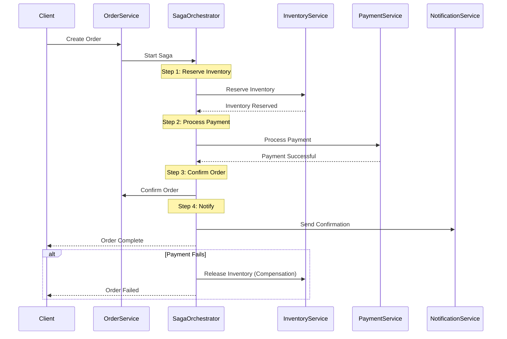

comprehensive documentation for Order Service with Saga pattern implementation.

## **Order Service - Complete Documentation**

### **Table of Contents**
1. [Overview](#overview)
2. [Architecture](#architecture)
3. [Saga Pattern Implementation](#saga-pattern-implementation)
4. [Getting Started](#getting-started)
5. [API Documentation](#api-documentation)
6. [Database Schema](#database-schema)
7. [Order State Machine](#order-state-machine)
8. [Event System](#event-system)
9. [Error Handling](#error-handling)
10. [Monitoring & Logging](#monitoring--logging)
11. [Deployment](#deployment)
12. [Troubleshooting](#troubleshooting)
13. [API Reference](#api-reference)

---

## **1. Overview**

### **1.1 Purpose**
The Order Service is the central orchestration engine for the e-commerce platform, responsible for:
- Order creation and management
- Distributed transaction coordination using Saga pattern
- Order state management and workflow
- Payment processing coordination
- Inventory reservation and confirmation
- Shipping tracking and updates
- Order cancellation and refunds
- Real-time order status tracking

### **1.2 Key Features**
- ✅ **Saga Pattern** for distributed transactions
- ✅ **State machine** for order workflow
- ✅ **Event-driven architecture** with RabbitMQ
- ✅ **Idempotent operations** for reliability
- ✅ **Compensation transactions** for rollbacks
- ✅ **Real-time order tracking**
- ✅ **Automatic retry mechanisms**
- ✅ **Timeout handling** for long-running transactions
- ✅ **Order timeline** with full history
- ✅ **Payment integration** with webhooks
- ✅ **Inventory integration** with reservation system
- ✅ **Cancellation with refunds**

### **1.3 Technology Stack**
| Component | Technology | Version |
|-----------|------------|---------|
| Runtime | Node.js | 18+ |
| Framework | Express.js | 4.18+ |
| Database | MongoDB | 5.0+ |
| Cache | Redis | 6.0+ |
| Message Broker | RabbitMQ | 3.8+ |
| Validation | Joi | 17.9+ |
| Logging | Winston | 3.10+ |

---

## **2. Architecture**

### **2.1 System Architecture**
```
┌─────────────────────────────────────────────────────────────────┐
│                        Order Service                             │
│  ┌──────────────┐  ┌──────────────┐  ┌──────────────┐          │
│  │   Order      │  │   Saga       │  │   Order      │          │
│  │ Controller   │  │ Orchestrator │  │   State      │          │
│  └──────────────┘  └──────────────┘  └──────────────┘          │
│  ┌──────────────┐  ┌──────────────┐  ┌──────────────┐          │
│  │   Order      │  │   Payment    │  │   Inventory  │          │
│  │   Service    │  │   Service    │  │   Service    │          │
│  └──────────────┘  └──────────────┘  └──────────────┘          │
└───────┬──────────────┬──────────────┬───────────────────────────┘
        │              │              │
        ▼              ▼              ▼
┌──────────────┐ ┌─────────────┐ ┌──────────────┐
│   MongoDB    │ │    Redis    │ │   RabbitMQ   │
│   Database   │ │    Cache    │ │    Events    │
└──────────────┘ └─────────────┘ └──────────────┘
        │              │              │
        └──────────────┼──────────────┘
                       ▼
              ┌──────────────┐
              │  Payment     │
              │  Service     │
              └──────────────┘
                       │
                       ▼
              ┌──────────────┐
              │  Inventory   │
              │  Service     │
              └──────────────┘
```

### **2.2 Saga Pattern Flow**


### **2.3 Data Flow - Order Creation**
```
1. Client → POST /orders
   ↓
2. Validate order data
   ↓
3. Create order (status: pending)
   ↓
4. Start Saga Orchestrator
   ↓
5. Reserve Inventory (Inventory Service)
   ↓
6. Process Payment (Payment Service)
   ↓
7. Confirm Order (status: confirmed)
   ↓
8. Send Notifications
   ↓
9. Return order details
```

---

## **3. Saga Pattern Implementation**

### **3.1 Saga Overview**
The Saga pattern manages distributed transactions across multiple services (Inventory, Payment, Notification) with compensation transactions for rollbacks.

### **3.2 Saga Steps**

| Step | Action | Compensation | Timeout |
|------|--------|--------------|---------|
| 1 | Reserve Inventory | Release Inventory | 10 seconds |
| 2 | Process Payment | Refund Payment | 15 seconds |
| 3 | Confirm Order | Cancel Order | 5 seconds |
| 4 | Send Notifications | None (optional) | 5 seconds |

### **3.3 Saga Context**
```json
{
  "sagaId": "550e8400-e29b-41d4-a716-446655440000",
  "orderId": "507f1f77bcf86cd799439011",
  "orderNumber": "ORD-202401-000001",
  "userId": "user_123",
  "items": [...],
  "total": 114.98,
  "step": "process_payment",
  "compensationSteps": [
    { "step": "refund_payment", "data": {...} },
    { "step": "release_inventory", "data": {...} }
  ]
}
```

### **3.4 Compensation Strategies**

| Failure Point | Compensation Action | Retry Strategy |
|---------------|---------------------|----------------|
| Inventory Reserve Failed | No compensation needed | Retry 3 times |
| Payment Failed | Release inventory | Retry 2 times |
| Order Confirm Failed | Refund + Release inventory | Retry 3 times |
| Timeout | Full compensation | Manual intervention |

### **3.5 Idempotency Keys**
```javascript
// Each order request has an idempotency key
POST /orders
Idempotency-Key: 550e8400-e29b-41d4-a716-446655440000

// Prevents duplicate order creation
```

---

## **4. Getting Started**

### **4.1 Prerequisites**
```bash
# Required software
Node.js >= 18.0.0
MongoDB >= 5.0
Redis >= 6.0
RabbitMQ >= 3.8

# Optional
Docker >= 20.0
Docker Compose >= 1.29
```

### **4.2 Installation**

```bash
# Clone repository
git clone https://github.com/your-org/order-service.git
cd order-service

# Install dependencies
npm install

# Copy environment variables
cp .env.example .env

# Edit configuration
nano .env

# Start dependencies
docker-compose up -d mongodb redis rabbitmq

# Seed database
npm run db:seed

# Start development server
npm run dev

# Run tests
npm test
```

### **4.3 Docker Setup**

**docker-compose.yml**
```yaml
version: '3.8'
services:
  order-service:
    build: .
    ports:
      - "3003:3003"
    environment:
      - NODE_ENV=production
      - MONGODB_URI=mongodb://mongodb:27017/order_service
      - REDIS_HOST=redis
      - RABBITMQ_URL=amqp://rabbitmq:5672
    depends_on:
      - mongodb
      - redis
      - rabbitmq
    restart: unless-stopped

  mongodb:
    image: mongo:5.0
    ports:
      - "27017:27017"
    volumes:
      - mongodb_data:/data/db

  redis:
    image: redis:6.2-alpine
    ports:
      - "6379:6379"

  rabbitmq:
    image: rabbitmq:3.9-management
    ports:
      - "5672:5672"
      - "15672:15672"

volumes:
  mongodb_data:
```

### **3.4 Environment Variables**

| Variable | Description | Default | Required |
|----------|-------------|---------|----------|
| `PORT` | Service port | 3003 | No |
| `NODE_ENV` | Environment | development | No |
| `MONGODB_URI` | MongoDB connection string | - | Yes |
| `REDIS_HOST` | Redis host | localhost | Yes |
| `REDIS_PORT` | Redis port | 6379 | Yes |
| `RABBITMQ_URL` | RabbitMQ URL | - | Yes |
| `JWT_SECRET` | JWT secret for auth | - | Yes |
| `SAGA_TIMEOUT_MS` | Saga step timeout | 30000 | No |
| `SAGA_COMPENSATION_RETRY_COUNT` | Retry attempts | 3 | No |
| `ORDER_TIMEOUT_MINUTES` | Order expiry | 30 | No |
| `MAX_ORDER_ITEMS` | Max items per order | 50 | No |
| `MIN_ORDER_AMOUNT` | Minimum order amount | 0.01 | No |
| `MAX_ORDER_AMOUNT` | Maximum order amount | 100000 | No |

---

## **5. API Documentation**

### **5.1 Base URL**
```
Development: http://localhost:3003/api/v1
Production: https://api.yourdomain.com/orders/api/v1
```

### **5.2 Authentication**
All endpoints require JWT token:
```http
Authorization: Bearer <your_jwt_token>
```

### **5.3 Order Endpoints**

#### **Create Order**
```http
POST /orders
Idempotency-Key: <unique-key>
```

**Request Body:**
```json
{
  "items": [
    {
      "productId": "507f1f77bcf86cd799439033",
      "sku": "APL-IP15P-001",
      "name": "iPhone 15 Pro",
      "quantity": 1,
      "price": 999.99
    },
    {
      "productId": "507f1f77bcf86cd799439034",
      "sku": "APL-ACC-001",
      "name": "iPhone Case",
      "quantity": 2,
      "price": 29.99
    }
  ],
  "customer": {
    "email": "john@example.com",
    "name": "John Doe",
    "phone": "+1234567890"
  },
  "shipping": {
    "address": {
      "street": "123 Main St",
      "city": "New York",
      "state": "NY",
      "country": "USA",
      "zipCode": "10001"
    },
    "method": "express"
  },
  "discount": 50.00,
  "couponCode": "WELCOME10",
  "notes": "Please leave at front door",
  "taxRate": 0.1,
  "shippingCost": 10.00
}
```

**Response (201 Created):**
```json
{
  "success": true,
  "message": "Order created successfully",
  "data": {
    "_id": "507f1f77bcf86cd799439055",
    "orderNumber": "ORD-202401-000001",
    "userId": "user_123",
    "customer": {
      "email": "john@example.com",
      "name": "John Doe",
      "phone": "+1234567890"
    },
    "items": [
      {
        "productId": "507f1f77bcf86cd799439033",
        "sku": "APL-IP15P-001",
        "name": "iPhone 15 Pro",
        "quantity": 1,
        "price": 999.99,
        "total": 999.99
      }
    ],
    "summary": {
      "subtotal": 1059.97,
      "discount": 50.00,
      "tax": 105.99,
      "shipping": 10.00,
      "total": 1125.96
    },
    "status": "confirmed",
    "payment": {
      "transactionId": "txn_123456",
      "paymentStatus": "completed",
      "amount": 1125.96,
      "paidAt": "2024-01-15T10:30:00Z"
    },
    "shipping": {
      "address": {
        "street": "123 Main St",
        "city": "New York",
        "state": "NY",
        "country": "USA",
        "zipCode": "10001"
      },
      "method": "express",
      "trackingNumber": null,
      "carrier": null
    },
    "timeline": [
      {
        "status": "pending",
        "message": "Order created",
        "timestamp": "2024-01-15T10:30:00Z"
      },
      {
        "status": "confirmed",
        "message": "Order confirmed",
        "timestamp": "2024-01-15T10:30:05Z"
      }
    ],
    "createdAt": "2024-01-15T10:30:00Z"
  }
}
```

#### **Get Order by ID**
```http
GET /orders/:id
```

**Response (200 OK):**
```json
{
  "success": true,
  "data": {
    "_id": "507f1f77bcf86cd799439055",
    "orderNumber": "ORD-202401-000001",
    "status": "shipped",
    "summary": {
      "total": 1125.96
    },
    "shipping": {
      "trackingNumber": "1Z999AA10123456784",
      "carrier": "UPS",
      "estimatedDelivery": "2024-01-18T00:00:00Z"
    },
    "timeline": [
      {
        "status": "pending",
        "message": "Order created",
        "timestamp": "2024-01-15T10:30:00Z"
      },
      {
        "status": "confirmed",
        "message": "Order confirmed",
        "timestamp": "2024-01-15T10:30:05Z"
      },
      {
        "status": "shipped",
        "message": "Order shipped via UPS, Tracking: 1Z999AA10123456784",
        "timestamp": "2024-01-16T09:15:00Z"
      }
    ]
  }
}
```

#### **Get User Orders**
```http
GET /orders/my-orders?page=1&limit=20&status=delivered&startDate=2024-01-01&endDate=2024-01-31
```

**Query Parameters:**
| Parameter | Type | Description |
|-----------|------|-------------|
| page | integer | Page number (default: 1) |
| limit | integer | Items per page (default: 20) |
| status | string | Filter by status |
| startDate | date | Filter by start date |
| endDate | date | Filter by end date |

**Response (200 OK):**
```json
{
  "success": true,
  "data": {
    "orders": [...],
    "pagination": {
      "page": 1,
      "limit": 20,
      "total": 45,
      "pages": 3,
      "hasNext": true,
      "hasPrev": false
    }
  }
}
```

#### **Cancel Order**
```http
POST /orders/:id/cancel
```

**Request Body:**
```json
{
  "reason": "Changed my mind"
}
```

**Response (200 OK):**
```json
{
  "success": true,
  "message": "Order cancelled successfully",
  "data": {
    "_id": "507f1f77bcf86cd799439055",
    "status": "cancelled",
    "payment": {
      "refundAmount": 1125.96,
      "refundReason": "Order cancelled by customer"
    }
  }
}
```

#### **Update Order Status (Admin)**
```http
PUT /orders/admin/:id/status
```

**Headers:**
```
Authorization: Bearer <admin_token>
```

**Request Body:**
```json
{
  "status": "shipped",
  "note": "Order shipped via UPS"
}
```

**Response (200 OK):**
```json
{
  "success": true,
  "message": "Order status updated successfully",
  "data": { ... }
}
```

#### **Update Shipping Info (Admin)**
```http
PUT /orders/admin/:id/shipping
```

**Request Body:**
```json
{
  "trackingNumber": "1Z999AA10123456784",
  "carrier": "UPS",
  "estimatedDelivery": "2024-01-18"
}
```

#### **Get Order Timeline**
```http
GET /orders/:id/timeline
```

**Response (200 OK):**
```json
{
  "success": true,
  "data": {
    "timeline": [
      {
        "status": "pending",
        "message": "Order created",
        "timestamp": "2024-01-15T10:30:00Z",
        "metadata": {}
      },
      {
        "status": "confirmed",
        "message": "Order confirmed",
        "timestamp": "2024-01-15T10:30:05Z",
        "metadata": {
          "paymentTransactionId": "txn_123456"
        }
      }
    ],
    "estimatedDelivery": "2024-01-18T00:00:00Z",
    "currentStatus": "confirmed"
  }
}
```

#### **Get Order Statistics (Admin)**
```http
GET /orders/admin/stats
```

**Response (200 OK):**
```json
{
  "success": true,
  "data": {
    "byStatus": [
      { "_id": "confirmed", "count": 150, "totalAmount": 125000 },
      { "_id": "shipped", "count": 75, "totalAmount": 62000 },
      { "_id": "delivered", "count": 200, "totalAmount": 180000 },
      { "_id": "cancelled", "count": 25, "totalAmount": 15000 }
    ],
    "today": {
      "orders": 12,
      "revenue": 14850.50
    },
    "averageOrderValue": 425.75,
    "totalOrders": 450
  }
}
```

#### **Search Orders (Admin)**
```http
GET /orders/admin/search?q=john@example.com&status=confirmed&page=1&limit=20
```

**Response (200 OK):**
```json
{
  "success": true,
  "data": {
    "orders": [...],
    "pagination": { ... }
  }
}
```

#### **Transition Order State (Admin)**
```http
POST /orders/admin/:id/transition
```

**Request Body:**
```json
{
  "newStatus": "shipped",
  "message": "Order has been shipped",
  "metadata": {
    "trackingNumber": "1Z999AA10123456784",
    "carrier": "UPS"
  }
}
```

---

## **6. Database Schema**

### **6.1 Order Schema**
```javascript
{
  _id: ObjectId,
  orderNumber: String,              // Unique order number (ORD-YYYYMM-XXXXXX)
  userId: String,                   // User ID from auth service
  customer: {
    email: String,                  // Customer email
    name: String,                   // Customer full name
    phone: String                   // Customer phone number
  },
  items: [{
    productId: String,              // Product ID
    sku: String,                    // Product SKU
    name: String,                   // Product name at time of order
    quantity: Number,               // Quantity ordered
    price: Number,                  // Price at time of order
    total: Number,                  // Line total
    image: String                   // Product image URL
  }],
  summary: {
    subtotal: Number,               // Subtotal before discounts
    discount: Number,               // Discount amount
    tax: Number,                    // Tax amount
    shipping: Number,               // Shipping cost
    total: Number                   // Grand total
  },
  status: String,                   // Order status
  payment: {
    transactionId: String,          // Payment gateway transaction ID
    paymentMethod: String,          // Payment method used
    paymentStatus: String,          // pending/completed/failed/refunded
    amount: Number,                 // Amount paid
    paidAt: Date,                   // Payment timestamp
    refundAmount: Number,           // Amount refunded
    refundReason: String            // Reason for refund
  },
  shipping: {
    address: {                      // Shipping address
      street: String,
      city: String,
      state: String,
      country: String,
      zipCode: String
    },
    method: String,                 // standard/express/overnight
    trackingNumber: String,         // Shipping tracking number
    carrier: String,                // Shipping carrier (UPS/FedEx/USPS)
    estimatedDelivery: Date,        // Estimated delivery date
    shippedAt: Date,                // Date shipped
    deliveredAt: Date               // Date delivered
  },
  timeline: [{                      // Order timeline entries
    status: String,                 // Status at this point
    message: String,                // Human readable message
    timestamp: Date,                // When this happened
    metadata: Object                // Additional data
  }],
  saga: {                           // Saga orchestration data
    step: String,                   // Current saga step
    context: Object,                // Saga context data
    compensationAttempts: Number    // Number of compensation attempts
  },
  metadata: {
    ipAddress: String,              // Customer IP at order time
    userAgent: String,              // Browser/device info
    couponCode: String,             // Applied coupon code
    notes: String                   // Customer notes
  },
  expiresAt: Date,                  // Auto-expiry for pending orders
  createdAt: Date,
  updatedAt: Date
}
```

### **6.2 OrderStatus Schema**
```javascript
{
  _id: ObjectId,
  orderId: ObjectId,                // Reference to Order
  history: [{
    status: String,                 // Status value
    timestamp: Date,                // When status changed
    note: String,                   // Additional note
    operator: String,               // Who changed it (user/system)
    metadata: Object                // Additional context
  }],
  current: {
    status: String,                 // Current status
    since: Date                     // Since when
  },
  estimated: {
    processing: Date,               // Estimated processing complete
    shipping: Date,                 // Estimated shipping date
    delivery: Date                  // Estimated delivery date
  },
  createdAt: Date,
  updatedAt: Date
}
```

### **6.3 Indexes**
```javascript
// Order indexes
db.orders.createIndex({ orderNumber: 1 }, { unique: true })
db.orders.createIndex({ userId: 1, createdAt: -1 })
db.orders.createIndex({ status: 1, createdAt: -1 })
db.orders.createIndex({ 'payment.transactionId': 1 })
db.orders.createIndex({ expiresAt: 1 }, { expireAfterSeconds: 0 })

// OrderStatus indexes
db.orderstatuses.createIndex({ orderId: 1 }, { unique: true })
db.orderstatuses.createIndex({ 'current.status': 1 })
```

---

## **7. Order State Machine**

### **7.1 State Transitions**

```
┌─────────┐
│ pending │
└────┬────┘
     │
     ▼
┌─────────────────┐
│ awaiting_payment│
└────┬────────────┘
     │
     ▼
┌──────────────────┐
│payment_processing│
└────┬─────────────┘
     │
     ├──────────────┐
     ▼              ▼
┌──────────┐  ┌─────────────┐
│confirmed │  │payment_failed│
└────┬─────┘  └──────┬──────┘
     │              │
     ▼              │
┌──────────┐        │
│processing│        │
└────┬─────┘        │
     │              │
     ▼              │
┌────────┐          │
│ shipped│          │
└────┬───┘          │
     │              │
     ▼              │
┌─────────┐         │
│delivered│         │
└────┬────┘         │
     │              │
     ▼              │
┌─────────┐         │
│ refunded│         │
└─────────┘         │
                    │
              ┌─────▼─────┐
              │ cancelled │
              └───────────┘
```

### **7.2 Valid Transitions**

| From | To | Allowed | Requires |
|------|-----|---------|----------|
| pending | awaiting_payment | ✅ | - |
| pending | cancelled | ✅ | Customer action |
| awaiting_payment | payment_processing | ✅ | Auto |
| awaiting_payment | cancelled | ✅ | Customer action |
| payment_processing | confirmed | ✅ | Payment success |
| payment_processing | payment_failed | ✅ | Payment failure |
| payment_failed | awaiting_payment | ✅ | Retry payment |
| confirmed | processing | ✅ | Auto |
| confirmed | cancelled | ✅ | Admin only |
| processing | shipped | ✅ | Admin only |
| shipped | delivered | ✅ | Auto/Admin |
| delivered | refunded | ✅ | Admin only |

### **7.3 State Actions**

```javascript
const stateActions = {
  'confirmed': async (order) => {
    // Confirm inventory deduction
    await inventoryService.confirm(order.id);
    // Send confirmation email
    await notificationService.sendOrderConfirmed(order);
  },
  
  'shipped': async (order) => {
    // Update inventory (already deducted)
    // Send shipping notification with tracking
    await notificationService.sendOrderShipped(order);
  },
  
  'delivered': async (order) => {
    // Update order completion metrics
    await analyticsService.trackDelivery(order.id);
    // Request review
    await notificationService.requestReview(order);
  },
  
  'cancelled': async (order) => {
    // Release inventory
    await inventoryService.release(order.id);
    // Process refund if paid
    if (order.payment.paymentStatus === 'completed') {
      await paymentService.refund(order.id);
    }
  }
};
```

### **7.4 Order Timeline Example**

```json
{
  "timeline": [
    {
      "status": "pending",
      "message": "Order created",
      "timestamp": "2024-01-15T10:30:00Z"
    },
    {
      "status": "awaiting_payment",
      "message": "Awaiting payment confirmation",
      "timestamp": "2024-01-15T10:30:01Z"
    },
    {
      "status": "payment_processing",
      "message": "Processing payment",
      "timestamp": "2024-01-15T10:30:02Z"
    },
    {
      "status": "confirmed",
      "message": "Payment confirmed",
      "timestamp": "2024-01-15T10:30:05Z"
    },
    {
      "status": "processing",
      "message": "Order is being processed",
      "timestamp": "2024-01-15T10:31:00Z"
    },
    {
      "status": "shipped",
      "message": "Order shipped via UPS. Tracking: 1Z999AA10123456784",
      "timestamp": "2024-01-16T09:15:00Z",
      "metadata": {
        "trackingNumber": "1Z999AA10123456784",
        "carrier": "UPS"
      }
    },
    {
      "status": "delivered",
      "message": "Order delivered",
      "timestamp": "2024-01-18T14:30:00Z"
    }
  ]
}
```

---

## **8. Event System**

### **8.1 Published Events**

| Event | Routing Key | Trigger | Payload |
|-------|-------------|---------|---------|
| Order Created | `order.created` | Order placed | orderId, userId, total, items |
| Order Confirmed | `order.confirmed` | Payment confirmed | orderId, userId, total |
| Order Shipped | `order.shipped` | Shipping updated | orderId, tracking, carrier |
| Order Delivered | `order.delivered` | Delivery confirmed | orderId, deliveredAt |
| Order Cancelled | `order.cancelled` | Order cancelled | orderId, reason |
| Order Status Updated | `order.status.updated` | Status change | oldStatus, newStatus |

### **8.2 Subscribed Events**

| Event | Source | Action |
|-------|--------|--------|
| `payment.response` | Payment Service | Handle payment result |
| `inventory.response` | Inventory Service | Handle inventory result |
| `payment.refund.completed` | Payment Service | Update refund status |

### **8.3 Event Examples**

#### **Order Created Event**
```json
{
  "eventId": "550e8400-e29b-41d4-a716-446655440000",
  "eventType": "order.created",
  "version": "1.0",
  "timestamp": "2024-01-15T10:30:00Z",
  "source": "order-service",
  "data": {
    "orderId": "507f1f77bcf86cd799439055",
    "orderNumber": "ORD-202401-000001",
    "userId": "user_123",
    "total": 1125.96,
    "items": [
      {
        "productId": "507f1f77bcf86cd799439033",
        "quantity": 1,
        "price": 999.99
      }
    ]
  }
}
```

#### **Payment Request Event**
```json
{
  "eventId": "550e8400-e29b-41d4-a716-446655440001",
  "eventType": "payment.request",
  "version": "1.0",
  "timestamp": "2024-01-15T10:30:01Z",
  "source": "order-service",
  "data": {
    "orderId": "507f1f77bcf86cd799439055",
    "orderNumber": "ORD-202401-000001",
    "userId": "user_123",
    "amount": 1125.96,
    "currency": "USD",
    "paymentMethod": "credit_card",
    "customer": {
      "email": "john@example.com",
      "name": "John Doe"
    }
  }
}
```

---

## **9. Error Handling**

### **9.1 Error Response Format**
```json
{
  "success": false,
  "message": "Error description",
  "timestamp": "2024-01-15T10:30:00Z",
  "details": ["Additional error details"]
}
```

### **9.2 HTTP Status Codes**

| Status | Description |
|--------|-------------|
| 200 | Success |
| 201 | Created |
| 400 | Bad Request - Invalid input |
| 401 | Unauthorized - Invalid token |
| 403 | Forbidden - Insufficient permissions |
| 404 | Not Found - Order doesn't exist |
| 409 | Conflict - Idempotency key already used |
| 422 | Unprocessable Entity - Validation failed |
| 429 | Too Many Requests - Rate limit |
| 500 | Internal Server Error |

### **9.3 Common Errors**

#### **Invalid State Transition**
```json
{
  "success": false,
  "message": "Invalid state transition: shipped -> pending",
  "timestamp": "2024-01-15T10:30:00Z"
}
```

#### **Cannot Cancel Order**
```json
{
  "success": false,
  "message": "Cannot cancel order in shipped status",
  "timestamp": "2024-01-15T10:30:00Z"
}
```

#### **Insufficient Inventory**
```json
{
  "success": false,
  "message": "Insufficient inventory for product: iPhone 15 Pro",
  "timestamp": "2024-01-15T10:30:00Z",
  "details": ["Available: 5, Requested: 10"]
}
```

#### **Payment Failed**
```json
{
  "success": false,
  "message": "Payment processing failed",
  "timestamp": "2024-01-15T10:30:00Z",
  "details": ["Insufficient funds"]
}
```

#### **Saga Timeout**
```json
{
  "success": false,
  "message": "Order processing timeout",
  "timestamp": "2024-01-15T10:30:00Z",
  "details": ["Saga step 'process_payment' timed out after 15000ms"]
}
```

---

## **10. Monitoring & Logging**

### **10.1 Health Check Endpoints**

#### **Full Health Check**
```http
GET /health
```

**Response:**
```json
{
  "status": "healthy",
  "service": "order-service",
  "version": "1.0.0",
  "timestamp": "2024-01-15T10:30:00Z",
  "uptime": 86400,
  "services": {
    "mongodb": "connected",
    "redis": "connected",
    "rabbitmq": "connected"
  }
}
```

#### **Readiness Probe**
```http
GET /health/ready
```

#### **Liveness Probe**
```http
GET /health/live
```

### **10.2 Metrics to Monitor**

| Metric | Description | Alert Threshold |
|--------|-------------|-----------------|
| Order Success Rate | % of successful orders | < 95% |
| Order Failure Rate | % of failed orders | > 5% |
| Saga Timeout Rate | % of saga timeouts | > 2% |
| Payment Success Rate | % of successful payments | < 98% |
| Inventory Reservation Rate | % of successful reservations | < 95% |
| Average Order Value | Average order total | < $50 |
| Orders per Minute | Order rate | > 100 |
| Saga Compensation Rate | % requiring compensation | > 1% |

### **10.3 Logging Levels**

| Level | Usage |
|-------|-------|
| **error** | Saga failures, payment errors, database issues |
| **warn** | Low inventory, payment retries, slow responses |
| **info** | Order creation, status changes, payment success |
| **debug** | Saga steps, cache operations (development) |

### **10.4 Log Examples**

#### **Order Created**
```json
{
  "level": "info",
  "message": "Order created",
  "service": "order-service",
  "timestamp": "2024-01-15T10:30:00Z",
  "orderId": "507f1f77bcf86cd799439055",
  "orderNumber": "ORD-202401-000001",
  "userId": "user_123",
  "total": 1125.96
}
```

#### **Saga Step**
```json
{
  "level": "debug",
  "message": "Saga step completed",
  "service": "order-service",
  "timestamp": "2024-01-15T10:30:02Z",
  "sagaId": "550e8400-e29b-41d4-a716-446655440000",
  "step": "reserve_inventory",
  "duration": 125
}
```

#### **Compensation Executed**
```json
{
  "level": "warn",
  "message": "Saga compensation executed",
  "service": "order-service",
  "timestamp": "2024-01-15T10:30:05Z",
  "sagaId": "550e8400-e29b-41d4-a716-446655440000",
  "failedStep": "process_payment",
  "compensationStep": "release_inventory",
  "reason": "Payment declined"
}
```

---

## **11. Deployment**

### **11.1 Kubernetes Deployment**

**deployment.yaml**
```yaml
apiVersion: apps/v1
kind: Deployment
metadata:
  name: order-service
  namespace: ecommerce
spec:
  replicas: 3
  selector:
    matchLabels:
      app: order-service
  template:
    metadata:
      labels:
        app: order-service
    spec:
      containers:
      - name: order-service
        image: order-service:latest
        ports:
        - containerPort: 3003
        env:
        - name: NODE_ENV
          value: "production"
        - name: MONGODB_URI
          valueFrom:
            secretKeyRef:
              name: mongodb-secret
              key: uri
        - name: REDIS_HOST
          value: "redis-service"
        - name: RABBITMQ_URL
          value: "amqp://rabbitmq-service:5672"
        resources:
          requests:
            memory: "256Mi"
            cpu: "250m"
          limits:
            memory: "512Mi"
            cpu: "500m"
        livenessProbe:
          httpGet:
            path: /health/live
            port: 3003
          initialDelaySeconds: 30
          periodSeconds: 10
        readinessProbe:
          httpGet:
            path: /health/ready
            port: 3003
          initialDelaySeconds: 5
          periodSeconds: 5
```

### **11.2 Environment Configuration**

| Environment | Replicas | Memory Limit | CPU Limit | Log Level |
|-------------|----------|--------------|-----------|-----------|
| Development | 1 | 512Mi | 500m | debug |
| Staging | 2 | 512Mi | 500m | info |
| Production | 3+ | 1Gi | 1000m | warn |

### **11.3 Performance Tuning**

```javascript
// MongoDB connection pool
mongoose.connect(uri, {
  maxPoolSize: 50,
  minPoolSize: 10
});

// Redis cache TTL
ORDER_CACHE_TTL = 300;  // 5 minutes for order details
USER_ORDERS_CACHE_TTL = 60;  // 1 minute for user orders

// Saga timeouts
SAGA_TIMEOUT_MS = 30000;  // 30 seconds total
INVENTORY_TIMEOUT = 10000;  // 10 seconds
PAYMENT_TIMEOUT = 15000;  // 15 seconds

// Retry configuration
MAX_RETRIES = 3;
RETRY_DELAY_MS = 2000;
```

### **11.4 Scaling Recommendations**

| Load | Replicas | MongoDB Pool | Redis Memory | RabbitMQ Nodes |
|------|----------|--------------|--------------|----------------|
| Low (< 100 orders/min) | 2 | 20 | 512MB | 1 |
| Medium (100-500 orders/min) | 4 | 50 | 2GB | 3 |
| High (> 500 orders/min) | 6+ | 100 | 4GB | 5+ |

---

## **12. Troubleshooting**

### **12.1 Common Issues & Solutions**

#### **Issue: Saga Timeout**
```bash
# Check saga context
redis-cli GET "saga:550e8400-e29b-41d4-a716-446655440000"

# Check service health
curl http://localhost:3003/health

# View saga logs
docker logs order-service | grep "saga.*timeout"
```

**Solution:** Increase timeout values or check dependent service health.

#### **Issue: Payment Processing Failed**
```bash
# Check payment service status
curl http://payment-service:3004/health

# View payment events
rabbitmqctl list_queues | grep payment

# Check order payment status
mongo order_service --eval "db.orders.find({_id: ObjectId('...')})"
```

**Solution:** Verify payment service is running and has sufficient funds.

#### **Issue: Inventory Reservation Failed**
```bash
# Check inventory levels
curl http://inventory-service:3005/api/v1/inventory/check/PROD-001

# View inventory events
rabbitmqctl list_bindings | grep inventory

# Check reserved inventory
mongo inventory_service --eval "db.inventory.find({sku: 'PROD-001'})"
```

**Solution:** Increase inventory levels or release stale reservations.

#### **Issue: Duplicate Orders**
```bash
# Check idempotency keys
redis-cli KEYS "idempotency:*"

# View recent orders by user
mongo order_service --eval "db.orders.find({userId: 'user_123'}).sort({createdAt: -1}).limit(5)"
```

**Solution:** Ensure idempotency keys are properly implemented.

### **12.2 Debugging Commands**

```bash
# View service logs
docker logs order-service -f --tail 100

# Check health
curl http://localhost:3003/health | jq

# Monitor RabbitMQ queues
rabbitmqctl list_queues name messages_ready messages_unacknowledged

# View Redis cache
redis-cli KEYS "order:*"
redis-cli GET "order:507f1f77bcf86cd799439055"

# Check database indexes
mongo order_service --eval "db.orders.getIndexes()"

# Monitor saga state
redis-cli KEYS "saga:*"

# Test order creation
curl -X POST http://localhost:3003/api/v1/orders \
  -H "Authorization: Bearer TOKEN" \
  -H "Content-Type: application/json" \
  -H "Idempotency-Key: test-123" \
  -d '{"items":[{"productId":"prod1","sku":"TEST","name":"Test","quantity":1,"price":10}],"customer":{"email":"test@test.com","name":"Test User"},"shipping":{"address":{"street":"123","city":"NY","state":"NY","country":"USA","zipCode":"10001"},"method":"standard"}}'
```

### **12.3 Recovery Procedures**

#### **Manual Order Confirmation**
```javascript
// If saga fails, manually confirm order
db.orders.updateOne(
  { _id: ObjectId("507f1f77bcf86cd799439055") },
  { 
    $set: { 
      status: "confirmed",
      "payment.paymentStatus": "completed",
      "payment.paidAt": new Date()
    },
    $push: {
      timeline: {
        status: "confirmed",
        message: "Manually confirmed by admin",
        timestamp: new Date()
      }
    }
  }
);
```

#### **Manual Inventory Release**
```javascript
// Release stuck inventory reservations
db.orders.updateOne(
  { _id: ObjectId("507f1f77bcf86cd799439055") },
  { $set: { status: "cancelled" } }
);

// Call inventory service to release
curl -X POST http://inventory-service:3005/api/v1/inventory/release \
  -H "Content-Type: application/json" \
  -d '{"orderId":"507f1f77bcf86cd799439055"}'
```

#### **Manual Refund Processing**
```javascript
// Process refund for cancelled order
db.orders.updateOne(
  { _id: ObjectId("507f1f77bcf86cd799439055") },
  {
    $set: {
      "payment.paymentStatus": "refunded",
      "payment.refundAmount": 1125.96,
      "payment.refundReason": "Manual refund by admin"
    }
  }
);
```

---

## **13. API Reference**

### **13.1 Quick Reference Card**

```bash
# Orders
GET    /orders/my-orders                    # List user orders
GET    /orders/:id                          # Get order by ID
POST   /orders                              # Create order
POST   /orders/:id/cancel                   # Cancel order
GET    /orders/:id/timeline                 # Get order timeline

# Admin Orders
GET    /orders/admin/stats                  # Get order statistics
GET    /orders/admin/search                 # Search orders
PUT    /orders/admin/:id/status             # Update order status
PUT    /orders/admin/:id/shipping           # Update shipping info
POST   /orders/admin/:id/transition         # Transition order state

# Order Status
GET    /orders/status/:orderId              # Get order status
PUT    /orders/status/:orderId              # Update status (admin)
GET    /orders/status/:orderId/history      # Get status history
GET    /orders/admin/metrics/status         # Get status metrics

# Health
GET    /health                              # Full health check
GET    /health/ready                        # Readiness probe
GET    /health/live                         # Liveness probe
```

### **13.2 Environment Variables Quick Reference**

| Variable | Default | Description |
|----------|---------|-------------|
| `PORT` | 3003 | Service port |
| `SAGA_TIMEOUT_MS` | 30000 | Saga step timeout |
| `SAGA_COMPENSATION_RETRY_COUNT` | 3 | Compensation retries |
| `ORDER_TIMEOUT_MINUTES` | 30 | Order expiry time |
| `MAX_ORDER_ITEMS` | 50 | Maximum items per order |
| `MIN_ORDER_AMOUNT` | 0.01 | Minimum order total |
| `MAX_ORDER_AMOUNT` | 100000 | Maximum order total |

### **13.3 Postman Collection**

```json
{
  "info": {
    "name": "Order Service API",
    "schema": "https://schema.getpostman.com/json/collection/v2.1.0/collection.json"
  },
  "variable": [
    {
      "key": "base_url",
      "value": "http://localhost:3003/api/v1"
    },
    {
      "key": "token",
      "value": "your_jwt_token"
    }
  ],
  "item": [
    {
      "name": "Orders",
      "item": [
        {
          "name": "Create Order",
          "request": {
            "method": "POST",
            "url": "{{base_url}}/orders",
            "header": [
              {
                "key": "Authorization",
                "value": "Bearer {{token}}"
              },
              {
                "key": "Idempotency-Key",
                "value": "{{$guid}}"
              }
            ],
            "body": {
              "mode": "raw",
              "raw": "{\n  \"items\": [\n    {\n      \"productId\": \"prod_001\",\n      \"sku\": \"TEST-001\",\n      \"name\": \"Test Product\",\n      \"quantity\": 1,\n      \"price\": 99.99\n    }\n  ],\n  \"customer\": {\n    \"email\": \"test@example.com\",\n    \"name\": \"Test User\",\n    \"phone\": \"+1234567890\"\n  },\n  \"shipping\": {\n    \"address\": {\n      \"street\": \"123 Main St\",\n      \"city\": \"New York\",\n      \"state\": \"NY\",\n      \"country\": \"USA\",\n      \"zipCode\": \"10001\"\n    },\n    \"method\": \"standard\"\n  }\n}"
            }
          }
        },
        {
          "name": "Get User Orders",
          "request": {
            "method": "GET",
            "url": "{{base_url}}/orders/my-orders?page=1&limit=10",
            "header": [
              {
                "key": "Authorization",
                "value": "Bearer {{token}}"
              }
            ]
          }
        }
      ]
    }
  ]
}
```

---

## **14. Changelog**

### **v1.0.0** (2024-01-15)
- Initial release
- Complete order management
- Saga pattern implementation
- State machine for order workflow
- Event-driven architecture
- Payment and inventory integration
- Order tracking with timeline
- Comprehensive error handling
- Redis caching implementation
- Health checks and monitoring

### **Planned Features**
- [ ] Order splitting for multiple shipments
- [ ] Advanced refund workflows
- [ ] Order editing before shipping
- [ ] Bulk order operations
- [ ] Order export (CSV/Excel)
- [ ] Webhook notifications
- [ ] Order analytics dashboard

---

## **15. SLA & Support**

### **15.1 Service Level Agreements**

| Metric | Target | Critical |
|--------|--------|----------|
| Availability | 99.9% | < 99.5% |
| Order Creation Latency (p95) | < 200ms | > 500ms |
| Saga Completion Time (p95) | < 5s | > 15s |
| Error Rate | < 0.1% | > 1% |

### **15.2 Support Contacts**

- **Email**: support@ecommerce.com
- **Documentation**: https://docs.ecommerce.com/order-service
- **Issue Tracker**: https://github.com/your-org/order-service/issues
- **Slack**: #order-service channel
- **On-Call**: +1-555-ORDER-911

### **15.3 Support Response Times**

| Priority | Response Time | Resolution Time |
|----------|--------------|-----------------|
| Critical (Saga failures) | 15 minutes | 1 hour |
| High (Payment issues) | 30 minutes | 2 hours |
| Normal (Order status) | 2 hours | 8 hours |
| Low (Documentation) | 24 hours | 48 hours |

---

**Documentation Version**: 1.0.0  
**Last Updated**: January 15, 2024  
**Maintainer**: Platform Team  
**Status**: ✅ Production Ready

---

This complete Order Service documentation covers all aspects of the service including architecture, API, database schema, state machine, saga pattern implementation, deployment, and troubleshooting. For additional questions or custom requirements, please contact the platform team.