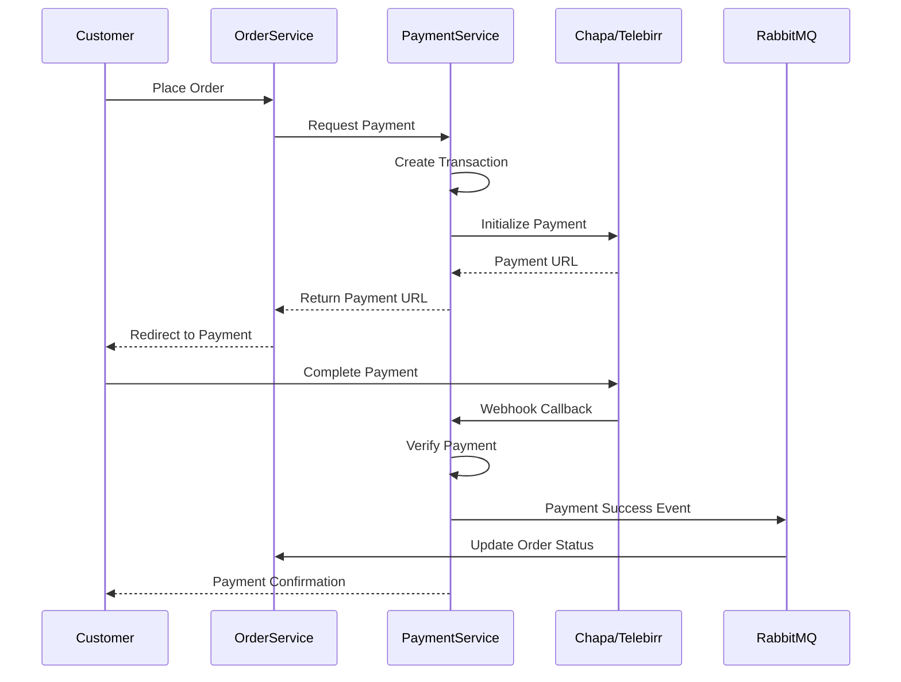

comprehensive documentation for Payment Service with Chapa and Telebirr integration.

## **Payment Service - Complete Documentation**

### **Table of Contents**
1. [Overview](#overview)
2. [Architecture](#architecture)
3. [Payment Flow](#payment-flow)
4. [Getting Started](#getting-started)
5. [API Documentation](#api-documentation)
6. [Payment Providers](#payment-providers)
7. [Webhook Integration](#webhook-integration)
8. [Database Schema](#database-schema)
9. [Event System](#event-system)
10. [Error Handling](#error-handling)
11. [Monitoring & Logging](#monitoring--logging)
12. [Deployment](#deployment)
13. [Troubleshooting](#troubleshooting)
14. [API Reference](#api-reference)

---

## **1. Overview**

### **1.1 Purpose**
The Payment Service is the central payment processing engine for the e-commerce platform, responsible for:
- Payment processing through multiple Ethiopian payment gateways
- Integration with Chapa (Card & Bank Transfer)
- Integration with Telebirr (Mobile Money)
- Cash on Delivery support
- Payment verification and confirmation
- Refund processing
- Webhook handling for payment callbacks
- Transaction tracking and reconciliation

### **1.2 Key Features**
- ✅ **Chapa Integration** - Card payments, bank transfers
- ✅ **Telebirr Integration** - Mobile money payments
- ✅ **Cash on Delivery** - Traditional payment method
- ✅ **Payment verification** - Real-time status checks
- ✅ **Webhook support** - Async payment confirmation
- ✅ **Refund management** - Full and partial refunds
- ✅ **Transaction logging** - Complete audit trail
- ✅ **Idempotent operations** - Prevent duplicate payments
- ✅ **Payment timeout handling** - Auto-expire pending payments
- ✅ **Event-driven architecture** - RabbitMQ integration
- ✅ **Retry mechanism** - Handle failed payments
- ✅ **Comprehensive reporting** - Payment analytics

### **1.3 Technology Stack**
| Component | Technology | Version |
|-----------|------------|---------|
| Runtime | Node.js | 18+ |
| Framework | Express.js | 4.18+ |
| Database | MongoDB | 5.0+ |
| Cache | Redis | 6.0+ |
| Message Broker | RabbitMQ | 3.8+ |
| Payment Gateways | Chapa, Telebirr | - |
| Validation | Joi | 17.9+ |
| Logging | Winston | 3.10+ |

### **1.4 Supported Ethiopian Payment Methods**

| Provider | Type | Description |
|----------|------|-------------|
| **Chapa** | Card & Bank | Credit/Debit cards, Bank transfers |
| **Telebirr** | Mobile Money | Mobile money payments |
| **Cash on Delivery** | Cash | Pay upon delivery |
| **CB Pay** (Planned) | Bank | Commercial Bank of Ethiopia |
| **eBirr** (Planned) | Mobile Money | eBirr wallet |

---

## **2. Architecture**

### **2.1 System Architecture**
```
┌─────────────────────────────────────────────────────────────────┐
│                        Payment Service                           │
│  ┌──────────────┐  ┌──────────────┐  ┌──────────────┐          │
│  │   Payment    │  │   Chapa      │  │  Telebirr    │          │
│  │  Controller  │  │  Service     │  │  Service     │          │
│  └──────────────┘  └──────────────┘  └──────────────┘          │
│  ┌──────────────┐  ┌──────────────┐  ┌──────────────┐          │
│  │   Webhook    │  │   Payment    │  │   Refund     │          │
│  │   Service    │  │   Service    │  │   Service    │          │
│  └──────────────┘  └──────────────┘  └──────────────┘          │
└───────┬──────────────┬──────────────┬───────────────────────────┘
        │              │              │
        ▼              ▼              ▼
┌──────────────┐ ┌─────────────┐ ┌──────────────┐
│   MongoDB    │ │    Redis    │ │   RabbitMQ   │
│   Database   │ │    Cache    │ │    Events    │
└──────────────┘ └─────────────┘ └──────────────┘
        │              │              │
        └──────────────┼──────────────┘
                       ▼
              ┌──────────────┐
              │  Chapa API   │
              │  Telebirr API│
              └──────────────┘
```

### **2.2 Payment Flow Diagram**


### **2.3 Payment States**
```
┌─────────┐     ┌────────────┐     ┌───────────┐
│ pending │────▶│ processing │────▶│ completed │
└─────────┘     └────────────┘     └───────────┘
     │                │                  │
     │                │                  │
     ▼                ▼                  ▼
┌────────┐     ┌──────────┐     ┌──────────┐
│ failed │     │ cancelled│     │ refunded │
└────────┘     └──────────┘     └──────────┘
```

---

## **3. Payment Flow**

### **3.1 Standard Payment Flow**

1. **Initialize Payment**
   - Client requests payment initialization
   - Service validates amount and payment method
   - Creates payment record with `pending` status
   - Calls provider API to get payment URL
   - Returns payment URL to client

2. **Process Payment**
   - Client redirects to payment provider
   - Customer completes payment on provider's page
   - Provider processes payment
   - Provider sends webhook callback

3. **Verify Payment**
   - Service receives webhook notification
   - Verifies webhook signature
   - Calls provider to verify payment status
   - Updates payment status to `completed`
   - Publishes payment success event

4. **Notify Services**
   - Order service receives payment confirmation
   - Notification service sends email/SMS
   - Inventory service confirms reservation

### **3.2 Payment Timeout Handling**
```javascript
// Payment expires after configured time
expiresAt: new Date(Date.now() + 30 * 60 * 1000) // 30 minutes

// Auto-expire MongoDB index
{ expiresAt: 1 }, { expireAfterSeconds: 0 }
```

### **3.3 Retry Logic**
| Attempt | Delay | Action |
|---------|-------|--------|
| 1 | - | Initial attempt |
| 2 | 5 seconds | Retry failed verification |
| 3 | 15 seconds | Final retry |

---

## **4. Getting Started**

### **4.1 Prerequisites**
```bash
# Required software
Node.js >= 18.0.0
MongoDB >= 5.0
Redis >= 6.0
RabbitMQ >= 3.8

# Required accounts
Chapa Merchant Account (https://chapa.co)
Telebirr Merchant Account

# Optional
Docker >= 20.0
Docker Compose >= 1.29
```

### **4.2 Installation**

```bash
# Clone repository
git clone https://github.com/your-org/payment-service.git
cd payment-service

# Install dependencies
npm install

# Copy environment variables
cp .env.example .env

# Edit configuration with your API keys
nano .env

# Start dependencies
docker-compose up -d mongodb redis rabbitmq

# Start development server
npm run dev

# Run tests
npm test
```

### **4.3 Docker Setup**

**docker-compose.yml**
```yaml
version: '3.8'
services:
  payment-service:
    build: .
    ports:
      - "3004:3004"
    environment:
      - NODE_ENV=production
      - MONGODB_URI=mongodb://mongodb:27017/payment_service
      - REDIS_HOST=redis
      - RABBITMQ_URL=amqp://rabbitmq:5672
      - CHAPA_SECRET_KEY=${CHAPA_SECRET_KEY}
      - TELEBIRR_APP_ID=${TELEBIRR_APP_ID}
    depends_on:
      - mongodb
      - redis
      - rabbitmq
    restart: unless-stopped

  mongodb:
    image: mongo:5.0
    ports:
      - "27017:27017"
    volumes:
      - mongodb_data:/data/db

  redis:
    image: redis:6.2-alpine
    ports:
      - "6379:6379"

  rabbitmq:
    image: rabbitmq:3.9-management
    ports:
      - "5672:5672"
      - "15672:15672"

volumes:
  mongodb_data:
```

### **4.4 Environment Variables**

| Variable | Description | Required |
|----------|-------------|----------|
| `PORT` | Service port | No |
| `NODE_ENV` | Environment | No |
| `MONGODB_URI` | MongoDB connection | Yes |
| `REDIS_HOST` | Redis host | Yes |
| `RABBITMQ_URL` | RabbitMQ URL | Yes |
| `CHAPA_SECRET_KEY` | Chapa secret key | For Chapa |
| `CHAPA_PUBLIC_KEY` | Chapa public key | For Chapa |
| `CHAPA_WEBHOOK_SECRET` | Webhook secret | For Chapa |
| `TELEBIRR_APP_ID` | Telebirr app ID | For Telebirr |
| `TELEBIRR_APP_KEY` | Telebirr app key | For Telebirr |
| `MIN_PAYMENT_AMOUNT` | Minimum payment | No |
| `MAX_PAYMENT_AMOUNT` | Maximum payment | No |
| `PAYMENT_TIMEOUT_MINUTES` | Timeout duration | No |

---

## **5. API Documentation**

### **5.1 Base URL**
```
Development: http://localhost:3004/api/v1
Production: https://api.yourdomain.com/payment/api/v1
```

### **5.2 Authentication**
All endpoints require JWT token:
```http
Authorization: Bearer <your_jwt_token>
```

### **5.3 Payment Endpoints**

#### **Initialize Payment**
```http
POST /payments/initialize
```

**Request Body:**
```json
{
  "orderId": "507f1f77bcf86cd799439055",
  "orderNumber": "ORD-202401-000001",
  "amount": 1125.96,
  "currency": "ETB",
  "paymentMethod": "chapa",
  "customer": {
    "email": "john@example.com",
    "name": "John Doe",
    "phone": "+251912345678"
  },
  "returnUrl": "https://ecommerce.com/payment/callback"
}
```

**Response (201 Created):**
```json
{
  "success": true,
  "message": "Payment initialized successfully",
  "data": {
    "transactionId": "TXN-1705312200000-A1B2C3D4",
    "paymentUrl": "https://checkout.chapa.co/checkout/abc123",
    "status": "pending"
  }
}
```

#### **Verify Payment**
```http
GET /payments/verify/:transactionId
```

**Response (200 OK):**
```json
{
  "success": true,
  "message": "Payment verification completed",
  "data": {
    "transactionId": "TXN-1705312200000-A1B2C3D4",
    "status": "completed",
    "amount": 1125.96,
    "paymentMethod": "chapa",
    "paidAt": "2024-01-15T10:35:00Z"
  }
}
```

#### **Get Payment Status**
```http
GET /payments/status/:transactionId
```

**Response (200 OK):**
```json
{
  "success": true,
  "data": {
    "transactionId": "TXN-1705312200000-A1B2C3D4",
    "status": "completed",
    "amount": 1125.96,
    "paymentMethod": "chapa",
    "paidAt": "2024-01-15T10:35:00Z"
  }
}
```

#### **Get User Payments**
```http
GET /payments/my-payments?page=1&limit=20&status=completed
```

**Response (200 OK):**
```json
{
  "success": true,
  "data": {
    "payments": [
      {
        "transactionId": "TXN-1705312200000-A1B2C3D4",
        "orderId": "507f1f77bcf86cd799439055",
        "orderNumber": "ORD-202401-000001",
        "amount": 1125.96,
        "paymentMethod": "chapa",
        "status": "completed",
        "createdAt": "2024-01-15T10:30:00Z",
        "paidAt": "2024-01-15T10:35:00Z"
      }
    ],
    "pagination": {
      "page": 1,
      "limit": 20,
      "total": 5,
      "pages": 1,
      "hasNext": false,
      "hasPrev": false
    }
  }
}
```

#### **Refund Payment (Admin)**
```http
POST /payments/refund/:transactionId
```

**Headers:**
```
Authorization: Bearer <admin_token>
```

**Request Body:**
```json
{
  "amount": 1125.96,
  "reason": "Customer requested refund"
}
```

**Response (200 OK):**
```json
{
  "success": true,
  "message": "Payment refunded successfully",
  "data": {
    "success": true,
    "refundId": "REF-1705312200000-X1Y2Z3W4",
    "refundAmount": 1125.96
  }
}
```

#### **Get Payment Statistics (Admin)**
```http
GET /payments/admin/stats
```

**Response (200 OK):**
```json
{
  "success": true,
  "data": {
    "byStatus": [
      { "_id": "completed", "count": 1250, "totalAmount": 1250000 },
      { "_id": "pending", "count": 50, "totalAmount": 50000 },
      { "_id": "failed", "count": 25, "totalAmount": 25000 },
      { "_id": "refunded", "count": 10, "totalAmount": 10000 }
    ],
    "today": {
      "count": 45,
      "total": 45000
    },
    "byMethod": [
      { "_id": "chapa", "count": 800, "totalAmount": 800000 },
      { "_id": "tele birr", "count": 400, "totalAmount": 400000 },
      { "_id": "cash_on_delivery", "count": 50, "totalAmount": 50000 }
    ],
    "totalPayments": 1335,
    "totalRevenue": 1335000
  }
}
```

---

## **6. Payment Providers**

### **6.1 Chapa Integration**

#### **Configuration**
```javascript
CHAPA_SECRET_KEY=chapa_live_secret_key_xxxxxxxxxxxx
CHAPA_PUBLIC_KEY=chapa_live_public_key_xxxxxxxxxxxx
CHAPA_WEBHOOK_SECRET=your_webhook_secret
CHAPA_API_URL=https://api.chapa.co/v1
CHAPA_CALLBACK_URL=https://api.yourdomain.com/payment/webhook/chapa
```

#### **Initialize Payment**
```javascript
const payload = {
  amount: 1125.96,
  currency: 'ETB',
  email: 'john@example.com',
  first_name: 'John',
  last_name: 'Doe',
  tx_ref: 'TXN-1705312200000-A1B2C3D4',
  callback_url: 'https://api.yourdomain.com/payment/webhook/chapa',
  return_url: 'https://ecommerce.com/payment/callback',
  customization: {
    title: 'E-commerce Payment',
    description: 'Payment for order ORD-202401-000001'
  }
};
```

#### **Webhook Format**
```json
{
  "tx_ref": "TXN-1705312200000-A1B2C3D4",
  "status": "success",
  "reference": "CHAPA-REF-123456",
  "amount": 1125.96,
  "currency": "ETB",
  "payment_method": "card"
}
```

### **6.2 Telebirr Integration**

#### **Configuration**
```javascript
TELEBIRR_APP_ID=your_app_id
TELEBIRR_APP_KEY=your_app_key
TELEBIRR_SHORT_CODE=123456
TELEBIRR_API_URL=https://api.telebirr.et
TELEBIRR_CALLBACK_URL=https://api.yourdomain.com/payment/webhook/telebirr
```

#### **Initialize Payment**
```javascript
const payload = {
  appId: 'your_app_id',
  shortCode: '123456',
  outTradeNo: 'TXN-1705312200000-A1B2C3D4',
  subject: 'Order ORD-202401-000001',
  totalAmount: 1125.96,
  timeoutExpress: '30m',
  returnUrl: 'https://ecommerce.com/payment/callback',
  notifyUrl: 'https://api.yourdomain.com/payment/webhook/telebirr'
};
```

#### **Signature Generation**
```javascript
const generateSignature = (data) => {
  const stringToSign = `${appId}${data.outTradeNo}${data.totalAmount}${appKey}`;
  return crypto.createHash('md5').update(stringToSign).digest('hex');
};
```

### **6.3 Cash on Delivery**

```javascript
// No external API calls needed
const initializeCashOnDelivery = async (payment) => {
  payment.status = 'pending';
  await payment.save();
  
  return {
    success: true,
    paymentUrl: null,
    providerData: {
      type: 'cash_on_delivery',
      message: 'Payment will be collected upon delivery'
    }
  };
};
```

---

## **7. Webhook Integration**

### **7.1 Webhook Endpoints**

| Provider | Endpoint | Method |
|----------|----------|--------|
| Chapa | `/payment/webhook/chapa` | POST |
| Telebirr | `/payment/webhook/telebirr` | POST |

### **7.2 Webhook Security**

#### **Chapa Signature Verification**
```javascript
const verifyChapaWebhook = (payload, signature) => {
  const expectedSignature = crypto
    .createHmac('sha256', webhookSecret)
    .update(JSON.stringify(payload))
    .digest('hex');
  
  return signature === expectedSignature;
};
```

#### **Telebirr Signature Verification**
```javascript
const verifyTelebirrWebhook = (payload) => {
  const receivedSign = payload.sign;
  const expectedSign = generateSignature(payload);
  return receivedSign === expectedSign;
};
```

### **7.3 Webhook Processing Flow**

```
1. Receive webhook from provider
   ↓
2. Verify signature
   ↓
3. Extract transaction reference
   ↓
4. Query payment record
   ↓
5. Verify payment status with provider
   ↓
6. Update payment status
   ↓
7. Publish events to RabbitMQ
   ↓
8. Return 200 OK to provider
```

### **7.4 Webhook Testing**

```bash
# Test Chapa webhook locally
curl -X POST http://localhost:3004/payment/webhook/chapa \
  -H "Content-Type: application/json" \
  -H "x-chapa-signature: test_signature" \
  -d '{
    "tx_ref": "TXN-1705312200000-A1B2C3D4",
    "status": "success",
    "reference": "CHAPA-REF-123456"
  }'

# Test Telebirr webhook
curl -X POST http://localhost:3004/payment/webhook/telebirr \
  -H "Content-Type: application/json" \
  -d '{
    "outTradeNo": "TXN-1705312200000-A1B2C3D4",
    "tradeState": "SUCCESS",
    "transactionId": "TEL-123456"
  }'
```

---

## **8. Database Schema**

### **8.1 Payment Schema**
```javascript
{
  _id: ObjectId,
  transactionId: String,           // Unique transaction ID
  orderId: String,                 // Reference to order
  orderNumber: String,             // Order number
  userId: String,                  // User ID
  customer: {
    email: String,                 // Customer email
    name: String,                  // Customer name
    phone: String                  // Customer phone
  },
  amount: Number,                  // Payment amount
  currency: String,                // Currency (ETB)
  paymentMethod: String,           // chapa, telebirr, cash_on_delivery
  status: String,                  // pending, processing, completed, failed, refunded
  providerData: {
    reference: String,             // Provider reference
    checkoutUrl: String,           // Payment URL
    providerResponse: Object       // Raw provider response
  },
  paymentDetails: {
    paidAt: Date,                  // Payment timestamp
    paymentMethodDetails: String,  // Card type, etc.
    transactionReference: String   // Provider transaction ID
  },
  refundDetails: {
    refundedAt: Date,              // Refund timestamp
    refundAmount: Number,          // Amount refunded
    refundReason: String,          // Reason for refund
    refundId: String               // Refund reference
  },
  metadata: {
    ipAddress: String,             // Customer IP
    userAgent: String,             // Browser info
    returnUrl: String,             // Return URL
    webhookData: Object            // Raw webhook data
  },
  retryCount: Number,              // Verification retries
  errorMessage: String,            // Error message if failed
  expiresAt: Date,                 // Auto-expiry
  createdAt: Date,
  updatedAt: Date
}
```

### **8.2 Indexes**
```javascript
// Payment indexes
db.payments.createIndex({ transactionId: 1 }, { unique: true })
db.payments.createIndex({ orderId: 1 })
db.payments.createIndex({ userId: 1, createdAt: -1 })
db.payments.createIndex({ status: 1, createdAt: 1 })
db.payments.createIndex({ expiresAt: 1 }, { expireAfterSeconds: 0 })
```

---

## **9. Event System**

### **9.1 Published Events**

| Event | Routing Key | Trigger | Payload |
|-------|-------------|---------|---------|
| Payment Initialized | `payment.initialized` | Payment created | transactionId, orderId, amount |
| Payment Success | `payment.success` | Payment confirmed | transactionId, orderId, amount |
| Payment Failed | `payment.failed` | Payment failed | transactionId, orderId, error |
| Payment Refunded | `payment.refunded` | Refund processed | transactionId, refundAmount |

### **9.2 Subscribed Events**

| Event | Source | Action |
|-------|--------|--------|
| `order.created` | Order Service | Create pending payment |
| `payment.request` | Order Service | Initialize payment |

### **9.3 Event Examples**

#### **Payment Success Event**
```json
{
  "eventId": "550e8400-e29b-41d4-a716-446655440000",
  "eventType": "payment.success",
  "version": "1.0",
  "timestamp": "2024-01-15T10:35:00Z",
  "source": "payment-service",
  "data": {
    "transactionId": "TXN-1705312200000-A1B2C3D4",
    "orderId": "507f1f77bcf86cd799439055",
    "orderNumber": "ORD-202401-000001",
    "userId": "user_123",
    "amount": 1125.96,
    "paymentMethod": "chapa",
    "paidAt": "2024-01-15T10:35:00Z"
  }
}
```

#### **Payment Failed Event**
```json
{
  "eventId": "550e8400-e29b-41d4-a716-446655440001",
  "eventType": "payment.failed",
  "version": "1.0",
  "timestamp": "2024-01-15T10:35:00Z",
  "source": "payment-service",
  "data": {
    "transactionId": "TXN-1705312200000-A1B2C3D4",
    "orderId": "507f1f77bcf86cd799439055",
    "error": "Insufficient funds"
  }
}
```

---

## **10. Error Handling**

### **10.1 Error Response Format**
```json
{
  "success": false,
  "message": "Error description",
  "timestamp": "2024-01-15T10:30:00Z",
  "details": ["Additional error details"]
}
```

### **10.2 HTTP Status Codes**

| Status | Description |
|--------|-------------|
| 200 | Success |
| 201 | Created |
| 400 | Bad Request - Invalid input |
| 401 | Unauthorized - Invalid token |
| 403 | Forbidden - Insufficient permissions |
| 404 | Not Found - Payment not found |
| 409 | Conflict - Duplicate transaction |
| 422 | Unprocessable Entity - Validation failed |
| 429 | Too Many Requests - Rate limit |
| 500 | Internal Server Error |

### **10.3 Common Errors**

#### **Invalid Amount**
```json
{
  "success": false,
  "message": "Minimum payment amount is 1 ETB",
  "timestamp": "2024-01-15T10:30:00Z"
}
```

#### **Payment Not Found**
```json
{
  "success": false,
  "message": "Payment not found",
  "timestamp": "2024-01-15T10:30:00Z"
}
```

#### **Provider Error**
```json
{
  "success": false,
  "message": "Payment initialization failed",
  "timestamp": "2024-01-15T10:30:00Z",
  "details": ["Invalid API key"]
}
```

#### **Cannot Refund**
```json
{
  "success": false,
  "message": "Cannot refund payment with status: pending",
  "timestamp": "2024-01-15T10:30:00Z"
}
```

---

## **11. Monitoring & Logging**

### **11.1 Health Check Endpoints**

#### **Full Health Check**
```http
GET /health
```

**Response:**
```json
{
  "status": "healthy",
  "service": "payment-service",
  "version": "1.0.0",
  "timestamp": "2024-01-15T10:30:00Z",
  "uptime": 86400,
  "services": {
    "mongodb": "connected",
    "redis": "connected",
    "rabbitmq": "connected"
  }
}
```

#### **Readiness Probe**
```http
GET /health/ready
```

#### **Liveness Probe**
```http
GET /health/live
```

### **11.2 Metrics to Monitor**

| Metric | Description | Alert Threshold |
|--------|-------------|-----------------|
| Payment Success Rate | % successful payments | < 95% |
| Payment Failure Rate | % failed payments | > 5% |
| Chapa API Latency | Response time | > 2 seconds |
| Telebirr API Latency | Response time | > 3 seconds |
| Webhook Processing Time | Time to process | > 1 second |
| Refund Rate | % of refunds | > 2% |
| Average Payment Value | Average amount | < 500 ETB |

### **11.3 Logging Examples**

#### **Payment Initialized**
```json
{
  "level": "info",
  "message": "Payment initialized",
  "service": "payment-service",
  "timestamp": "2024-01-15T10:30:00Z",
  "transactionId": "TXN-1705312200000-A1B2C3D4",
  "orderId": "507f1f77bcf86cd799439055",
  "amount": 1125.96,
  "paymentMethod": "chapa"
}
```

#### **Webhook Received**
```json
{
  "level": "info",
  "message": "Webhook received",
  "service": "payment-service",
  "timestamp": "2024-01-15T10:35:00Z",
  "provider": "chapa",
  "transactionId": "TXN-1705312200000-A1B2C3D4",
  "status": "success"
}
```

---

## **12. Deployment**

### **12.1 Kubernetes Deployment**

**deployment.yaml**
```yaml
apiVersion: apps/v1
kind: Deployment
metadata:
  name: payment-service
  namespace: ecommerce
spec:
  replicas: 3
  selector:
    matchLabels:
      app: payment-service
  template:
    metadata:
      labels:
        app: payment-service
    spec:
      containers:
      - name: payment-service
        image: payment-service:latest
        ports:
        - containerPort: 3004
        env:
        - name: NODE_ENV
          value: "production"
        - name: MONGODB_URI
          valueFrom:
            secretKeyRef:
              name: mongodb-secret
              key: uri
        - name: CHAPA_SECRET_KEY
          valueFrom:
            secretKeyRef:
              name: chapa-secret
              key: secret-key
        resources:
          requests:
            memory: "256Mi"
            cpu: "250m"
          limits:
            memory: "512Mi"
            cpu: "500m"
        livenessProbe:
          httpGet:
            path: /health/live
            port: 3004
          initialDelaySeconds: 30
          periodSeconds: 10
        readinessProbe:
          httpGet:
            path: /health/ready
            port: 3004
          initialDelaySeconds: 5
          periodSeconds: 5
```

### **12.2 Environment Configuration**

| Environment | Replicas | Memory Limit | CPU Limit | Log Level |
|-------------|----------|--------------|-----------|-----------|
| Development | 1 | 512Mi | 500m | debug |
| Staging | 2 | 512Mi | 500m | info |
| Production | 3+ | 1Gi | 1000m | warn |

### **12.3 Performance Tuning**

```javascript
// MongoDB connection pool
mongoose.connect(uri, {
  maxPoolSize: 50,
  minPoolSize: 10
});

// Redis cache TTL
PAYMENT_CACHE_TTL = 300;  // 5 minutes

// Payment timeout
PAYMENT_TIMEOUT_MINUTES = 30;  // 30 minutes

// Retry configuration
MAX_RETRIES = 3;
RETRY_DELAY_MS = 5000;
```

---

## **13. Troubleshooting**

### **13.1 Common Issues & Solutions**

#### **Issue: Chapa Payment Fails**
```bash
# Check Chapa API key
curl -X GET https://api.chapa.co/v1/balance \
  -H "Authorization: Bearer $CHAPA_SECRET_KEY"

# View payment logs
docker logs payment-service | grep "chapa"

# Check webhook delivery
# Verify webhook URL is accessible from internet
```

**Solution:** Verify API keys and webhook configuration.

#### **Issue: Telebirr Integration Fails**
```bash
# Check Telebirr credentials
echo $TELEBIRR_APP_ID
echo $TELEBIRR_APP_KEY

# Test API connectivity
curl -X POST $TELEBIRR_API_URL/unifiedOrder \
  -d "appId=$TELEBIRR_APP_ID"
```

**Solution:** Ensure correct app ID, key, and short code.

#### **Issue: Webhook Not Received**
```bash
# Check webhook logs
docker logs payment-service | grep "webhook"

# Test webhook endpoint
curl -X POST http://localhost:3004/payment/webhook/chapa \
  -H "Content-Type: application/json" \
  -d '{"test": true}'
```

**Solution:** Verify webhook URL is publicly accessible and correct.

#### **Issue: Duplicate Transactions**
```bash
# Check for duplicate transaction IDs
mongo payment_service --eval "db.payments.aggregate([{$group:{_id:'$transactionId',count:{$sum:1}}},{$match:{count:{$gt:1}}}])"

# Check idempotency keys
redis-cli KEYS "idempotency:*"
```

**Solution:** Ensure idempotency keys are properly implemented.

### **13.2 Debugging Commands**

```bash
# View service logs
docker logs payment-service -f --tail 100

# Check health
curl http://localhost:3004/health | jq

# Test payment initialization
curl -X POST http://localhost:3004/api/v1/payments/initialize \
  -H "Authorization: Bearer TOKEN" \
  -H "Content-Type: application/json" \
  -d '{
    "orderId": "test-order",
    "orderNumber": "TEST-001",
    "amount": 100,
    "paymentMethod": "chapa",
    "customer": {
      "email": "test@test.com",
      "name": "Test User"
    }
  }'

# Monitor Redis cache
redis-cli MONITOR | grep "payment"

# Check pending payments
mongo payment_service --eval "db.payments.find({status:'pending'}).pretty()"

# Test webhook
curl -X POST http://localhost:3004/payment/webhook/chapa \
  -H "x-chapa-signature: test" \
  -d '{"tx_ref":"TEST-123","status":"success"}'
```

### **13.3 Recovery Procedures**

#### **Manual Payment Verification**
```javascript
// Manually verify a payment
db.payments.updateOne(
  { transactionId: "TXN-XXX" },
  { 
    $set: { 
      status: "completed",
      "paymentDetails.paidAt": new Date()
    }
  }
);

// Publish success event manually
// Use RabbitMQ management UI to publish payment.success event
```

#### **Manual Refund Processing**
```javascript
// Process refund manually
db.payments.updateOne(
  { transactionId: "TXN-XXX" },
  {
    $set: {
      status: "refunded",
      "refundDetails": {
        refundedAt: new Date(),
        refundAmount: 100,
        refundReason: "Manual refund"
      }
    }
  }
);
```

---

## **14. API Reference**

### **14.1 Quick Reference Card**

```bash
# Initialize Payment
POST /payments/initialize
{
  "orderId": "string",
  "orderNumber": "string",
  "amount": number,
  "paymentMethod": "chapa|tele birr|cash_on_delivery",
  "customer": {
    "email": "string",
    "name": "string",
    "phone": "string"
  }
}

# Verify Payment
GET /payments/verify/:transactionId

# Get Payment Status
GET /payments/status/:transactionId

# Get User Payments
GET /payments/my-payments?page=1&limit=20

# Refund Payment (Admin)
POST /payments/refund/:transactionId
{
  "amount": number,
  "reason": "string"
}

# Get Stats (Admin)
GET /payments/admin/stats

# Health Check
GET /health
```

### **14.2 Postman Collection**

```json
{
  "info": {
    "name": "Payment Service API",
    "schema": "https://schema.getpostman.com/json/collection/v2.1.0/collection.json"
  },
  "variable": [
    {
      "key": "base_url",
      "value": "http://localhost:3004/api/v1"
    },
    {
      "key": "token",
      "value": "your_jwt_token"
    }
  ],
  "item": [
    {
      "name": "Initialize Payment",
      "request": {
        "method": "POST",
        "url": "{{base_url}}/payments/initialize",
        "header": [
          {
            "key": "Authorization",
            "value": "Bearer {{token}}"
          }
        ],
        "body": {
          "mode": "raw",
          "raw": "{\n  \"orderId\": \"test-order-123\",\n  \"orderNumber\": \"TEST-001\",\n  \"amount\": 100,\n  \"paymentMethod\": \"chapa\",\n  \"customer\": {\n    \"email\": \"test@example.com\",\n    \"name\": \"Test User\",\n    \"phone\": \"+251912345678\"\n  }\n}"
        }
      }
    },
    {
      "name": "Verify Payment",
      "request": {
        "method": "GET",
        "url": "{{base_url}}/payments/verify/:transactionId",
        "header": [
          {
            "key": "Authorization",
            "value": "Bearer {{token}}"
          }
        ]
      }
    }
  ]
}
```

### **14.3 Supported Currencies**

| Currency | Code | Supported By |
|----------|------|--------------|
| Ethiopian Birr | ETB | All providers |
| US Dollar | USD | Chapa only |

### **14.4 Payment Methods**

| Method | Code | Description |
|--------|------|-------------|
| Chapa | `chapa` | Card & bank transfers |
| Telebirr | `tele birr` | Mobile money |
| Cash on Delivery | `cash_on_delivery` | Pay on delivery |

---

## **15. Changelog**

### **v1.0.0** (2024-01-15)
- Initial release
- Chapa payment gateway integration
- Telebirr mobile money integration
- Cash on delivery support
- Complete payment lifecycle management
- Webhook handling for callbacks
- Refund processing
- Event-driven architecture
- Comprehensive error handling
- Redis caching implementation

### **Planned Features**
- [ ] CB Pay integration
- [ ] eBirr integration
- [ ] Recurring payments
- [ ] Payment installment plans
- [ ] QR code payments
- [ ] Payment analytics dashboard
- [ ] Fraud detection system
- [ ] Multi-currency support

---

## **16. SLA & Support**

### **16.1 Service Level Agreements**

| Metric | Target | Critical |
|--------|--------|----------|
| Availability | 99.9% | < 99.5% |
| Payment Processing (p95) | < 3 seconds | > 10 seconds |
| Webhook Processing (p95) | < 1 second | > 5 seconds |
| Error Rate | < 0.5% | > 2% |

### **16.2 Support Contacts**

- **Email**: payments@ecommerce.com
- **Documentation**: https://docs.ecommerce.com/payment-service
- **Issue Tracker**: https://github.com/your-org/payment-service/issues
- **Slack**: #payment-service channel
- **24/7 On-Call**: +1-555-PAY-HELP

### **16.3 Provider Support**

| Provider | Support Channel | Response Time |
|----------|----------------|---------------|
| Chapa | support@chapa.co | 24 hours |
| Telebirr | merchant@telebirr.et | 48 hours |

---

**Documentation Version**: 1.0.0  
**Last Updated**: January 15, 2024  
**Maintainer**: Payment Team  
**Status**: ✅ Production Ready

---

This complete Payment Service documentation covers all aspects of the service including Chapa and Telebirr integration, API endpoints, webhook handling, database schema, event system, deployment, and troubleshooting. For additional questions or custom requirements, please contact the payment team.