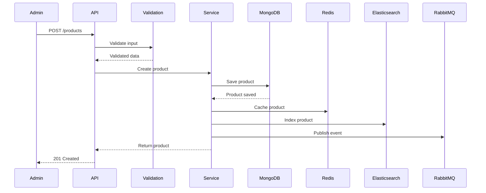

comprehensive documentation for Product Catalog Service.

## **Product Catalog Service - Complete Documentation**

### **Table of Contents**
1. [Overview](#overview)
2. [Architecture](#architecture)
3. [Getting Started](#getting-started)
4. [API Documentation](#api-documentation)
5. [Database Schema](#database-schema)
6. [Search & Indexing](#search--indexing)
7. [Inventory Management](#inventory-management)
8. [Caching Strategy](#caching-strategy)
9. [Event System](#event-system)
10. [Error Handling](#error-handling)
11. [Monitoring & Logging](#monitoring--logging)
12. [Deployment](#deployment)
13. [Troubleshooting](#troubleshooting)
14. [API Reference](#api-reference)

---

## **1. Overview**

### **1.1 Purpose**
The Product Catalog Service is the central management system for all product-related operations in the e-commerce platform, responsible for:
- Product management (CRUD operations)
- Category and brand management
- Inventory tracking and management
- Product search and filtering
- Product image management
- Product variants and attributes
- SEO optimization
- Real-time inventory updates

### **1.2 Key Features**
- ✅ **Full product lifecycle management**
- ✅ **Advanced search with Elasticsearch**
- ✅ **Redis caching for high performance**
- ✅ **Real-time inventory tracking**
- ✅ **Category tree structure**
- ✅ **Product variants and attributes**
- ✅ **Bulk operations support**
- ✅ **Image optimization with Sharp**
- ✅ **Event-driven architecture**
- ✅ **SEO-friendly URLs (slugs)**
- ✅ **Related products recommendation**
- ✅ **Product reviews integration**

### **1.3 Technology Stack**
| Component | Technology | Version |
|-----------|------------|---------|
| Runtime | Node.js | 18+ |
| Framework | Express.js | 4.18+ |
| Database | MongoDB | 5.0+ |
| Search Engine | Elasticsearch | 8.9+ |
| Cache | Redis | 6.0+ |
| Message Broker | RabbitMQ | 3.8+ |
| Image Processing | Sharp | 0.32+ |
| Validation | Joi | 17.9+ |
| Logging | Winston | 3.10+ |

---

## **2. Architecture**

### **2.1 System Architecture**
```
┌─────────────────────────────────────────────────────────────┐
│                     Client Applications                      │
└─────────────────────┬───────────────────────────────────────┘
                      │
                      ▼
┌─────────────────────────────────────────────────────────────┐
│                  Product Catalog Service                     │
│  ┌──────────────┐  ┌──────────────┐  ┌──────────────┐      │
│  │   Product    │  │   Category   │  │    Brand     │      │
│  │  Controller  │  │  Controller  │  │  Controller  │      │
│  └──────────────┘  └──────────────┘  └──────────────┘      │
│  ┌──────────────┐  ┌──────────────┐  ┌──────────────┐      │
│  │   Product    │  │   Search     │  │    Cache     │      │
│  │   Service    │  │   Service    │  │   Service    │      │
│  └──────────────┘  └──────────────┘  └──────────────┘      │
└───────┬──────────────┬──────────────┬───────────────────────┘
        │              │              │
        ▼              ▼              ▼
┌──────────────┐ ┌─────────────┐ ┌──────────────┐
│   MongoDB    │ │    Redis    │ │ Elasticsearch│
│   Database   │ │    Cache    │ │    Search    │
└──────────────┘ └─────────────┘ └──────────────┘
        │              │              │
        └──────────────┼──────────────┘
                       ▼
              ┌──────────────┐
              │   RabbitMQ   │
              │    Events    │
              └──────────────┘
```

### **2.2 Data Flow - Product Creation**


---

## **3. Getting Started**

### **3.1 Prerequisites**
```bash
# Required software
Node.js >= 18.0.0
MongoDB >= 5.0
Redis >= 6.0
Elasticsearch >= 8.0 (optional but recommended)
RabbitMQ >= 3.8

# Optional
Docker >= 20.0
Docker Compose >= 1.29
```

### **3.2 Installation**

```bash
# Clone repository
git clone https://github.com/your-org/product-catalog-service.git
cd product-catalog-service

# Install dependencies
npm install

# Copy environment variables
cp .env.example .env

# Edit configuration
nano .env

# Start Elasticsearch (optional)
docker run -d -p 9200:9200 -e "discovery.type=single-node" elasticsearch:8.9.0

# Seed database with sample data
npm run db:seed

# Sync products to Elasticsearch
npm run elastic:sync

# Start development server
npm run dev

# Run tests
npm test
```

### **3.3 Docker Setup**

**docker-compose.yml**
```yaml
version: '3.8'
services:
  product-service:
    build: .
    ports:
      - "3002:3002"
    environment:
      - NODE_ENV=production
      - MONGODB_URI=mongodb://mongodb:27017/product_service
      - REDIS_HOST=redis
      - ELASTICSEARCH_NODE=http://elasticsearch:9200
      - RABBITMQ_URL=amqp://rabbitmq:5672
    depends_on:
      - mongodb
      - redis
      - elasticsearch
      - rabbitmq
    restart: unless-stopped

  mongodb:
    image: mongo:5.0
    ports:
      - "27017:27017"
    volumes:
      - mongodb_data:/data/db

  redis:
    image: redis:6.2-alpine
    ports:
      - "6379:6379"

  elasticsearch:
    image: elasticsearch:8.9.0
    ports:
      - "9200:9200"
    environment:
      - discovery.type=single-node
      - xpack.security.enabled=false
    volumes:
      - elasticsearch_data:/usr/share/elasticsearch/data

  rabbitmq:
    image: rabbitmq:3.9-management
    ports:
      - "5672:5672"
      - "15672:15672"

volumes:
  mongodb_data:
  elasticsearch_data:
```

### **3.4 Environment Variables**

| Variable | Description | Default | Required |
|----------|-------------|---------|----------|
| `PORT` | Service port | 3002 | No |
| `NODE_ENV` | Environment | development | No |
| `MONGODB_URI` | MongoDB connection string | - | Yes |
| `REDIS_HOST` | Redis host | localhost | Yes |
| `REDIS_PORT` | Redis port | 6379 | Yes |
| `ELASTICSEARCH_NODE` | Elasticsearch URL | http://localhost:9200 | No |
| `RABBITMQ_URL` | RabbitMQ URL | - | Yes |
| `CACHE_TTL` | Cache time-to-live (seconds) | 3600 | No |
| `MAX_FILE_SIZE` | Max image upload size | 5242880 | No |
| `JWT_SECRET` | JWT secret for auth | - | Yes |

---

## **4. API Documentation**

### **4.1 Base URL**
```
Development: http://localhost:3002/api/v1
Production: https://api.yourdomain.com/catalog/api/v1
```

### **4.2 Authentication**
Most endpoints require JWT token:
```http
Authorization: Bearer <your_jwt_token>
```

### **4.3 Product Endpoints**

#### **Create Product**
```http
POST /products
```

**Headers:**
```
Authorization: Bearer <admin_token>
Content-Type: application/json
```

**Request Body:**
```json
{
  "name": "iPhone 15 Pro",
  "sku": "APL-IP15P-001",
  "description": "Latest iPhone with A17 Pro chip and titanium design",
  "shortDescription": "The most powerful iPhone yet",
  "price": 999.99,
  "comparePrice": 1099.99,
  "category": "507f1f77bcf86cd799439011",
  "brand": "507f1f77bcf86cd799439022",
  "tags": ["smartphone", "apple", "5g"],
  "inventory": {
    "quantity": 100,
    "lowStockThreshold": 10,
    "trackInventory": true
  },
  "weight": {
    "value": 0.5,
    "unit": "kg"
  },
  "dimensions": {
    "length": 15,
    "width": 7,
    "height": 0.8,
    "unit": "cm"
  },
  "isFeatured": true,
  "seo": {
    "title": "Buy iPhone 15 Pro - Best Price",
    "description": "Get the latest iPhone 15 Pro with A17 Pro chip",
    "keywords": ["iphone", "apple", "smartphone"]
  }
}
```

**Response (201 Created):**
```json
{
  "success": true,
  "message": "Product created successfully",
  "data": {
    "_id": "507f1f77bcf86cd799439033",
    "name": "iPhone 15 Pro",
    "slug": "iphone-15-pro",
    "sku": "APL-IP15P-001",
    "price": 999.99,
    "comparePrice": 1099.99,
    "discountPercentage": 9,
    "category": {
      "_id": "507f1f77bcf86cd799439011",
      "name": "Electronics",
      "slug": "electronics"
    },
    "brand": {
      "_id": "507f1f77bcf86cd799439022",
      "name": "Apple",
      "slug": "apple"
    },
    "inventory": {
      "quantity": 100,
      "reserved": 0,
      "availableQuantity": 100,
      "inStock": true
    },
    "isActive": true,
    "isFeatured": true,
    "createdAt": "2024-01-15T10:30:00Z"
  }
}
```

#### **Get All Products**
```http
GET /products?page=1&limit=20&category=electronics&minPrice=100&maxPrice=1000&sortBy=price&sortOrder=asc
```

**Query Parameters:**
| Parameter | Type | Description |
|-----------|------|-------------|
| page | integer | Page number (default: 1) |
| limit | integer | Items per page (default: 20, max: 100) |
| search | string | Search by name/description |
| category | string | Filter by category ID |
| brand | string | Filter by brand ID |
| minPrice | number | Minimum price filter |
| maxPrice | number | Maximum price filter |
| sortBy | string | Sort field (price, createdAt, name, rating) |
| sortOrder | string | asc or desc (default: desc) |
| isActive | boolean | Filter by active status |
| isFeatured | boolean | Filter featured products |
| tags | string | Filter by tags (comma-separated) |
| inStock | boolean | Show only in-stock products |

**Response (200 OK):**
```json
{
  "success": true,
  "data": {
    "products": [
      {
        "_id": "507f1f77bcf86cd799439033",
        "name": "iPhone 15 Pro",
        "slug": "iphone-15-pro",
        "price": 999.99,
        "comparePrice": 1099.99,
        "primaryImage": "https://cdn.example.com/products/iphone15.jpg",
        "averageRating": 4.8,
        "totalReviews": 125,
        "inStock": true
      }
    ],
    "pagination": {
      "page": 1,
      "limit": 20,
      "total": 150,
      "pages": 8,
      "hasNext": true,
      "hasPrev": false
    }
  }
}
```

#### **Get Product by ID**
```http
GET /products/:id
```

**Response (200 OK):**
```json
{
  "success": true,
  "data": {
    "_id": "507f1f77bcf86cd799439033",
    "name": "iPhone 15 Pro",
    "slug": "iphone-15-pro",
    "sku": "APL-IP15P-001",
    "description": "Latest iPhone with A17 Pro chip...",
    "shortDescription": "The most powerful iPhone yet",
    "price": 999.99,
    "comparePrice": 1099.99,
    "discountPercentage": 9,
    "category": {
      "_id": "507f1f77bcf86cd799439011",
      "name": "Electronics",
      "slug": "electronics",
      "path": "electronics"
    },
    "brand": {
      "_id": "507f1f77bcf86cd799439022",
      "name": "Apple",
      "slug": "apple",
      "logo": "https://cdn.example.com/brands/apple.png"
    },
    "images": [
      {
        "url": "https://cdn.example.com/products/iphone15-1.jpg",
        "isPrimary": true,
        "order": 0
      }
    ],
    "attributes": [
      {
        "name": "Color",
        "value": "Natural Titanium"
      },
      {
        "name": "Storage",
        "value": "256GB"
      }
    ],
    "variants": [
      {
        "sku": "APL-IP15P-256-NT",
        "attributes": {
          "color": "Natural Titanium",
          "storage": "256GB"
        },
        "price": 999.99,
        "inventory": 50
      }
    ],
    "tags": ["smartphone", "apple", "5g"],
    "inventory": {
      "quantity": 100,
      "reserved": 10,
      "availableQuantity": 90,
      "trackInventory": true,
      "inStock": true
    },
    "weight": {
      "value": 0.5,
      "unit": "kg"
    },
    "dimensions": {
      "length": 15,
      "width": 7,
      "height": 0.8,
      "unit": "cm"
    },
    "shipping": {
      "freeShipping": false,
      "estimatedDays": [2, 3]
    },
    "seo": {
      "title": "Buy iPhone 15 Pro - Best Price",
      "description": "Get the latest iPhone 15 Pro with A17 Pro chip"
    },
    "averageRating": 4.8,
    "totalReviews": 125,
    "totalSold": 500,
    "views": 10000,
    "isActive": true,
    "isFeatured": true,
    "createdAt": "2024-01-15T10:30:00Z",
    "updatedAt": "2024-01-15T10:30:00Z"
  }
}
```

#### **Update Product**
```http
PUT /products/:id
```

**Headers:**
```
Authorization: Bearer <admin_token>
```

**Request Body:**
```json
{
  "price": 899.99,
  "isFeatured": false,
  "inventory": {
    "quantity": 75
  }
}
```

**Response (200 OK):**
```json
{
  "success": true,
  "message": "Product updated successfully",
  "data": { ... }
}
```

#### **Delete Product**
```http
DELETE /products/:id?hardDelete=true
```

**Query Parameters:**
| Parameter | Type | Description |
|-----------|------|-------------|
| hardDelete | boolean | Permanently delete (default: false) |

**Response (200 OK):**
```json
{
  "success": true,
  "message": "Product deleted successfully"
}
```

#### **Search Products**
```http
GET /products/search?q=iphone&category=electronics&minPrice=500
```

**Response (200 OK):**
```json
{
  "success": true,
  "data": {
    "products": [...],
    "total": 25,
    "page": 1,
    "limit": 20,
    "totalPages": 2
  }
}
```

#### **Get Product Suggestions**
```http
GET /products/suggestions?q=iph&limit=5
```

**Response (200 OK):**
```json
{
  "success": true,
  "data": ["iPhone 15 Pro", "iPhone 14", "iPhone Case"]
}
```

#### **Get Featured Products**
```http
GET /products/featured?limit=10
```

**Response (200 OK):**
```json
{
  "success": true,
  "data": [...]
}
```

#### **Get Related Products**
```http
GET /products/:id/related?limit=6
```

**Response (200 OK):**
```json
{
  "success": true,
  "data": [...]
}
```

#### **Update Inventory**
```http
PUT /products/:productId/inventory
```

**Headers:**
```
Authorization: Bearer <admin_token>
```

**Request Body:**
```json
{
  "quantity": 50,
  "operation": "add"
}
```

**Operation values:** `add`, `deduct`, `set`

**Response (200 OK):**
```json
{
  "success": true,
  "message": "Inventory updated successfully",
  "data": {
    "inventory": {
      "quantity": 150,
      "reserved": 10,
      "availableQuantity": 140,
      "inStock": true
    }
  }
}
```

### **4.4 Category Endpoints**

#### **Create Category**
```http
POST /categories
```

**Request Body:**
```json
{
  "name": "Electronics",
  "description": "Electronic devices and gadgets",
  "parent": null,
  "isActive": true
}
```

#### **Get Category Tree**
```http
GET /categories/tree
```

**Response (200 OK):**
```json
{
  "success": true,
  "data": [
    {
      "_id": "507f1f77bcf86cd799439011",
      "name": "Electronics",
      "slug": "electronics",
      "children": [
        {
          "_id": "507f1f77bcf86cd799439012",
          "name": "Smartphones",
          "slug": "smartphones",
          "children": []
        }
      ]
    }
  ]
}
```

#### **Get Category Products**
```http
GET /categories/:id/products?page=1&limit=20
```

### **4.5 Brand Endpoints**

#### **Create Brand**
```http
POST /brands
```

**Request Body:**
```json
{
  "name": "Apple",
  "description": "Apple Inc.",
  "website": "https://www.apple.com",
  "logo": "https://cdn.example.com/brands/apple.png"
}
```

#### **Get Brand Products**
```http
GET /brands/:id/products?page=1&limit=20
```

### **4.6 Product Statistics**
```http
GET /products/stats
```

**Response (200 OK):**
```json
{
  "success": true,
  "data": {
    "total": 1250,
    "active": 1100,
    "featured": 50,
    "outOfStock": 25,
    "topCategories": [
      { "name": "Electronics", "productCount": 450 },
      { "name": "Clothing", "productCount": 320 }
    ],
    "priceRange": {
      "minPrice": 9.99,
      "maxPrice": 1999.99,
      "avgPrice": 89.50
    }
  }
}
```

---

## **5. Database Schema**

### **5.1 Product Schema**
```javascript
{
  _id: ObjectId,
  name: String,                    // Product name
  slug: String,                    // URL-friendly name
  sku: String,                     // Unique SKU
  description: String,             // Full description
  shortDescription: String,        // Brief description
  price: Number,                   // Current price
  comparePrice: Number,            // Original/MRP price
  costPerItem: Number,             // Cost price
  category: ObjectId,              // Category reference
  brand: ObjectId,                 // Brand reference
  images: [{                       // Product images
    url: String,
    alt: String,
    isPrimary: Boolean,
    order: Number
  }],
  attributes: [{                   // Product attributes
    name: String,
    value: String,
    visible: Boolean
  }],
  variants: [{                     // Product variants
    sku: String,
    attributes: Map,
    price: Number,
    comparePrice: Number,
    inventory: Number,
    images: [String]
  }],
  tags: [String],                  // Product tags
  weight: {                        // Weight information
    value: Number,
    unit: String
  },
  dimensions: {                    // Dimensions
    length: Number,
    width: Number,
    height: Number,
    unit: String
  },
  inventory: {                     // Inventory data
    quantity: Number,
    reserved: Number,
    lowStockThreshold: Number,
    trackInventory: Boolean,
    allowBackorders: Boolean
  },
  shipping: {                      // Shipping info
    freeShipping: Boolean,
    internationalShipping: Boolean,
    estimatedDays: [Number]
  },
  seo: {                           // SEO metadata
    title: String,
    description: String,
    keywords: [String]
  },
  isActive: Boolean,               // Active status
  isFeatured: Boolean,             // Featured status
  isDigital: Boolean,              // Digital product
  averageRating: Number,           // Average rating (0-5)
  totalReviews: Number,            // Total review count
  totalSold: Number,               // Units sold
  views: Number,                   // View count
  createdBy: ObjectId,             // Creator user ID
  updatedBy: ObjectId,             // Last updater
  createdAt: Date,
  updatedAt: Date
}
```

### **5.2 Category Schema**
```javascript
{
  _id: ObjectId,
  name: String,                    // Category name
  slug: String,                    // URL-friendly name
  description: String,             // Category description
  parent: ObjectId,                // Parent category
  image: {                         // Category image
    url: String,
    alt: String
  },
  icon: String,                    // Icon identifier
  level: Number,                   // Hierarchy level
  path: String,                    // Full path (e.g., "electronics/phones")
  isActive: Boolean,               // Active status
  order: Number,                   // Display order
  seo: {                           // SEO metadata
    title: String,
    description: String,
    keywords: [String]
  },
  productCount: Number,            // Number of products
  createdAt: Date,
  updatedAt: Date
}
```

### **5.3 Brand Schema**
```javascript
{
  _id: ObjectId,
  name: String,                    // Brand name
  slug: String,                    // URL-friendly name
  description: String,             // Brand description
  logo: {                          // Brand logo
    url: String,
    alt: String
  },
  website: String,                 // Brand website
  isActive: Boolean,               // Active status
  order: Number,                   // Display order
  productCount: Number,            // Number of products
  createdAt: Date,
  updatedAt: Date
}
```

### **5.4 Indexes**
```javascript
// Product indexes
db.products.createIndex({ name: "text", description: "text", tags: "text" })
db.products.createIndex({ sku: 1 }, { unique: true })
db.products.createIndex({ slug: 1 }, { unique: true })
db.products.createIndex({ category: 1, isActive: 1 })
db.products.createIndex({ price: 1 })
db.products.createIndex({ createdAt: -1 })

// Category indexes
db.categories.createIndex({ slug: 1 }, { unique: true })
db.categories.createIndex({ parent: 1 })
db.categories.createIndex({ path: 1 })

// Brand indexes
db.brands.createIndex({ slug: 1 }, { unique: true })
db.brands.createIndex({ name: 1 })
```

---

## **6. Search & Indexing**

### **6.1 Elasticsearch Configuration**

**Index Settings:**
```json
{
  "settings": {
    "analysis": {
      "analyzer": {
        "autocomplete_analyzer": {
          "tokenizer": "autocomplete_tokenizer",
          "filter": ["lowercase"]
        }
      },
      "tokenizer": {
        "autocomplete_tokenizer": {
          "type": "edge_ngram",
          "min_gram": 2,
          "max_gram": 10,
          "token_chars": ["letter", "digit"]
        }
      }
    }
  }
}
```

### **6.2 Search Features**

| Feature | Description |
|---------|-------------|
| **Full-text search** | Search by product name, description, tags |
| **Fuzzy matching** | Handles typos and misspellings |
| **Autocomplete** | Real-time suggestions as you type |
| **Faceted search** | Filter by category, brand, price range |
| **Sorting** | Sort by price, rating, newest, best-selling |
| **Boosted fields** | Product names have higher relevance |

### **6.3 Search Examples**

```javascript
// Basic search
GET /products/_search
{
  "query": {
    "multi_match": {
      "query": "iphone",
      "fields": ["name^3", "description", "tags"]
    }
  }
}

// Filtered search
GET /products/_search
{
  "query": {
    "bool": {
      "must": [{ "match": { "name": "iphone" }}],
      "filter": [
        { "term": { "category": "electronics" }},
        { "range": { "price": { "gte": 500, "lte": 1000 }}}
      ]
    }
  }
}
```

---

## **7. Inventory Management**

### **7.1 Inventory States**

| State | Description |
|-------|-------------|
| **In Stock** | Available quantity > 0 |
| **Low Stock** | Quantity ≤ threshold |
| **Out of Stock** | Quantity = 0 |
| **Backorder** | Allow orders when out of stock |

### **7.2 Inventory Operations**

```javascript
// Add inventory
await updateInventory(productId, 50, 'add');

// Deduct inventory (when order placed)
await updateInventory(productId, 1, 'deduct');

// Set exact quantity
await updateInventory(productId, 100, 'set');

// Reserve inventory (during checkout)
product.reserveInventory(1);

// Confirm deduction (after payment)
product.confirmInventoryDeduction(1);

// Release reservation (if payment fails)
product.releaseInventory(1);
```

### **7.3 Low Stock Alerts**

When inventory falls below threshold, an event is published:
```json
{
  "eventType": "inventory.low",
  "data": {
    "productId": "507f1f77bcf86cd799439033",
    "name": "iPhone 15 Pro",
    "sku": "APL-IP15P-001",
    "currentStock": 5,
    "threshold": 10
  }
}
```

---

## **8. Caching Strategy**

### **8.1 Cache Configuration**

| Cache Key Pattern | TTL | Description |
|------------------|-----|-------------|
| `product:{id}` | 1 hour | Single product data |
| `product:slug:{slug}` | 1 hour | Product by slug |
| `products:list:*` | 5 minutes | Product listings |
| `products:featured` | 30 minutes | Featured products |
| `category:{id}` | 1 hour | Category data |
| `category:tree` | 1 hour | Full category tree |
| `brand:{id}` | 1 hour | Brand data |

### **8.2 Cache Invalidation Triggers**

| Action | Cache Keys Invalidated |
|--------|----------------------|
| Product update | `product:*`, `products:list:*` |
| Category update | `category:*`, `categories:list:*`, `products:list:*` |
| Brand update | `brand:*`, `brands:list:*`, `products:list:*` |
| Inventory update | `product:*`, `products:list:*` |

### **8.3 Cache Warming**

```javascript
// Warm cache for popular products
const warmCache = async () => {
  const popular = await Product.find().sort('-views').limit(100);
  for (const product of popular) {
    await setCache(`product:${product._id}`, product, 3600);
  }
};
```

---

## **9. Event System**

### **9.1 Published Events**

| Event | Routing Key | Trigger | Payload |
|-------|-------------|---------|---------|
| Product Created | `product.created` | New product added | productId, sku, name, price |
| Product Updated | `product.updated` | Product modified | productId, changes |
| Product Deleted | `product.deleted` | Product removed | productId, sku |
| Inventory Updated | `inventory.updated` | Stock changed | productId, quantity, operation |
| Inventory Low | `inventory.low` | Stock below threshold | productId, currentStock |

### **9.2 Event Example**

```json
{
  "eventId": "550e8400-e29b-41d4-a716-446655440000",
  "eventType": "product.created",
  "version": "1.0",
  "timestamp": "2024-01-15T10:30:00Z",
  "source": "product-service",
  "data": {
    "productId": "507f1f77bcf86cd799439033",
    "sku": "APL-IP15P-001",
    "name": "iPhone 15 Pro",
    "price": 999.99,
    "category": "electronics",
    "quantity": 100
  }
}
```

---

## **10. Error Handling**

### **10.1 Error Response Format**
```json
{
  "success": false,
  "message": "Error description",
  "timestamp": "2024-01-15T10:30:00Z",
  "details": ["Additional error details"]
}
```

### **10.2 HTTP Status Codes**

| Status | Description |
|--------|-------------|
| 200 | Success |
| 201 | Created |
| 400 | Bad Request - Invalid input |
| 401 | Unauthorized - Invalid token |
| 403 | Forbidden - Insufficient permissions |
| 404 | Not Found - Resource doesn't exist |
| 409 | Conflict - SKU already exists |
| 422 | Unprocessable Entity - Validation failed |
| 429 | Too Many Requests - Rate limit |
| 500 | Internal Server Error |

### **10.3 Common Errors**

#### **Product Not Found**
```json
{
  "success": false,
  "message": "Product not found",
  "timestamp": "2024-01-15T10:30:00Z"
}
```

#### **Duplicate SKU**
```json
{
  "success": false,
  "message": "Product with this SKU already exists",
  "timestamp": "2024-01-15T10:30:00Z"
}
```

#### **Insufficient Inventory**
```json
{
  "success": false,
  "message": "Insufficient inventory",
  "timestamp": "2024-01-15T10:30:00Z",
  "details": ["Available: 5, Requested: 10"]
}
```

---

## **11. Monitoring & Logging**

### **11.1 Health Check Endpoints**

#### **Full Health Check**
```http
GET /health
```

**Response:**
```json
{
  "status": "healthy",
  "service": "product-service",
  "version": "1.0.0",
  "timestamp": "2024-01-15T10:30:00Z",
  "uptime": 86400,
  "services": {
    "mongodb": "connected",
    "redis": "connected",
    "elasticsearch": "connected",
    "rabbitmq": "connected"
  }
}
```

#### **Readiness Probe**
```http
GET /health/ready
```

#### **Liveness Probe**
```http
GET /health/live
```

### **11.2 Metrics to Monitor**

| Metric | Description | Alert Threshold |
|--------|-------------|-----------------|
| Products Count | Total active products | < 100 |
| Out of Stock | Products with 0 inventory | > 10% |
| Low Stock | Products below threshold | > 5% |
| Search Latency | Elasticsearch response time | > 100ms |
| Cache Hit Rate | Redis cache effectiveness | < 70% |
| API Response Time | Average response time | > 500ms |

### **11.3 Logging Levels**

| Level | Usage |
|-------|-------|
| **error** | Database errors, search failures, critical issues |
| **warn** | Low inventory, slow queries, rate limiting |
| **info** | Product creation, updates, inventory changes |
| **debug** | Cache operations, search queries (development) |

### **11.4 Log Examples**

```json
{
  "level": "info",
  "message": "Product created",
  "service": "product-service",
  "timestamp": "2024-01-15T10:30:00Z",
  "productId": "507f1f77bcf86cd799439033",
  "sku": "APL-IP15P-001",
  "userId": "admin_123"
}
```

---

## **12. Deployment**

### **12.1 Kubernetes Deployment**

**deployment.yaml**
```yaml
apiVersion: apps/v1
kind: Deployment
metadata:
  name: product-service
  namespace: ecommerce
spec:
  replicas: 3
  selector:
    matchLabels:
      app: product-service
  template:
    metadata:
      labels:
        app: product-service
    spec:
      containers:
      - name: product-service
        image: product-service:latest
        ports:
        - containerPort: 3002
        env:
        - name: NODE_ENV
          value: "production"
        - name: MONGODB_URI
          valueFrom:
            secretKeyRef:
              name: mongodb-secret
              key: uri
        - name: REDIS_HOST
          value: "redis-service"
        - name: ELASTICSEARCH_NODE
          value: "http://elasticsearch-service:9200"
        resources:
          requests:
            memory: "256Mi"
            cpu: "250m"
          limits:
            memory: "512Mi"
            cpu: "500m"
        livenessProbe:
          httpGet:
            path: /health/live
            port: 3002
          initialDelaySeconds: 30
          periodSeconds: 10
        readinessProbe:
          httpGet:
            path: /health/ready
            port: 3002
          initialDelaySeconds: 5
          periodSeconds: 5
```

### **12.2 Performance Tuning**

```javascript
// MongoDB connection pool
mongoose.connect(uri, {
  maxPoolSize: 50,
  minPoolSize: 10
});

// Redis cache optimization
CACHE_TTL=3600  // 1 hour for products
LIST_CACHE_TTL=300  // 5 minutes for listings

// Elasticsearch bulk indexing
const bulkSize = 100;
const concurrency = 5;

// API pagination limits
DEFAULT_PAGE_SIZE=20
MAX_PAGE_SIZE=100
```

### **12.3 Scaling Recommendations**

| Environment | Replicas | MongoDB Pool | Redis Memory | ES Nodes |
|-------------|----------|--------------|--------------|----------|
| Development | 1 | 10 | 256MB | 1 |
| Staging | 2 | 20 | 512MB | 1 |
| Production | 3+ | 50 | 2GB | 3 |

---

## **13. Troubleshooting**

### **13.1 Common Issues**

#### **Elasticsearch Connection Failed**
```bash
# Check Elasticsearch status
curl http://localhost:9200/_cluster/health

# View logs
docker logs elasticsearch

# Re-index products
npm run elastic:sync
```

#### **Redis Connection Issues**
```bash
# Test Redis connection
redis-cli ping

# Monitor Redis
redis-cli monitor

# Clear cache
redis-cli FLUSHALL
```

#### **MongoDB Slow Queries**
```javascript
// Check query performance
db.products.find({...}).explain("executionStats")

// Create missing indexes
db.products.createIndex({ category: 1, price: -1 })
```

#### **RabbitMQ Events Not Publishing**
```bash
# List exchanges
rabbitmqctl list_exchanges

# Check queues
rabbitmqctl list_queues

# View bindings
rabbitmqctl list_bindings
```

### **13.2 Debugging Commands**

```bash
# View logs
docker logs product-service -f --tail 100

# Check health
curl http://localhost:3002/health | jq

# Monitor cache
redis-cli KEYS "product:*"

# Search test
curl "http://localhost:3002/api/v1/products/search?q=iphone"

# Check Elasticsearch index
curl "http://localhost:9200/products/_count"

# Test product creation
curl -X POST http://localhost:3002/api/v1/products \
  -H "Authorization: Bearer TOKEN" \
  -H "Content-Type: application/json" \
  -d '{"name":"Test","sku":"TEST-001","price":99.99}'
```

---

## **14. API Reference**

### **14.1 Quick Reference Card**

```bash
# Products
GET    /products                    # List products
GET    /products/:id                # Get product by ID
GET    /products/slug/:slug         # Get product by slug
POST   /products                    # Create product
PUT    /products/:id                # Update product
DELETE /products/:id                # Delete product

# Search & Special
GET    /products/search?q=iphone    # Search products
GET    /products/suggestions?q=ip   # Get suggestions
GET    /products/featured           # Get featured
GET    /products/:id/related        # Get related
GET    /products/stats              # Get statistics

# Inventory
PUT    /products/:id/inventory      # Update inventory

# Categories
GET    /categories                  # List categories
GET    /categories/tree             # Get category tree
GET    /categories/:id              # Get category
POST   /categories                  # Create category
PUT    /categories/:id              # Update category
DELETE /categories/:id              # Delete category
GET    /categories/:id/products     # Get category products

# Brands
GET    /brands                      # List brands
GET    /brands/:id                  # Get brand
POST   /brands                      # Create brand
PUT    /brands/:id                  # Update brand
DELETE /brands/:id                  # Delete brand
GET    /brands/:id/products         # Get brand products

# Health
GET    /health                      # Full health check
GET    /health/ready                # Readiness probe
GET    /health/live                 # Liveness probe
```

### **14.2 Postman Collection**

```json
{
  "info": {
    "name": "Product Catalog Service API",
    "schema": "https://schema.getpostman.com/json/collection/v2.1.0/collection.json"
  },
  "variable": [
    {
      "key": "base_url",
      "value": "http://localhost:3002/api/v1"
    },
    {
      "key": "token",
      "value": "your_jwt_token"
    }
  ],
  "item": [
    {
      "name": "Products",
      "item": [
        {
          "name": "Get All Products",
          "request": {
            "method": "GET",
            "url": "{{base_url}}/products?page=1&limit=10"
          }
        },
        {
          "name": "Create Product",
          "request": {
            "method": "POST",
            "url": "{{base_url}}/products",
            "header": [
              {
                "key": "Authorization",
                "value": "Bearer {{token}}"
              }
            ],
            "body": {
              "mode": "raw",
              "raw": "{\n  \"name\": \"Test Product\",\n  \"sku\": \"TEST-001\",\n  \"description\": \"Test description\",\n  \"price\": 99.99,\n  \"category\": \"category_id\"\n}"
            }
          }
        }
      ]
    }
  ]
}
```

---

## **15. Changelog**

### **v1.0.0** (2024-01-15)
- Initial release
- Complete product management
- Category and brand management
- Advanced search with Elasticsearch
- Redis caching implementation
- Inventory tracking system
- Event-driven architecture
- Image optimization with Sharp
- Comprehensive API documentation

---

## **16. License**

This service is proprietary and confidential. Unauthorized copying or distribution is prohibited.

---

## **17. Support**

### **Contact Information**
- **Email**: support@ecommerce.com
- **Documentation**: https://docs.ecommerce.com/product-service
- **Issue Tracker**: https://github.com/your-org/product-service/issues
- **Slack**: #product-service channel

### **SLAs**
| Priority | Response Time | Resolution Time |
|----------|--------------|-----------------|
| Critical | 15 minutes | 2 hours |
| High | 1 hour | 4 hours |
| Normal | 4 hours | 24 hours |
| Low | 24 hours | 72 hours |

---

**Documentation Version**: 1.0.0  
**Last Updated**: January 15, 2024  
**Maintainer**: Platform Team  
**Status**: ✅ Production Ready

---

This documentation provides a complete guide for the Product Catalog Service. For additional questions or custom requirements, please contact the platform team.